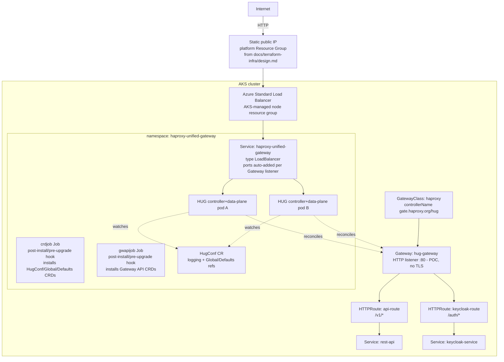

# Deploying HAProxy Unified Gateway (HUG) on AKS via Helm

> **Status:** Implementation guide — companion to `docs/nats-tenant-queue-api/design.md` (section 3/4, where HUG is the Gateway API implementation fronting Keycloak and the REST API) and `docs/terraform-infra/design.md` (which provisions the AKS cluster, its Standard Load Balancer, and its static public IP). **This is a POC configuration: the `Gateway` uses a plain HTTP listener on port 80, no TLS.**

## 1. Purpose and scope

`docs/nats-tenant-queue-api/design.md` assumes HUG is already running in the cluster and exposing `Gateway`/`HTTPRoute` resources for Keycloak's `/auth/*` paths and the REST API's `/v1/*` paths. This document is the missing implementation step: it covers installing HAProxy Unified Gateway (HUG) into the AKS cluster from its official Helm chart (`haproxytech/haproxy-unified-gateway`, [Artifact Hub](https://artifacthub.io/packages/helm/haproxytech/haproxy-unified-gateway), [source](https://github.com/haproxytech/helm-charts/tree/main/haproxy-unified-gateway)), wiring its `Service` to the static public IP that `docs/terraform-infra/design.md` provisions, and creating the `GatewayClass`, `Gateway`, `HTTPRoute`, and `ReferenceGrant` objects the parent design's routing depends on — packaged as a second, custom local Helm chart installed via Helmfile (section 7), not one-off `kubectl apply -f` calls.

In scope: Helm repo setup, the chart's `values.yaml` overrides for an AKS deployment, the resulting Helmfile-driven install/upgrade workflow, the Gateway API objects (`GatewayClass`, `Gateway`, `HTTPRoute`, `ReferenceGrant`) layered on top as this document's own local Helm chart, and the Azure-specific Service annotations needed to bind HUG's data-plane Service to a pre-existing static public IP. Out of scope: provisioning the AKS cluster itself (`docs/terraform-infra/design.md`), TLS termination (this POC's `Gateway` listener is plain HTTP on port 80 — no certificate, no TLS setup; see section 9), and deploying Keycloak, the REST API, or NATS (their own Helm releases / Deployments, unaffected by this document).

## 2. Prerequisites

- An AKS cluster, Kubernetes **1.34+** (chart's `Chart.yaml` requirement), with `kubectl` context pointed at it. `docs/terraform-infra/design.md` provisions this with the Standard Load Balancer SKU and a static Standard public IP address in the platform Resource Group; its actual version comes from that document's `aks_kubernetes_version` input variable, not fixed here.
- Helm **3.7+** (chart requires 3.6+, chart repo recommends 3.7+).
- [Helmfile](https://github.com/helmfile/helmfile) **0.150+** (needs `releases[].createNamespace` support), with the `helm-diff` plugin installed (`helm plugin install https://github.com/databus23/helm-diff`) — `helmfile` shells out to `helm` and uses this plugin for `helmfile diff`.
- Cluster-admin `kubectl` access: the chart's install creates `ClusterRole`/`ClusterRoleBinding` objects and, via post-install Helm hook Jobs, installs CustomResourceDefinitions cluster-wide; the local `hug-app` chart (section 7) also creates a cluster-scoped `GatewayClass`, so the same elevated access applies to that release too.
- The Azure public IP resource, its name, and the Resource Group it lives in (from `docs/terraform-infra/design.md`'s Terraform outputs), needed to pin HUG's `Service` to that stable IP rather than letting Azure allocate a fresh one.
- Chart version pinned in this document: **1.2.0** (`appVersion: 1.0.7`, HAProxy Unified Gateway built on HAProxy 3.2 LTS). Re-check `helm search repo haproxytech/haproxy-unified-gateway --versions` before following these steps against a newer release, since defaults can change between chart versions (`loadBalancerClass`, for example, only exists from `1.2.0` on).

## 3. Architecture on AKS



Every listener defined on the `Gateway` resource causes the controller to add a matching port to the chart-managed `Service` at reconcile time (see section 6); the chart itself does not hardcode `http`/`https` Service ports. `GatewayClass` is not created by the upstream chart — it is a cluster-scoped object this document creates via its own local Helm chart, `charts/hug-app` (section 7), referencing the controller's default `controllerName` (`gate.haproxy.org/hug`).

## 4. Declare the release with Helmfile

Instead of `helm repo add` + `helm install` run by hand, this document drives the chart through [Helmfile](https://github.com/helmfile/helmfile). Save as `helmfile.yaml` (same directory as `values-hug-aks.yaml` from section 5):

```yaml
# helmfile.yaml
repositories:
  - name: haproxytech
    url: https://haproxytech.github.io/helm-charts

releases:
  - name: hug
    namespace: haproxy-unified-gateway
    createNamespace: true      # helmfile creates the namespace; keep the
                                # chart's own namespace.create false (unset)
                                # — same rule as the chart README's warning
                                # against combining both, just via helmfile
    chart: haproxytech/haproxy-unified-gateway
    version: 1.2.0
    values:
      - values-hug-aks.yaml
```

Pull the repo index and confirm the pinned version resolves:

```console
helmfile repos
helm search repo haproxytech/haproxy-unified-gateway --versions
```

## 5. `values.yaml` overrides for AKS

Every key below is a real key from the chart's `values.yaml` ([source](https://github.com/haproxytech/helm-charts/blob/main/haproxy-unified-gateway/values.yaml)); nothing here is invented. Save this as `values-hug-aks.yaml`:

```yaml
# values-hug-aks.yaml
controller:
  kind: Deployment
  replicaCount: 2          # 1 pod = one restart is a full outage; see section 8

  image:
    repository: docker.io/haproxytech/haproxy-unified-gateway
    tag: ""                 # empty = chart's pinned appVersion (1.0.7)
    pullPolicy: IfNotPresent

  resources:
    requests:
      memory: 2048Mi
      cpu: 500m              # add a CPU request explicitly: HPA (section 8)
    limits:                  # needs one to compute CPU utilization
      memory: 2560Mi

  service:
    enabled: true
    type: LoadBalancer
    annotations:
      # Pin the Service to the static public IP that
      # docs/terraform-infra/design.md provisions in the platform
      # Resource Group, instead of letting AKS allocate a fresh
      # dynamic IP on every LoadBalancer recreation.
      service.beta.kubernetes.io/azure-pip-name: "pip-natssaas-hug-prod"
      service.beta.kubernetes.io/azure-load-balancer-resource-group: "rg-natssaas-platform-prod"
    # loadBalancerSourceRanges: []   # set to restrict source CIDRs if needed

  podDisruptionBudget:
    enabled: true             # defaults to minAvailable: 1 when unset

  autoscaling:
    enabled: false            # see section 8 before enabling

  strategy:
    type: RollingUpdate

  topologySpreadConstraints:
    - maxSkew: 1
      topologyKey: kubernetes.io/hostname
      whenUnsatisfiable: ScheduleAnyway
      labelSelector:
        matchLabels:
          app.kubernetes.io/name: haproxy-unified-gateway

  # Defaults (kube-rbac metrics auth, RuntimeDefault seccomp, unprivileged
  # container, ServiceMonitor/PodMonitor disabled) are left as chart
  # defaults; see section 10 to turn on Prometheus scraping.

hugconf:
  logging:
    defaultLevel: Info

# Both hooks stay enabled: crdjob installs HUG's own CRDs (HugConf, Global,
# Defaults) and gwapijob installs the upstream Gateway API CRDs the chart
# needs (GatewayClass, Gateway, HTTPRoute, ReferenceGrant). Leaving
# gwapijob.version at the chart's default keeps HTTPRoute-only routing
# (all this system needs, per docs/nats-tenant-queue-api/design.md); bump
# it only if a later feature needs a newer Gateway API resource.
crdjob:
  enabled: true
gwapijob:
  enabled: true
```

Two Azure-specific notes on the `service.annotations` block:

- `azure-pip-name` is the current, recommended way to pin a `LoadBalancer` Service to a pre-existing Azure public IP; it avoids the throttling and eventual-consistency issues Microsoft documents for the older, deprecated `loadBalancerIP` field (which the chart also exposes as `controller.service.loadBalancerIP`, but this document uses the annotation instead). Source: [Microsoft Learn — Use a static IP with a load balancer in AKS](https://learn.microsoft.com/en-us/azure/aks/static-ip).
- `azure-load-balancer-resource-group` is required whenever the public IP lives outside AKS's own auto-generated node Resource Group (`MC_...`) — exactly the case here, since `docs/terraform-infra/design.md` places the IP in the platform Resource Group alongside the AKS cluster resource, not in the node Resource Group Azure creates automatically.
- If this Gateway should not be internet-facing (an internal-only environment), add `service.beta.kubernetes.io/azure-load-balancer-internal: "true"` and `service.beta.kubernetes.io/azure-load-balancer-internal-subnet: "<subnet-name>"` instead of the public-IP annotations above; `docs/nats-tenant-queue-api/design.md`'s system context assumes a public-facing Gateway, so this document does not use them.

## 6. Install the chart

```console
helmfile diff      # preview against helmfile.yaml from section 4
helmfile apply      # sync: installs on first run, upgrades on later runs
```

`helmfile apply` runs `helm upgrade --install` under the hood for the `hug` release, which triggers, in order: the `ServiceAccount`/`ClusterRole`/`ClusterRoleBinding`, the `Deployment` (or `DaemonSet`), the `Service`, the `HugConf` custom resource, and two Helm post-install hook `Job`s — `crdjob` (runs `hug --job-check-crd`, installing/updating HUG's own CRDs) and `gwapijob` (runs `hug --job-gwapi=<version>`, installing the Kubernetes Gateway API CRDs). Both Jobs are one-shot, TTL-cleaned after 60 seconds by default, and re-run on every `helm upgrade` (hook: `post-install,pre-upgrade`) so CRDs stay current across chart upgrades without a separate manual step.

Verify:

```console
kubectl get pods -n haproxy-unified-gateway -l "app.kubernetes.io/name=haproxy-unified-gateway,app.kubernetes.io/instance=hug"
kubectl get jobs -n haproxy-unified-gateway
kubectl get crds | grep -E 'gateway.networking.k8s.io|gate.v3.haproxy.org'
kubectl get hugconf -n haproxy-unified-gateway
kubectl get svc hug-haproxy-unified-gateway -n haproxy-unified-gateway -w
```

The `Service` starts with only its `stat` (31024) and `controller-metrics` (31060) ports; `http`/`https` ports are added automatically by the controller, one per listener, once a `Gateway` resource exists (section 7) — this is chart behavior documented directly in the chart's own `NOTES.txt` output after install, not a delay to work around. Watching `kubectl get svc ... -w` shows the Azure Load Balancer's `EXTERNAL-IP` settle to the pinned static IP within a few minutes.

## 7. Gateway API objects — a second local Helm chart, via Helmfile

The chart does not create a `GatewayClass` — that is a cluster operator responsibility, per the Gateway API's own role split between infrastructure objects (`GatewayClass`, `Gateway`) and route-owner objects (`HTTPRoute`), which `docs/nats-tenant-queue-api/design.md` (section 4, Decisions) already calls out as the reason HUG was chosen over Application Gateway. This document packages the `GatewayClass` and `Gateway` it owns as one local Helm chart, `charts/hug-app`, deployed as a second Helmfile release alongside the upstream `hug` release from section 4 — the same reasoning `docs/keycloak-operator/design.md` section 6 gives for packaging its own app-layer resources as `charts/keycloak-app`: one `helmfile diff` previews every object together before anything changes, `helm history`/`helm rollback` give this release a revision trail no standalone `kubectl apply -f` ever had, and there is one lifecycle to reason about instead of two independently-applied files.

**Update:** `api-route` (the `HTTPRoute` sending `/v1/*` to the REST API's Service) and its `allow-hug-to-api` `ReferenceGrant` used to live in this chart, in an earlier revision of this document. They have moved to `docs/rest-api-workload/design.md`, the document that specifies the REST API's own Deployment and Service, for the same reason `keycloak-route` moved to `docs/keycloak-operator/design.md` (see the note below): a route shares its backend Service's chart lifecycle, not the Gateway's. Once the REST API's Service and route both live in the `nats-saas-api` namespace, no `ReferenceGrant` is needed for that route at all (same-namespace backend reference), so `allow-hug-to-api` was dropped rather than moved. This chart now owns only `GatewayClass` and `Gateway`.

Chart layout:

```
charts/hug-app/
  Chart.yaml
  values.yaml
  templates/
    gatewayclass.yaml
    gateway.yaml
```

```yaml
# charts/hug-app/Chart.yaml
apiVersion: v2
name: hug-app
description: GatewayClass, Gateway, HTTPRoute (api-route), and ReferenceGrant for this system's HUG-fronted routing
type: application
version: 0.1.0
```

```yaml
# charts/hug-app/values.yaml — chart defaults; already match this document's single
# AKS environment, so no separate values-hug-app-aks.yaml is needed for this POC —
# add one only if a second environment needs a different hostname/backend
gatewayClass:
  name: haproxy
  controllerName: gate.haproxy.org/hug   # chart default; matches
                                          # controller.extraArgs "--controller-name"
                                          # if that flag is ever overridden

gateway:
  name: hug-gateway
  namespace: haproxy-unified-gateway
  listenerName: http                     # POC: plain HTTP, no TLS — see section 9
  port: 80
```

```yaml
# charts/hug-app/templates/gatewayclass.yaml
apiVersion: gateway.networking.k8s.io/v1
kind: GatewayClass
metadata:
  name: {{ .Values.gatewayClass.name }}
spec:
  controllerName: {{ .Values.gatewayClass.controllerName }}
```

```yaml
# charts/hug-app/templates/gateway.yaml
apiVersion: gateway.networking.k8s.io/v1
kind: Gateway
metadata:
  name: {{ .Values.gateway.name }}
  namespace: {{ .Values.gateway.namespace }}
spec:
  gatewayClassName: {{ .Values.gatewayClass.name }}
  listeners:
    - name: {{ .Values.gateway.listenerName }}
      protocol: HTTP
      port: {{ .Values.gateway.port }}
      allowedRoutes:
        namespaces:
          from: All                  # Keycloak's and the API's HTTPRoutes
                                      # live in their own namespaces
```

Neither `keycloak-route` nor `api-route` is part of this chart, on purpose: each targets a different Service owned by a different chart, and each shares that Service's release lifecycle, not this one. `keycloak-route` targets Keycloak's own Service, so `docs/keycloak-operator/design.md` section 9 packages it as a template in its own Helm chart (`charts/keycloak-app`, deployed via that document's own Helmfile release) and applies it there, alongside the `Keycloak` CR itself. `api-route` targets the REST API's own Service, so `docs/rest-api-workload/design.md` packages it the same way, in `charts/rest-api-app`. This document neither templates nor applies `httproute-keycloak.yaml` or `httproute-api.yaml`. `keycloak-service`/`8080` (the backend `keycloak-route` targets) is the Service name and port the official Keycloak Operator actually generates for a `Keycloak` CR named `keycloak` (`<CR name>-service`, HTTP-only per that document's POC scope) — see `docs/keycloak-operator/design.md` sections 8-9. `rest-api`/`8080` (the backend `api-route` targets) is the Service `docs/rest-api-workload/design.md` creates directly, in the same `nats-saas-api` namespace as the route itself, which is why that route needs no `ReferenceGrant`: a `ReferenceGrant` is only required when a route's backend reference crosses a namespace boundary, and here it does not.

**Declare the release with Helmfile**, extending the same `helmfile.yaml` from section 4 with a second entry:

```yaml
# helmfile.yaml — extends section 4's releases list
releases:
  - name: hug
    namespace: haproxy-unified-gateway
    createNamespace: true
    chart: haproxytech/haproxy-unified-gateway
    version: 1.2.0
    values:
      - values-hug-aks.yaml

  - name: hug-app
    namespace: haproxy-unified-gateway
    createNamespace: false     # namespace already created by the hug release above;
                                 # gatewayclass.yaml is cluster-scoped, gateway.yaml
                                 # targets haproxy-unified-gateway
    chart: ./charts/hug-app
    needs:
      - haproxy-unified-gateway/hug   # wait for hug's gwapijob hook to install the
                                        # Gateway API CRDs before creating instances of them
```

`needs` makes Helmfile install/upgrade `hug` to completion — including its post-install hook Jobs (section 6) — before starting `hug-app`; without it, `hug-app`'s `GatewayClass`/`Gateway` could apply against a cluster that does not yet have the Gateway API CRDs `gwapijob` installs, and fail.

Apply both releases and confirm the `Gateway` reports `Programmed: True`:

```console
helmfile diff       # previews both hug and hug-app against helmfile.yaml above
helmfile apply       # sync: installs hug-app after hug's hooks complete; upgrades on later runs
kubectl get gateway hug-gateway -n haproxy-unified-gateway -o yaml
kubectl get svc hug-haproxy-unified-gateway -n haproxy-unified-gateway   # http-80 port now present
```

`keycloak-route` and `api-route` are each applied separately: `keycloak-route` from `docs/keycloak-operator/design.md` section 9's `helmfile apply` for its own `keycloak-app` release, and `api-route` from `docs/rest-api-workload/design.md`'s `helmfile apply` for its own `rest-api-app` release — run those documents' steps for either route to show up. Once all three releases are applied:

```console
kubectl get httproute -A   # api-route and keycloak-route
```

## 8. Scaling and availability

- `controller.replicaCount: 2` (or higher) plus `controller.podDisruptionBudget.enabled: true` (defaults to `minAvailable: 1`) is the minimum for HUG itself not to be a single point of failure — `docs/nats-tenant-queue-api/design.md`'s failure-behavior section (7) already flags a single-replica HUG deployment as turning a pod restart into a full outage; this document's default (`replicaCount: 2`) closes that specific open question for HUG's own availability, though it does not address the cluster/region-level single point of failure the parent design still carries.
- `controller.autoscaling.enabled: true` (HPA) requires a CPU **request**, not just a memory request, under `controller.resources.requests.cpu` — the chart's default `values.yaml` only sets a memory request, and the chart's own inline comment warns HPA cannot compute utilization and silently stays at `<unknown>` without one. The `values-hug-aks.yaml` above already sets `cpu: 500m` for this reason.
- `controller.keda.enabled: true` is a mutually-exclusive alternative to HPA (KEDA disables HPA automatically if both are set); only relevant if scaling should react to HAProxy/Prometheus-derived metrics rather than CPU. Not used in this document's baseline.
- `controller.kind: DaemonSet` with `controller.daemonset.useHostNetwork: true` is the chart's other supported topology (one HUG pod per node, binding host ports 80/443 directly, bypassing the Service/Load Balancer NodePort hop). Not used here: `Deployment` + `LoadBalancer` Service matches `docs/terraform-infra/design.md`'s assumption that a Kubernetes `LoadBalancer` Service is what attaches to the Standard Load Balancer's static public IP, and keeps HUG pod count independent of node count.

## 9. TLS (not used — POC scope)

This POC's `Gateway` (section 7) runs a single `http`/80 listener with no `tls` block and no `certificateRefs` — a deliberate scope decision, not an open item. `docs/nats-tenant-queue-api/design.md` establishes that HUG terminates TLS in the target architecture, but that is out of scope for this POC; traffic to `hug-gateway` is plain HTTP end to end from the internet-facing static public IP.

Before this goes past POC, revisit this section and add back an `https`/443 listener with `tls.mode: Terminate` and a `certificateRefs` Secret. The two realistic options at that point: run [cert-manager](https://cert-manager.io/) in-cluster with an ACME issuer and let it manage the TLS Secret automatically, or provision the certificate externally (e.g. from an existing CA) and load it into the Secret manually or via the Azure Key Vault CSI driver the parent design already uses for NATS credentials.

## 10. Monitoring

Enable Prometheus scraping (requires Prometheus Operator already running in the cluster) by adding to `values-hug-aks.yaml`:

```yaml
controller:
  serviceMonitor:
    enabled: true
    extraLabels:
      release: prometheus     # match the Prometheus Operator's own release label
```

The chart's default `controller.metricsAuth: kube-rbac` and the default `serviceMonitor.endpoints` (already pre-configured for HTTPS + bearer token on the `metrics` port, plain HTTP on `stat`) work together out of the box; the only extra step is granting Prometheus's ServiceAccount access to the `/metrics` nonResourceURL via a `ClusterRole`/`ClusterRoleBinding`, exactly as documented in the chart's own README. Two endpoints are scraped: `stat` (port 31024, native `haproxy_*` metrics — connections, request rate, backend health, latency) and `metrics` (port 31060, controller-level `hug_*` metrics — config generation, reload counts, cert/map operations).

## 11. Upgrade and rollback

Bump `version:` in `helmfile.yaml` (section 4), then:

```console
helmfile diff
helmfile apply

helm history hug -n haproxy-unified-gateway
helm rollback hug <REVISION> -n haproxy-unified-gateway
```

Rollback stays a raw `helm rollback` — helmfile has no revision-rollback verb of its own, it only re-applies whatever `helmfile.yaml` + values currently declare. After a manual `helm rollback`, revert `version:` in `helmfile.yaml` to match, so the next `helmfile apply` does not immediately re-upgrade over the rollback.

`crdjob` and `gwapijob` re-run on every `helm upgrade` (their hook annotation includes `pre-upgrade`), so CRDs stay in sync automatically; `helm rollback` does not re-run them in reverse, so a rollback that needs older CRD schemas back is not a fully automated path — verify CRD state manually after any rollback that crosses a CRD-changing chart version.

One AKS-specific upgrade caveat: `controller.service.loadBalancerClass` is immutable on an existing `LoadBalancer` Service — a Kubernetes-level restriction, not a chart one — so if a future change ever needs it, the Service has to be deleted and recreated (briefly dropping the static IP binding) rather than updated in place via `helm upgrade`. `values-hug-aks.yaml` above does not set it, since AKS has exactly one default `LoadBalancer` implementation and there is no competing controller in this cluster to disambiguate.

## 12. Uninstall

```console
helmfile destroy
```

`helmfile destroy` now tears down both releases declared in `helmfile.yaml` (section 7) — `hug-app` (its `GatewayClass` and `Gateway`) and `hug` itself — with no separate `kubectl delete -f` step left. Neither `keycloak-route` nor `api-route` is deleted here — they are owned and torn down by `docs/keycloak-operator/design.md` section 12's `helmfile destroy` for the `keycloak-app` release and `docs/rest-api-workload/design.md`'s `helmfile destroy` for the `rest-api-app` release, respectively.

`helmfile destroy` runs `helm uninstall` for each release; it does not remove the CRDs the `hug` release's hook Jobs installed (standard Helm behavior for any CRD installed via a Job rather than the chart's own `crds/` directory) or the Azure static public IP itself, which `docs/terraform-infra/design.md`'s Terraform state owns, not this Helm release.

## 13. Troubleshooting

- **`Service` stuck with no `EXTERNAL-IP`**: check `kubectl describe svc hug-haproxy-unified-gateway -n haproxy-unified-gateway` for AKS cloud-controller events; a mismatched `azure-pip-name` (typo, wrong Resource Group in `azure-load-balancer-resource-group`) is the most common cause, since the cloud controller cannot attach to a public IP it cannot find or does not have permission to reach.
- **`Gateway` not `Programmed`**: for this POC's plain HTTP listener, usually a `GatewayClass` whose `controllerName` does not match the running controller's `--controller-name` flag (default `gate.haproxy.org/hug`) — TLS Secret mismatches (section 9) do not apply here since no `tls` block is configured.
- **`HTTPRoute` `ResolvedRefs: False`**: almost always a missing `ReferenceGrant` when the route, its `Gateway`, and its backend `Service` span more than one namespace (section 7), or a backend Service/port that does not exist.
- **`crdjob`/`gwapijob` Job failed**: `kubectl logs job/<name> -n haproxy-unified-gateway`; a `backoffLimit: 0` means Helm's install/upgrade fails immediately on the first failure rather than retrying, so check RBAC (the Job's own `ServiceAccount` needs CRD-write permission, granted by `controller-crdjob-rbac.yaml` in the chart) if it fails on a cluster with restrictive admission policies.
- **`hug-app` release fails to apply**: its `needs: [haproxy-unified-gateway/hug]` (section 7) only waits for the `hug` release's Helm hooks to run, not for them to succeed — if `gwapijob` itself failed (previous bullet), the Gateway API CRDs `hug-app`'s templates instantiate were never installed, and `helmfile apply` fails on `hug-app` with a missing-CRD error; fix `gwapijob` first, then re-run `helmfile apply`.

## 14. References

- [HAProxy Unified Gateway Helm chart — Artifact Hub](https://artifacthub.io/packages/helm/haproxytech/haproxy-unified-gateway)
- [helm-charts/haproxy-unified-gateway — source, values.yaml, README](https://github.com/haproxytech/helm-charts/tree/main/haproxy-unified-gateway)
- [haproxytech/haproxy-unified-gateway — controller source](https://github.com/haproxytech/haproxy-unified-gateway/)
- [Announcing HAProxy Unified Gateway 1.0 — HAProxy Technologies blog](https://www.haproxy.com/blog/announcing-haproxy-unified-gateway-1-0)
- [Kubernetes Gateway API specification](https://gateway-api.sigs.k8s.io/)
- [Helmfile](https://github.com/helmfile/helmfile) — declarative `helm` release management; this document's `charts/hug-app` (section 7) is a second release in the same `helmfile.yaml`, installed the same way as the upstream `hug` chart (section 4)
- [Use a static IP with a load balancer in AKS — Microsoft Learn](https://learn.microsoft.com/en-us/azure/aks/static-ip)
- `docs/nats-tenant-queue-api/design.md` — parent system design referencing HUG
- `docs/terraform-infra/design.md` — AKS cluster, Standard Load Balancer, and static public IP this document builds on
- `docs/rest-api-workload/design.md` — owns `api-route` and the `rest-api` Service it targets, moved out of this document's `hug-app` chart
