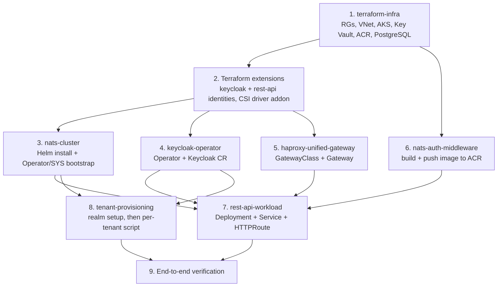

# NATS SaaS Platform — Implementation Plan

> **Status:** Draft, derived from the seven design documents under `docs/`. This document sequences the work; it does not restate implementation detail already specified elsewhere. Every step below names the design document and section that is the authority for exact configuration, values files, Terraform snippets, and acceptance criteria. Where this plan states a fact from a source document, treat the source document as canonical if the two ever disagree.

## 1. Purpose

Seven design documents together specify a multi-tenant REST API backed by NATS JetStream, fronted by HAProxy Unified Gateway (HUG), authenticated through a self-hosted Keycloak, all running in one AKS cluster:

| # | Document | Owns |
|---|---|---|
| 1 | `docs/terraform-infra/design.md` | Azure foundation: Resource Groups, VNet, AKS, Key Vault, ACR, PostgreSQL Flexible Server |
| 2 | `docs/nats-cluster/design.md` | NATS JetStream cluster on AKS (Helm), Operator/SYS-account/resolver bootstrap |
| 3 | `docs/keycloak-operator/design.md` | Keycloak on AKS via the official Operator, its database, its Key Vault identity |
| 4 | `docs/haproxy-unified-gateway/design.md` | HUG on AKS via Helm: `GatewayClass`, `Gateway`, static-IP binding |
| 5 | `docs/nats-auth-middleware/design.md` | The REST API's Go middleware (AuthN, tenant NATS pool, JetStream KV) and its container image build/publish |
| 6 | `docs/rest-api-workload/design.md` | The REST API's Kubernetes Deployment/Service/Route, its Key Vault identity |
| 7 | `docs/tenant-provisioning/design.md` | One-time Keycloak realm setup, per-tenant onboarding script |
| — | `docs/nats-tenant-queue-api/design.md` | Parent system design; referenced throughout, not itself an implementation step |

No document is buildable in isolation past a certain point — each one assumes outputs from at least one other. This plan orders the work so every phase's prerequisites already exist when that phase starts, and calls out the two places where a later document corrects an earlier one.

## 2. Dependency graph

`nats-cluster`, `keycloak-operator`, and `haproxy-unified-gateway` have no dependency on each other and can be built in parallel once phase 2 completes. `nats-auth-middleware` (the image build) only needs ACR to exist, so it can also run in parallel with phases 3–5. Everything converges at phase 7, which is the first point a request can flow end to end.

## 3. Phase 0 — Prerequisites and tooling

Install once, on the workstation(s) that will run every phase below:

- Azure CLI (`az`), authenticated against the target subscription.
- Terraform **>= 1.7.0**, `azurerm` provider `~> 3.90`, `random` provider `~> 3.6` (`docs/terraform-infra/design.md` §6).
- `kubectl` **1.26+**, `kustomize` (bundled with `kubectl apply -k`).
- Helm **3.7+** (Keycloak Operator's own OCI-chart path needs **3.8+**, `docs/keycloak-operator/design.md` §5); Helmfile **0.150+** with the `helm-diff` plugin.
- `nsc` **v2.15.0** and the NATS CLI (`nats`) **v0.4.0**, on the workstation that will bootstrap NATS and, later, onboard tenants (`docs/nats-cluster/design.md` §2, `docs/tenant-provisioning/design.md` §8) — never inside the cluster.
- `psql` or the `az postgres flexible-server` connect helpers, for the one manual database step in phase 4.
- `kcadm.sh` (Keycloak's admin CLI) or equivalent, for the one-time realm setup in phase 8.
- Docker, for the image build in phase 6.

Re-check every pinned version (chart versions, `nsc`/`natscli` versions, Operator version, Dockerfile base image digests) against its source before following these steps, per each design document's own prerequisites section — several were pinned "current at time of writing," not floated deliberately.

## 4. Phase 1 — Azure infrastructure (Terraform)

**Authority:** `docs/terraform-infra/design.md`, all sections.

**Steps:**

1. Bootstrap the Terraform state backend by hand — an Azure Storage Account and blob container — since Terraform cannot manage the backend it depends on (`docs/terraform-infra/design.md` §4, §6, "State backend bootstrap").
2. `terraform init` against that backend, then `terraform apply` on the root module described in that document's §4 (Components and responsibilities) and §6 (example configuration). One apply creates, in order Terraform resolves automatically from resource references: the three Resource Groups (network, platform, data), the VNet and its two subnets and three private DNS zones, the Key Vault, the AKS cluster and its static public IP, the Container Registry, the `AcrPull` and `Network Contributor` role assignments, the PostgreSQL Flexible Server, and the generated PostgreSQL admin password written to Key Vault.
3. Set the three firewall-allowlist variables (`key_vault_allowed_public_ip`, `postgres_firewall_allowed_cidrs`, `acr_firewall_allowed_cidrs`) for at least the operator's own workstation/CI runner IP — all three default to closed (§5, Requirements) and later phases need direct access (Key Vault reads in phase 4, PostgreSQL admin access in phase 4, image pushes in phase 6).
4. Record the outputs every later phase needs: `aks_cluster_name`, `aks_oidc_issuer_url`, `aks_public_ip_address`, `key_vault_name`, `key_vault_uri`, `acr_login_server`, `postgres_fqdn` (§6).

**Validation:** `terraform plan` run twice with no code change shows zero planned changes (§5, Requirements). `kubectl get nodes` against the new cluster (via `az aks get-credentials`) succeeds.

**Note — do not skip to phase 7 with this module alone.** As written, this document's root module grants `Key Vault Secrets User` to `module.aks.kubelet_identity_object_id`, which has no federated credential a pod's ServiceAccount can exchange a token against. `docs/rest-api-workload/design.md` §4 (Decisions) identifies this as a defect and phase 2 below replaces that role assignment with the correct one. Apply phase 1 and phase 2 together in practice — they are the same Terraform root module and the same `terraform apply` — rather than treating phase 1 as a standalone milestone.

## 5. Phase 2 — Terraform extensions: workload identities

**Authority:** `docs/keycloak-operator/design.md` §4.1 and §4.3; `docs/rest-api-workload/design.md` §4 (Decisions) and §6 (Terraform extension).

These three blocks all extend the same root module from phase 1 and belong in the same `terraform apply`:

1. **Keycloak's identity** (`docs/keycloak-operator/design.md` §4.1): a dedicated `azurerm_user_assigned_identity` (`id-keycloak`), its `azurerm_federated_identity_credential` (subject `system:serviceaccount:keycloak:keycloak`), its `Key Vault Secrets User` role assignment, a generated `keycloak-db-password` `random_password`, and the two Key Vault secrets (`keycloak-db-username`, `keycloak-db-password`) that phase 4 reads back out.
2. **AKS Key Vault Secrets Store CSI driver addon** (`docs/keycloak-operator/design.md` §4.3): add the `key_vault_secrets_provider` block to the existing `azurerm_kubernetes_cluster` resource in `modules/aks`. This is additive to Workload Identity, not a replacement.
3. **REST API's identity, correctly wired** (`docs/rest-api-workload/design.md` §6): a dedicated `azurerm_user_assigned_identity` (`id-rest-api`), its `azurerm_federated_identity_credential` (subject `system:serviceaccount:nats-saas-api:rest-api`), and a `Key Vault Secrets User` role assignment scoped to that identity — **replacing** the broken kubelet-identity role assignment phase 1 would otherwise leave in place.

**Validation:** `terraform apply` completes with no manual `-target`; the two new outputs (`keycloak_identity_client_id`, `rest_api_identity_client_id`) are present. `kubectl get pods -n kube-system -l app=secrets-store-csi-driver` (once phase 4 creates the `keycloak` namespace's pods that trigger the addon) confirms the CSI driver DaemonSet is running.

## 6. Phase 3 — NATS cluster

**Authority:** `docs/nats-cluster/design.md`, all sections.

**Steps:**

1. On the operator's workstation (never in-cluster), bootstrap the Operator/SYS-account/JWT-resolver identity hierarchy with `nsc` (§4): `nsc add operator`, `nsc add account SYS`, `nsc edit operator --system-account SYS`, `nsc add user -a SYS sys`, `nsc generate config --nats-resolver --sys-account SYS -o resolver.conf`. Keep the Operator's signing keys (`~/.nsc`) on this workstation only — they never enter the cluster or any values file.
2. Paste `resolver.conf`'s `operator`, `system_account`, `resolver`, and `resolver_preload` blocks into `config.merge` in `values-nats-aks.yaml` (§6), alongside the clustering (`replicas: 3`), JetStream (`fileStore` on `managed-csi-premium`), and resolver (`managed-csi`) settings that document specifies.
3. Declare the `nats` Helmfile release (§5) and run `helmfile apply` (§7).
4. Add the `NetworkPolicy` via the chart's `extraResources` extension point (§8), restricting inbound access to the REST API's future pod selector (`nats-saas-api` namespace, `app: rest-api`) and NATS's own inter-node traffic only.

**Validation:** `kubectl get pods -n nats` shows three `nats-N` pods `Running`/`1/1 Ready`; `nats server list` from the `nats-box` pod reports three cluster members; `kubectl get pvc -n nats` shows six bound PVCs (§7).

**Hands off to phase 8:** an Operator and `SYS` account the resolver trusts, and a resolver ready to accept pushed per-tenant Account JWTs (§9). No tenant Account exists yet.

## 7. Phase 4 — Keycloak

**Authority:** `docs/keycloak-operator/design.md`, all sections.

**Steps:**

1. From a host with network access to PostgreSQL (in-VNet, or a temporary firewall entry), read the admin and `keycloak-db-password` secrets back out of Key Vault and manually create the `keycloak` role and database on the shared Flexible Server (§4.2) — this one step stays outside Terraform and outside any chart, by design.
2. Install the Keycloak Operator's CRDs and controller into the `keycloak` namespace (§5): `kubectl apply -k 'github.com/keycloak/keycloak-k8s-resources/kubernetes?ref=26.7.2'`.
3. Assemble the CA trust bundle for Azure PostgreSQL's TLS chain — both current root CAs, never an intermediate or server cert (§6.3) — and package the ServiceAccount, `SecretProviderClass`, CA `Secret`, `Keycloak` CR, and `HTTPRoute` as the local `charts/keycloak-app` chart (§6, §8, §9).
4. Declare the `keycloak-app` Helmfile release and run `helmfile apply`.

**Validation:** `kubectl get keycloaks/keycloak -n keycloak -o go-template=...` reports `Ready: True`, `HasErrors: False` (§9). `kubectl get httproute keycloak-route -n keycloak` shows `ResolvedRefs: True` once phase 5's `Gateway` exists.

**Order note:** `keycloak-route` (this chart's `HTTPRoute`) will not resolve until phase 5's `Gateway` and `GatewayClass` exist. Installing phase 4 before phase 5 is fine — the route object applies, it simply reports unresolved until phase 5 completes — but do not expect `/auth/*` traffic to flow until both are done.

## 8. Phase 5 — HAProxy Unified Gateway (HUG)

**Authority:** `docs/haproxy-unified-gateway/design.md`, all sections.

**Steps:**

1. Declare the upstream `hug` Helmfile release (§4) with `values-hug-aks.yaml` (§5) — two replicas, `Service` pinned via `azure-pip-name`/`azure-load-balancer-resource-group` annotations to the static public IP phase 1 provisioned, both `crdjob` and `gwapijob` hooks enabled.
2. `helmfile apply` the `hug` release (§6); confirm its post-install hook Jobs installed HUG's own CRDs and the Kubernetes Gateway API CRDs.
3. Package `GatewayClass` and `Gateway` (plain HTTP listener on port 80 — POC scope, §9) as the local `charts/hug-app` chart, declared as a second Helmfile release with `needs: [haproxy-unified-gateway/hug]` so it waits for `gwapijob` (§7).
4. `helmfile apply` both releases together.

**Validation:** `kubectl get gateway hug-gateway -n haproxy-unified-gateway` reports `Programmed: True`; `kubectl get svc hug-haproxy-unified-gateway -n haproxy-unified-gateway` shows the `EXTERNAL-IP` settled to the pinned static IP (§6, §7).

**Note:** `api-route` and `keycloak-route` are deliberately **not** part of this chart — each lives with the chart that owns its backend Service (`docs/rest-api-workload/design.md`, `docs/keycloak-operator/design.md` respectively). This phase only produces the `Gateway` those routes attach to.

## 9. Phase 6 — REST API image: build and publish

**Authority:** `docs/nats-auth-middleware/design.md` §4 ("How the image is built and published") and §6 (Dockerfile, build/push commands).

This phase needs only phase 1 (ACR must exist) and the REST API's own source code (its Go implementation is out of scope for every design document in this set — see §13 of that document). It can run in parallel with phases 3–5.

**Steps:**

1. Build the multi-stage image from the pinned Dockerfile (§6): a `golang:1.25-bookworm` builder stage producing a static (`CGO_ENABLED=0`) binary, copied into a `distroless/static-debian12:nonroot` final stage running as UID `65532`. Both base images pinned by digest.
2. Tag the image with the immutable short git commit SHA (`git rev-parse --short HEAD`) — never `latest`.
3. Authenticate to the ACR from phase 1 using a short-lived Azure AD token from CI's own federated identity (`az acr login`) — never a static registry credential (ACR's admin user is disabled, `docs/terraform-infra/design.md` `INV-11`).
4. `docker push` the tagged image. This only succeeds if the pushing runner's source IP is on `acr_firewall_allowed_cidrs` (set in phase 1, step 3) and its token carries `AcrPush`.

**Validation:** the acceptance criteria in `docs/nats-auth-middleware/design.md` §9 (`AC-6`, `AC-7`): the image's default user is non-root with no shell in its entrypoint's process tree and no embedded credential in any layer; the push succeeds only when both the firewall and authorization conditions hold.

**Open dependency:** which CI platform runs this and how its federated Azure AD identity is provisioned is explicitly out of scope in both this document and `docs/terraform-infra/design.md` (§12 of the former, Open questions of the latter) — resolve this before treating phase 6 as automatable; until then, run these steps by hand from an allowlisted workstation.

## 10. Phase 7 — REST API workload deployment

**Authority:** `docs/rest-api-workload/design.md`, all sections. Depends on phases 2 (identity), 3 (NATS reachable), 4 (Keycloak reachable, for JWKS), 5 (`Gateway` to attach to), and 6 (an image tag to deploy).

**Steps:**

1. Confirm phase 2's Terraform already replaced the kubelet-identity Key Vault role assignment with `id-rest-api`'s — this phase's Key Vault access depends on that fix, not on anything this phase's own chart does.
2. Set `image.tag` in `values-rest-api-aks.yaml` to the git-SHA tag phase 6 pushed, and `serviceAccount.azureClientId` to the `rest_api_identity_client_id` Terraform output from phase 2.
3. Deploy the `charts/rest-api-app` chart (§6): namespace `nats-saas-api`, ServiceAccount with Workload Identity annotations, `ConfigMap` (Keycloak issuer/JWKS URLs, NATS address, pool TTL/max-conns), two-replica `Deployment` (readiness gated on the JWKS cache's first successful fetch, non-root `securityContext`, 10-second termination grace), `Service` on port 8080, `api-route` `HTTPRoute` for `/v1/*`, `rest-api-allow-hug` `NetworkPolicy`, and a `PodDisruptionBudget` (`minAvailable: 1`).
4. Declare the Helmfile release with `needs: [haproxy-unified-gateway/hug]` and `helmfile apply`.

**Validation:** the acceptance criteria in `docs/rest-api-workload/design.md` §9 — two `Ready` pods and `api-route` reporting `ResolvedRefs: True` (`AC-1`); a Key Vault read via Workload Identity with no credential anywhere in the pod spec (`AC-2`); a request outside the `haproxy-unified-gateway` namespace rejected at the network layer (`AC-4`); a rolling update never drops the healthy backend count to zero (`AC-5`).

At this point every workload the parent system design (`docs/nats-tenant-queue-api/design.md`) assumes is running, but no tenant exists yet — every request still fails with `tenant_not_provisioned` (`503`), since `Pool.Get` finds no Key Vault entry for any `tenant_id`.

## 11. Phase 8 — Keycloak realm setup and tenant onboarding

**Authority:** `docs/tenant-provisioning/design.md`, all sections.

**Steps (one-time, before the first tenant, §4.1):**

1. Create the `natssaas` realm in Keycloak, a `rest-api` client, a `tenant` client scope holding one protocol mapper that copies each user's `tenant_id` attribute into a `tenant_id` token claim, and set that scope as a default scope on the `rest-api` client.
2. Review this setup carefully before onboarding anyone — a mistake here affects every tenant's tokens at once, unlike a mistake in the per-tenant script below.

**Steps (per tenant, §4.2, repeatable):**

1. Run `./onboard-tenant.sh <tenant_id> <admin_email>` from the operator's workstation (the same one holding the NATS Operator's signing keys).
2. The script validates `tenant_id` against the shared naming rule (§6), then in order: creates the Keycloak user with the `tenant_id` attribute and a must-reset temporary password; creates the NATS Account and User (`nsc add account/user`); creates the tenant's JetStream KV bucket (`history=1`, default 1 GiB quota); pushes the Account/User JWTs to the resolver (`nsc push`); writes the tenant's NATS user JWT and seed to Key Vault as `tenant-<tenant_id>-nats-jwt` / `tenant-<tenant_id>-nats-seed`.
3. Re-running the script for the same `tenant_id` is a safe no-op (`INV-2`) — use this to resume after any partial failure (§7).

**Validation:** the acceptance criteria in `docs/tenant-provisioning/design.md` §9 — a token issued after login carries the exact `tenant_id` passed to the script (`AC-2`); a `POST /v1/items` with that token succeeds and lands in that tenant's own bucket (`AC-3`); re-running the script twice produces no duplicates (`AC-4`).

## 12. Phase 9 — End-to-end verification

With every phase above complete, prove the system works as `docs/nats-tenant-queue-api/design.md` describes it, not just that each component reports healthy in isolation:

1. Onboard two tenants (phase 8) and confirm each can create, list, get, and delete items through `POST/GET/DELETE https://api.natssaas.example.com/v1/items`, and that neither can see the other's data (`docs/nats-tenant-queue-api/design.md` `AC-1`, `AC-3`, `AC-4`).
2. Confirm a request with a valid token but no `tenant_id` claim is rejected with `403` before any NATS call (`AC-2`).
3. Kill one `rest-api` pod, one `nats-N` pod, and one `keycloak` pod in turn and confirm the system keeps serving traffic through the remaining replica in each case, consistent with each component's own `PodDisruptionBudget`.
4. Confirm `terraform plan` (phase 1/2's module), `helmfile diff` (every release from phases 3–5, 7), all report no drift.

## 13. Cross-cutting patterns used throughout

A few conventions recur across every phase; understanding them once avoids re-deriving them per phase:

- **No static credentials, anywhere.** Every workload-to-Azure credential is Workload Identity (federated OIDC, `docs/terraform-infra/design.md` `INV-2`/`INV-3`, `INV-11`); every workload-to-database credential (Keycloak's, tenants' NATS creds) is generated by Terraform or `nsc` and stored only in Key Vault, never in a manifest or image layer.
- **Helmfile, not one-off `helm install`.** Every chart in phases 3–5, 7 is declared as a Helmfile release specifically so `helmfile diff` previews changes and `helm history`/`helm rollback` give each release a revision trail.
- **A route lives with its backend Service's chart, not its Gateway's chart.** `keycloak-route` ships in `charts/keycloak-app`; `api-route` ships in `charts/rest-api-app`. `charts/hug-app` owns only `GatewayClass` and `Gateway`. This is why phases 4 and 7 each apply their own `HTTPRoute` rather than phase 5 applying all of them.
- **Two known corrections already folded into this plan**, both real defects in earlier documents, both already reflected in phase 2 and section 4 above: the Key Vault role assignment that must target `id-rest-api`, not AKS's kubelet identity (`docs/rest-api-workload/design.md` §4), and the `api-route`/`ReferenceGrant` move out of `hug-app` into `rest-api-app` (same document, same section).
- **POC scope, consistently.** No TLS anywhere in this system yet — not the `Gateway` listener, not NATS client/cluster connections, not Keycloak's own HTTP listener. Every design document flags this the same way; do not add TLS to one layer without revisiting all of them together (`docs/haproxy-unified-gateway/design.md` §9).

## 14. Known open items before production

Carried forward from the design documents, not resolved by this plan:

- CI/CD platform and its federated Azure AD identity for the image push (phase 6) — blocks automating phase 6 and phase 7's deploy step (`docs/nats-auth-middleware/design.md` §12, `docs/terraform-infra/design.md` §12).
- JetStream stream/bucket replica count and Azure Disk snapshot cadence for production tenants (`docs/nats-tenant-queue-api/design.md` §12).
- Web application firewall in front of HUG — lost when Application Gateway was rejected in favor of HUG (`docs/nats-tenant-queue-api/design.md` §12).
- TLS end-to-end (Gateway listener, NATS, Keycloak) — deferred everywhere, revisit as one cross-cutting change, not per component.
- Keycloak SMTP configuration for the tenant-admin invitation email, and who is authorized to run the onboarding script (`docs/tenant-provisioning/design.md` §12) — both block a production-safe rollout, not initial development.
- Vulnerability scanning gate and base-image re-pin cadence for the REST API image (`docs/nats-auth-middleware/design.md` §12).
- Tenant self-service signup and tenant offboarding — out of scope everywhere in this document set; still nothing built for either.
