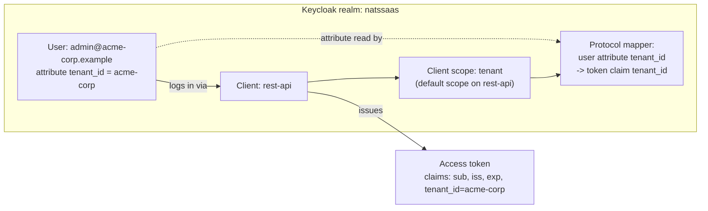
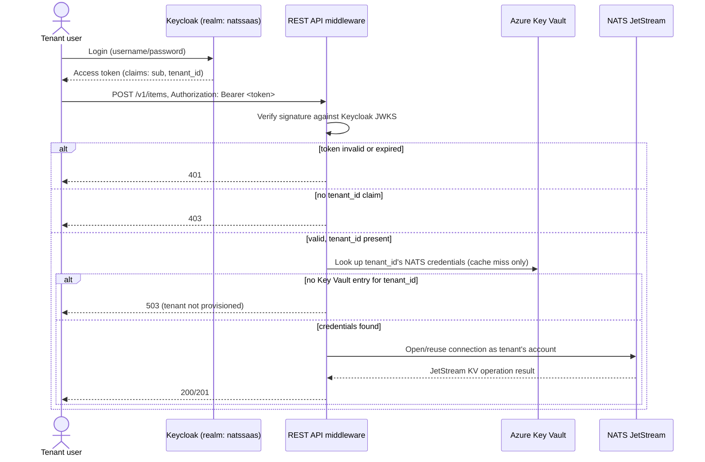

# Keycloak authentication — user guide

> **Audience:** engineers and operators working on this project who need to understand Keycloak's core concepts and how this project uses them. This is an explanatory guide, not a design document — for the authoritative specification and rationale behind any decision described here, see `docs/keycloak-operator/design.md`, `docs/tenant-provisioning/design.md`, and `docs/nats-auth-middleware/design.md`.

## 1. Why Keycloak is here

This project is a multi-tenant SaaS platform: many companies ("tenants") share one deployment, and every API request must be traced back to exactly one tenant before it touches any data. Keycloak is the identity provider that makes this possible — it authenticates users and issues access tokens that carry a `tenant_id` claim, which the REST API trusts to decide whose NATS account and data a request may touch.

Keycloak itself never talks to NATS or to tenant data directly. Its only job is: verify who a user is, and stamp their tenant onto every token it issues.

## 2. Core Keycloak concepts

Keycloak organizes identity around a small set of concepts. This section explains each one generically, then the next section explains exactly how this project uses it.

### Realm
A **realm** is an isolated space of users, clients, and configuration — think of it as a tenant boundary *within Keycloak itself*, separate from this project's own notion of a tenant. Two realms share nothing: different users, different clients, different signing keys. Most Keycloak deployments that serve multiple external customers either use one realm per customer, or one shared realm with per-user attributes distinguishing customers.

### Client
A **client** is an application registered in a realm that is allowed to request authentication from Keycloak — for example, a REST API, a web frontend, or a CLI tool. A client has its own ID, credentials (if confidential), and a set of scopes it can request.

### Client scope
A **client scope** is a named, reusable bundle of claims and permissions that can be attached to one or more clients. Client scopes let you define "what a token issued to this client contains" once, and reuse it across clients if needed.

### Protocol mapper
A **protocol mapper** is a rule, attached to a client scope (or directly to a client), that copies some piece of user or session data into a claim on the issued token. Without a protocol mapper, a user attribute exists in Keycloak's database but never appears in a token — a client verifying that token has no way to see it.

### User and user attributes
A **user** is an individual identity record in a realm: username, email, credentials, and a set of arbitrary **attributes** (key/value pairs) an operator or admin can set. Attributes are how you attach project-specific data — like which tenant a user belongs to — to an identity Keycloak wasn't originally designed to know about.

### Roles
**Roles** are Keycloak's built-in authorization primitive — a user can be granted a role, and that role can be checked by a client. This project does not currently use Keycloak roles for authorization; see section 4.

### Access token
An **access token** is a signed JSON Web Token (JWT) Keycloak issues after a successful login. It carries standard claims (issuer, subject, expiry, audience) plus whatever a client's client scopes and protocol mappers add. A client verifies a token by checking its signature against Keycloak's published public keys (its **JWKS** — JSON Web Key Set) rather than calling back into Keycloak on every request.

## 3. How this project configures Keycloak

### 3.1 One shared realm, not one realm per tenant

This project uses a single realm, `natssaas`, shared by every tenant. This is a deliberate choice, not a default: a per-tenant realm would mean a per-tenant Keycloak client, a per-tenant JWKS endpoint, and the REST API having to work out which realm a request claims to belong to *before* authenticating it — which this project's design explicitly rules out (a request must never assert its own tenant; only a verified token may). The shared-realm approach means every tenant's users share one realm's session and rate-limit configuration; that is an accepted tradeoff, not an oversight, and Keycloak's own realm/client isolation options remain available later if it becomes a problem.

Tenant identity within this one realm comes entirely from a **user attribute**, not from realm boundaries: every user has a `tenant_id` attribute, and that value is what separates one company's users from another's.

### 3.2 The `rest-api` client and the `tenant_id` claim

A single client, `rest-api`, represents the REST API's login/token-verification relationship with Keycloak. Attached to it is a client scope named `tenant`, which holds exactly one protocol mapper: it copies each authenticated user's `tenant_id` attribute into a `tenant_id` claim on every access token that client issues. That client scope is set as a **default** scope on `rest-api`, so every login through this client automatically gets the claim — no per-request opt-in is needed.

This is the entire mechanism that turns "a user logged in" into "a user logged in *as a specific tenant's employee*." Nothing else in Keycloak's configuration does tenant scoping.



This one-time realm/client/protocol-mapper setup happens exactly once, ever, before the first tenant is onboarded — never again per tenant. It is kept deliberately separate from per-tenant onboarding (section 3.3) because the two have very different blast radii: a mistake in this setup silently affects every tenant's tokens at once, while a mistake onboarding one tenant only affects that tenant.

### 3.3 Onboarding a tenant: how a user gets its `tenant_id`

There is no self-service signup. An operator runs a single onboarding script once per new tenant:

```console
./onboard-tenant.sh <tenant_id> <admin_email>
```

The first thing the script does is validate `tenant_id` against a shared naming rule (`^[a-z0-9]([a-z0-9-]{0,61}[a-z0-9])?$`) — this same string is later reused, byte-for-byte, as the NATS account name and as part of the Key Vault secret names that hold that tenant's NATS credentials, so it has to be safe for all three systems at once. The `tenant_id` is always chosen by the operator; it is never something the company being onboarded gets to pick or influence.

Once validated, the script's first step creates a Keycloak user in the `natssaas` realm with:
- the `tenant_id` attribute set to the exact validated value,
- a temporary, must-reset password (so the operator never learns the password the tenant's user will actually use going forward).

Every later step in that script (creating a NATS account, a JetStream bucket, pushing credentials, writing them to Key Vault) exists to make that tenant's account usable once its user logs in — but from Keycloak's point of view, onboarding a tenant *is* creating one user with one attribute. Re-running the script for a `tenant_id` that already has a Keycloak user is a safe no-op; it never creates a duplicate or changes the attribute.

A `tenant_id` is never edited on an existing user after creation — changing it once data already exists is treated as a separate "tenant migration" event and is explicitly unsupported by this design.

## 4. Users, in relation to this project

Concretely, in this system:

- **One Keycloak user = one human at one tenant.** There is no concept of a user belonging to more than one tenant, and no user without a `tenant_id` attribute is expected to ever call the API successfully (see section 5).
- **A user's only project-relevant piece of Keycloak state is the `tenant_id` attribute.** Keycloak roles, groups, and other built-in authorization primitives are not used for tenant scoping in this project — everything currently hinges on that one attribute and the one protocol mapper that surfaces it.
- **The REST API never creates, edits, or deletes a Keycloak user itself.** User lifecycle is entirely the onboarding script's responsibility (and, today, has no offboarding counterpart — deleting a user is a manual, out-of-scope operation).
- **A user's identity (`sub` claim) is tracked separately from their tenant.** The REST API's middleware reads both the `tenant_id` and `sub` claims off a verified token, but only `tenant_id` is ever used to pick a NATS account or bucket. `sub` is available for audit logging only, so two different users at the same tenant are always able to access the same tenant data, and one user's identity is never itself a data-partitioning boundary.

## 5. What happens on a login and an API call



The token is verified locally against Keycloak's cached JWKS on every request — no per-request round trip back to Keycloak. Only the first `tenant_id`-scoped call after a cache miss pays a Key Vault round trip; the NATS connection is then pooled and reused for that tenant.

## 6. Where responsibility sits

| Concern | Owner | Not owned by |
|---|---|---|
| Deploying Keycloak itself (Operator, database, TLS trust to Postgres) | `docs/keycloak-operator/design.md` | — |
| Realm, client, client scope, protocol mapper (one-time) | `docs/tenant-provisioning/design.md` §4.1 | Onboarding script |
| Creating a tenant's Keycloak user and `tenant_id` attribute | Onboarding script (`docs/tenant-provisioning/design.md` §4.2) | Keycloak's one-time setup |
| Verifying tokens, extracting `tenant_id`/`sub`, routing to a tenant's NATS account | `AuthMiddleware` / `Pool` (`docs/nats-auth-middleware/design.md`) | Keycloak |
| Deciding which NATS account/bucket a request may touch | The verified `tenant_id` claim alone | Any header, path segment, or other request-supplied value |

## 7. Key invariants worth remembering

- A `tenant_id` is never accepted from, or chosen by, the company being onboarded — only an operator sets it, once, at user-creation time.
- A `tenant_id` value is identical, byte-for-byte, across Keycloak (user attribute), NATS (account name), and Key Vault (secret name component) for a given tenant.
- The REST API extracts `tenant_id` from a token exactly once, in `AuthMiddleware`, and carries it only on the request's `context.Context` for the rest of that request's lifetime — no downstream code re-derives or overrides it from anything else the request carries.
- A user with no `tenant_id` claim is rejected (`403`) before any NATS or Key Vault call is made.
- A user whose tenant has a Keycloak identity but no matching NATS/Key Vault provisioning yet fails closed (`503`), never open.

## 8. References

- `docs/keycloak-operator/design.md` — how Keycloak itself is deployed and kept available.
- `docs/tenant-provisioning/design.md` — the realm/client/protocol-mapper setup and the per-tenant onboarding script, in full detail.
- `docs/nats-auth-middleware/design.md` — how a verified token becomes a tenant-scoped NATS connection inside the REST API.
- `docs/implementation-plan.md` — where these pieces fit in the overall build sequence (phases 4 and 8).
