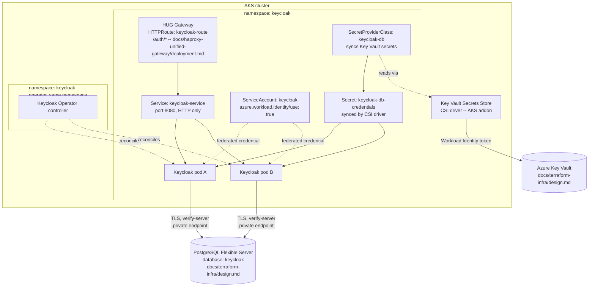

# Deploying Keycloak on AKS via the official Keycloak Operator

> **Status:** Implementation guide — companion to `docs/nats-tenant-queue-api/design.md` (section 4, which specifies Keycloak backed by Azure Database for PostgreSQL Flexible Server), `docs/terraform-infra/design.md` (which provisions the AKS cluster, Workload Identity, Key Vault, and the PostgreSQL Flexible Server itself), and `docs/haproxy-unified-gateway/deployment.md` (which routes `/auth/*` to Keycloak's Service). **Deviation from `docs/nats-tenant-queue-api/design.md`:** that design names Keycloak's "official Helm chart" as the deployment mechanism (sections 3, 4, 9); this document instead uses the **official Keycloak Operator** (a separate, CRD-based official distribution channel, not the Helm chart) per this feature's requirement. Nothing else about that design's decisions changes — same Keycloak, same Azure Database for PostgreSQL Flexible Server backing store, same HUG-fronted routing. **This is a POC configuration**, matching `docs/haproxy-unified-gateway/deployment.md` section 9: Keycloak runs HTTP-only, no TLS anywhere between the internet and Keycloak's pods.

## 1. Purpose and scope

`docs/nats-tenant-queue-api/design.md` assumes an in-cluster Keycloak reachable at a ClusterIP Service and backed by Azure Database for PostgreSQL Flexible Server. `docs/terraform-infra/design.md` provisions the AKS cluster (with Workload Identity and its OIDC issuer already enabled) and the PostgreSQL Flexible Server itself, but stops at the point where `kubectl` and Helm take over (its own section 13, "Out of scope") — it provisions no Keycloak database, no Keycloak database role, and no Key Vault access path for a Keycloak pod. This document is the missing implementation step: installing the Keycloak Operator, provisioning a least-privilege database and role for Keycloak on the existing Flexible Server, wiring that credential into the cluster via the Key Vault Secrets Store CSI driver and Workload Identity (the same trust boundary `docs/terraform-infra/design.md` already commits to for the REST API), trusting Azure's PostgreSQL TLS certificate chain, and creating the `Keycloak` custom resource itself.

In scope: installing the Keycloak Operator (CRDs + controller) into the `keycloak` namespace, provisioning a dedicated `keycloak` database/role on the shared PostgreSQL Flexible Server, sourcing that credential from Key Vault into the cluster, the `Keycloak` custom resource's database/HTTP/hostname/proxy configuration, TLS trust for the outbound PostgreSQL connection, and verifying the deployment. Out of scope: provisioning AKS, the VNet, Key Vault, or the PostgreSQL Flexible Server itself (`docs/terraform-infra/design.md`), HUG's installation and the `HTTPRoute` that fronts Keycloak (`docs/haproxy-unified-gateway/deployment.md` — this document only updates that route's backend reference, see section 9), realm/client configuration and the `tenant_id` protocol mapper (`docs/nats-tenant-queue-api/design.md` section 13 tracks that as a separate tenant-provisioning workstream), and TLS termination in front of Keycloak (POC scope, see the status banner above).

## 2. Prerequisites

- An AKS cluster with Workload Identity and its OIDC issuer enabled (`docs/terraform-infra/design.md`, `modules/aks`), `kubectl` context pointed at it, and cluster-admin access — installing the Operator's CRDs needs it.
- The Azure Database for PostgreSQL Flexible Server already provisioned (`docs/terraform-infra/design.md`, `modules/postgresql`), its private FQDN (Terraform output `postgres_fqdn`), and network access to it: either from inside the VNet, or a temporary entry in `postgres_firewall_allowed_cidrs` for the workstation running the one-time setup in section 4.
- The PostgreSQL admin credential, already written to Key Vault by Terraform (`docs/terraform-infra/design.md` section 4, Decisions) — needed once, to create Keycloak's own database and role.
- The Azure Key Vault from `docs/terraform-infra/design.md`, and permission to create secrets in it and role assignments against it.
- **Provisioned by extending `docs/terraform-infra/design.md`'s Terraform project — see section 4.1:** the dedicated `keycloak` user-assigned identity, its Workload Identity federated credential, its `Key Vault Secrets User` role assignment, and the two Key Vault secrets holding Keycloak's database credential.
- **Also provisioned by Terraform, folded into `modules/aks` — see section 4.3:** the AKS Key Vault Secrets Store CSI driver addon.
- `kubectl` **1.26+**, `kustomize` (bundled with `kubectl apply -k`), and `psql` (or `az postgres flexible-server` connect helpers) for the one-time database setup.
- Helm **3.7+** and [Helmfile](https://github.com/helmfile/helmfile) **0.150+** with the `helm-diff` plugin, the same floor `docs/haproxy-unified-gateway/deployment.md` section 2 sets for HUG — this document's ServiceAccount, `SecretProviderClass`, `Keycloak` CR, and `HTTPRoute` are packaged as one local Helm chart deployed via Helmfile (section 6).
- Operator/Keycloak version pinned in this document: **26.7.2** (`keycloak/keycloak-k8s-resources`, current at time of writing). Re-check the [releases page](https://github.com/keycloak/keycloak-k8s-resources/releases) before following these steps against a newer release.

## 3. Architecture



Keycloak pods never receive a static database password, or a static master-realm admin password, in a pod spec, image, or hand-created Kubernetes Secret: the CSI driver mounts the Key Vault secrets as a projected volume and, via its Secret-sync feature, materializes them into the `keycloak-db-credentials` and `keycloak-admin-credentials` Kubernetes Secrets that the `Keycloak` CR's `db.usernameSecret`/`db.passwordSecret` and `bootstrapAdmin.user.secret` fields reference — the same no-static-credential trust boundary `docs/terraform-infra/design.md` (`INV-3`, `AC-2`) already establishes for the REST API's own Key Vault access, just applied to a second workload identity.

## 4. Provision Keycloak's database, role, and Key Vault access

**Split scope.** Creating the `keycloak` database/role on the Flexible Server (4.2 below) stays a manual `psql` step: Terraform never opens a connection to PostgreSQL itself (section 6.3 makes the same point about TLS trust), the same boundary `docs/terraform-infra/design.md` already respects for its own admin credential. Everything else is Terraform-managed: the dedicated user-assigned identity, its Workload Identity federated credential, its `Key Vault Secrets User` role assignment, and the two Key Vault secrets holding the role's credential (4.1 below) extend `docs/terraform-infra/design.md`'s root module, the same root-module-owns-role-assignments-and-secrets pattern it already uses for AKS's own Key Vault access and the PostgreSQL admin password (its own section 4, Decisions); enabling the CSI driver addon on AKS (4.3 below) extends `modules/aks` itself, since it is a property of the `azurerm_kubernetes_cluster` resource that module already owns.

**4.1 — Identity, federated credential, role assignment, and Key Vault secret: Terraform.** A dedicated user-assigned managed identity for Keycloak (not a reuse of the REST API's identity) keeps the two workloads' Key Vault access independently auditable and revocable, matching the least-privilege reasoning `docs/terraform-infra/design.md` section 4 already applies to its three-Resource-Group split. This extends `docs/terraform-infra/design.md`'s root module — same file, same `terraform apply`, ordered after `modules/aks` and `modules/key_vault` the same way the existing `Key Vault Secrets User` role assignment for AKS already is:

```hcl
# root module — extends docs/terraform-infra/design.md alongside the existing
# Key Vault Secrets User role assignment for AKS

resource "azurerm_user_assigned_identity" "keycloak" {
  name                = "id-keycloak"
  resource_group_name = module.resource_group_platform.name
  location            = module.resource_group_platform.location
}

resource "azurerm_federated_identity_credential" "keycloak" {
  name                = "keycloak-workload-identity"
  resource_group_name = module.resource_group_platform.name
  parent_id           = azurerm_user_assigned_identity.keycloak.id
  issuer              = module.aks.oidc_issuer_url
  subject             = "system:serviceaccount:keycloak:keycloak"
  audience            = ["api://AzureADTokenExchange"]
}

resource "azurerm_role_assignment" "keycloak_key_vault_secrets_user" {
  scope                = module.key_vault.id
  role_definition_name = "Key Vault Secrets User"
  principal_id         = azurerm_user_assigned_identity.keycloak.principal_id
}

resource "random_password" "keycloak_db" {
  length  = 32
  special = true
}

resource "azurerm_key_vault_secret" "keycloak_db_username" {
  name         = "keycloak-db-username"
  value        = "keycloak"
  key_vault_id = module.key_vault.id
}

resource "azurerm_key_vault_secret" "keycloak_db_password" {
  name         = "keycloak-db-password"
  value        = random_password.keycloak_db.result
  key_vault_id = module.key_vault.id
}

resource "random_password" "keycloak_admin" {
  length  = 24
  special = true
}

resource "azurerm_key_vault_secret" "keycloak_admin_username" {
  name         = "keycloak-admin-username"
  value        = "admin"
  key_vault_id = module.key_vault.id
}

resource "azurerm_key_vault_secret" "keycloak_admin_password" {
  name         = "keycloak-admin-password"
  value        = random_password.keycloak_admin.result
  key_vault_id = module.key_vault.id
}

output "keycloak_identity_client_id" {
  value = azurerm_user_assigned_identity.keycloak.client_id
}
```

`terraform apply` creates all resources in one graph: the role assignment and federated credential both depend on `azurerm_user_assigned_identity.keycloak`, and `azurerm_federated_identity_credential` additionally depends on `module.aks` for the OIDC issuer URL, so Terraform orders everything automatically — no `-target` flag, no second apply. `keycloak_identity_client_id` is the value `values-keycloak-aks.yaml.gotmpl`'s `serviceAccount.azureClientId` (section 6.4) needs. `random_password`, not a human, generates the database credential now — nobody invents or types a password. The same applies to the master-realm bootstrap admin: `random_password.keycloak_admin` generates it, `keycloak-admin-username`/`keycloak-admin-password` are the two Key Vault secrets the SecretProviderClass (section 6.2) syncs into the `keycloak-admin-credentials` `Secret` that the `Keycloak` CR's `spec.bootstrapAdmin.user.secret` (section 6.4) references — nobody types or hands an operator a master-realm password either.

**4.2 — Dedicated database and role, not the admin credential.** Keycloak must not run against the Flexible Server's admin login: that login is provisioned for Terraform's own use (`docs/terraform-infra/design.md` section 4) and is unnecessarily privileged for an application connection. From a host with network access to the server (in-VNet, or a workstation temporarily added to `postgres_firewall_allowed_cidrs`), read the credential Terraform generated in 4.1 back out of Key Vault:

```console
az keyvault secret show --vault-name <key_vault_name> --name postgres-admin-password --query value -o tsv
az keyvault secret show --vault-name <key_vault_name> --name keycloak-db-password --query value -o tsv
psql "host=<postgres_fqdn> port=5432 dbname=postgres user=<postgres_admin_username> sslmode=verify-full"
```

```sql
CREATE ROLE keycloak WITH LOGIN PASSWORD '<value of keycloak-db-password above>';
CREATE DATABASE keycloak OWNER keycloak;
```

The role's password must match the `keycloak-db-password` secret exactly: Terraform already generated and stored it in 4.1, so this step only makes the PostgreSQL role match what is already in Key Vault — it does not choose the value.

**4.3 — Enable the Key Vault Secrets Store CSI driver addon on AKS: Terraform.** `azurerm_kubernetes_cluster` has a dedicated block for this addon; add it to the cluster resource `modules/aks` already owns (`docs/terraform-infra/design.md` section 4) rather than enabling it out-of-band with `az aks addon enable`:

```hcl
# modules/aks — added to the existing azurerm_kubernetes_cluster resource

resource "azurerm_kubernetes_cluster" "this" {
  # ...existing arguments (name, resource_group_name, node pools,
  # Azure CNI Overlay, Workload Identity, OIDC issuer, Load Balancer SKU, etc.)

  key_vault_secrets_provider {
    secret_rotation_enabled  = true
    secret_rotation_interval = "2m"
  }
}
```

This installs the `secrets-store.csi.k8s.io` CSI driver plus the Azure provider `DaemonSet` cluster-wide, the same as `az aks addon enable --addon azure-keyvault-secrets-provider` would; it is additive to, and independent of, the Workload Identity webhook `modules/aks` already enables. `secret_rotation_enabled = true` keeps the synced `keycloak-db-credentials` Secret (section 6.2) in step if the Key Vault secret's value ever changes (e.g., a future credential rotation) without a pod restart; drop the block entirely, rather than setting it `false`, if the addon should stay off — `azurerm` has no separate on/off flag once the block is present.

## 5. Install the Keycloak Operator

Namespace-scoped install (the Operator watches only its own namespace — least privilege, and the only namespace this POC needs it to reconcile):

```console
kubectl create namespace keycloak
kubectl apply -k 'github.com/keycloak/keycloak-k8s-resources/kubernetes?ref=26.7.2'
```

This applies the `keycloaks.k8s.keycloak.org` and `keycloakrealmimports.k8s.keycloak.org` CRDs plus the Operator's `Deployment`, `ServiceAccount`, `Role`/`RoleBinding`, and RBAC, all scoped to the `keycloak` namespace. (A cluster-wide variant exists — `kubectl apply -k 'github.com/keycloak/keycloak-k8s-resources/kubernetes/cluster-wide?ref=26.7.2'` into a separate `keycloak-operator` namespace, watching every namespace — not used here, since this cluster only ever runs one Keycloak instance in one namespace, per `docs/nats-tenant-queue-api/design.md`.)

Verify:

```console
kubectl get pods -n keycloak -l app.kubernetes.io/name=keycloak-operator
kubectl get crds | grep k8s.keycloak.org
```

**Helmfile alternative.** The Keycloak project merged an official Helm chart for the Operator on 2026-08-12 (`keycloak/keycloak#42079`), published as an OCI artifact at `oci://quay.io/keycloak/keycloak-operator-helm` — the same distribution shape `docs/haproxy-unified-gateway/deployment.md` already drives through Helmfile for HUG. This document still uses the kustomize method above as primary, not this chart: the chart is one week old at time of writing, is not yet referenced from `https://www.keycloak.org/operator/installation`, and its own follow-up release-process issue (`keycloak-rel#196`) was still open — meaning it may not yet be attached to a tagged, pinnable release the way `ref=26.7.2` is above. If it has stabilized by the time this is followed, this is the equivalent Helmfile release block:

```yaml
# helmfile.yaml
releases:
  - name: keycloak-operator
    namespace: keycloak
    createNamespace: true
    chart: oci://quay.io/keycloak/keycloak-operator-helm
    version: <pin once confirmed published — do not float>
    values:
      - crds:
          enabled: true   # false if CRDs are already installed/managed separately
```

```console
helmfile diff
helmfile apply
```

This needs Helm **3.8+** (OCI chart support), not the 3.7+ floor `docs/haproxy-unified-gateway/deployment.md` section 2 lists for its own (non-OCI) chart repo. Before relying on this path, confirm the chart actually resolves for a specific version — `helm show chart oci://quay.io/keycloak/keycloak-operator-helm --version <X>` — since an unresolvable pin fails closed, not silently. Everything from section 6 onward (ServiceAccount, `SecretProviderClass`, the `Keycloak` CR, TLS trust) is identical regardless of which of these two methods installed the Operator.

## 6. Package the app-layer resources as a Helm chart

The ServiceAccount, `SecretProviderClass`, CA trust `Secret`, `Keycloak` CR, and `HTTPRoute` (sections 6, 8, 9) are one local Helm chart, deployed as a single Helmfile release — the same reasoning `docs/haproxy-unified-gateway/deployment.md` section 4 already gives for driving HUG through Helmfile rather than one-off `kubectl apply -f` calls: one `helmfile diff` previews every resource together before anything changes, `helm history`/`helm rollback` give this release a revision trail the Keycloak Operator's own CRDs never had (section 11), and there is one lifecycle to reason about instead of five independently-applied files. Everything the Operator itself owns (the CRDs, the controller, section 5) stays out of this chart — the chart's templates create instances of the Operator's CRDs, they do not install the CRDs themselves, so this release only ever succeeds after section 5 has already run, by either of its methods.

Chart layout:

```
charts/keycloak-app/
  Chart.yaml
  values.yaml
  templates/
    serviceaccount.yaml
    secretproviderclass.yaml
    postgres-ca-secret.yaml
    keycloak.yaml       # section 8
    httproute.yaml       # section 9
```

```yaml
# charts/keycloak-app/Chart.yaml
apiVersion: v2
name: keycloak-app
description: ServiceAccount, SecretProviderClass, Keycloak CR, and HUG HTTPRoute for this system's Keycloak instance
type: application
version: 0.1.0
```

```yaml
# charts/keycloak-app/values.yaml — chart defaults; environment-specific values (secrets, real
# hostnames) are supplied by values-keycloak-aks.yaml.gotmpl below, never committed here
namespace: keycloak

serviceAccount:
  name: keycloak
  azureClientId: ""        # keycloak_identity_client_id, Terraform output, section 4.1

keyVault:
  name: ""                  # key_vault_name, docs/terraform-infra/design.md
  tenantId: ""               # azure_tenant_id

postgres:
  host: ""                   # postgres_fqdn, docs/terraform-infra/design.md output
  port: 5432
  database: keycloak
  caBundle: ""                # PEM content, section 6.3

keycloak:
  instances: 2
  hostname: auth.natssaas.example.com

hug:
  gatewayName: hug-gateway
  gatewayNamespace: haproxy-unified-gateway   # docs/haproxy-unified-gateway/deployment.md
```

**6.1 — ServiceAccount:**

```yaml
# charts/keycloak-app/templates/serviceaccount.yaml
apiVersion: v1
kind: ServiceAccount
metadata:
  name: {{ .Values.serviceAccount.name }}
  namespace: {{ .Values.namespace }}
  annotations:
    azure.workload.identity/client-id: {{ .Values.serviceAccount.azureClientId | quote }}
  labels:
    azure.workload.identity/use: "true"
```

**6.2 — `SecretProviderClass`:**

```yaml
# charts/keycloak-app/templates/secretproviderclass.yaml
apiVersion: secrets-store.csi.x-k8s.io/v1
kind: SecretProviderClass
metadata:
  name: keycloak-db
  namespace: {{ .Values.namespace }}
spec:
  provider: azure
  parameters:
    usePodIdentity: "false"
    useVMManagedIdentity: "false"
    clientID: {{ .Values.serviceAccount.azureClientId | quote }}
    keyvaultName: {{ .Values.keyVault.name | quote }}
    tenantId: {{ .Values.keyVault.tenantId | quote }}
    objects: |
      array:
        - |
          objectName: keycloak-db-username
          objectType: secret
        - |
          objectName: keycloak-db-password
          objectType: secret
        - |
          objectName: keycloak-admin-username
          objectType: secret
        - |
          objectName: keycloak-admin-password
          objectType: secret
  secretObjects:
    - secretName: keycloak-db-credentials
      type: Opaque
      data:
        - objectName: keycloak-db-username
          key: username
        - objectName: keycloak-db-password
          key: password
    - secretName: keycloak-admin-credentials
      type: Opaque
      data:
        - objectName: keycloak-admin-username
          key: username
        - objectName: keycloak-admin-password
          key: password
```

`secretObjects` is what actually creates the `keycloak-db-credentials` and `keycloak-admin-credentials` Kubernetes `Secret`s the `Keycloak` CR references (section 8) — a `SecretProviderClass` on its own only projects a volume, it does not sync a `Secret` by itself. The CSI driver only performs this sync when a pod mounting the `SecretProviderClass` as a volume actually starts, so neither `Secret` exists until Keycloak's first pod starts (section 8), regardless of how early this template is applied.

**6.3 — CA trust bundle, as a chart-templated `Secret`:**

The bundle's *content* is still assembled outside Helm — it is two downloaded public root certificates, not something a template generates — but the resulting `Secret` object is now templated like everything else in this chart, rather than created with a one-off `kubectl create secret` imperative command:

```console
curl -sSL -o /tmp/digicert-global-root-g2.crt https://cacerts.digicert.com/DigiCertGlobalRootG2.crt
curl -sSL -o /tmp/ms-rsa-root-2017.crt "https://www.microsoft.com/pkiops/certs/Microsoft%20RSA%20Root%20Certificate%20Authority%202017.crt"
openssl x509 -inform der -in /tmp/digicert-global-root-g2.crt -out /tmp/digicert-global-root-g2.pem
openssl x509 -inform der -in /tmp/ms-rsa-root-2017.crt -out /tmp/ms-rsa-root-2017.pem
cat /tmp/digicert-global-root-g2.pem /tmp/ms-rsa-root-2017.pem > azure-postgres-ca.pem
```

```yaml
# charts/keycloak-app/templates/postgres-ca-secret.yaml
apiVersion: v1
kind: Secret
metadata:
  name: azure-postgres-ca
  namespace: {{ .Values.namespace }}
type: Opaque
stringData:
  ca.pem: |
{{ .Values.postgres.caBundle | indent 4 }}
```

Both root CAs are needed together in that file: Azure Database for PostgreSQL's certificate chain is currently mid-rotation (root CA rotation to `DigiCert Global Root G2` completing per-region through Q1 2026, per Microsoft's published schedule), so a trust store holding only one of the two roots risks a connection failure the moment a given region's chain rotates. Only the two **root** CAs go in this bundle — never an intermediate CA or an individual server certificate; Microsoft explicitly does not announce intermediate/server certificate rotations, and pinning to one breaks silently on the next routine rotation (`docs/terraform-infra/design.md` has no equivalent precedent for this, since Terraform itself never opens a TLS connection to PostgreSQL).

**6.4 — Declare the release with Helmfile**, alongside `azure-postgres-ca.pem` from 6.3:

```yaml
# helmfile.yaml
releases:
  - name: keycloak-app
    namespace: keycloak
    createNamespace: true
    chart: ./charts/keycloak-app
    values:
      - values-keycloak-aks.yaml.gotmpl
```

```yaml
# values-keycloak-aks.yaml.gotmpl — the .gotmpl extension makes Helmfile render this
# values file as a Go template before handing it to Helm, which is what makes readFile
# available; a plain .yaml values file cannot pull in azure-postgres-ca.pem this way
serviceAccount:
  name: keycloak
  azureClientId: "<keycloak_identity_client_id Terraform output, section 4.1>"
keyVault:
  name: "<key_vault_name>"
  tenantId: "<azure_tenant_id>"
postgres:
  host: "<postgres_fqdn>"
  caBundle: |
{{ readFile "azure-postgres-ca.pem" | indent 4 }}
keycloak:
  instances: 2
  hostname: auth.natssaas.example.com
```

Nothing is applied yet — sections 8 and 9 add this chart's remaining two templates (`keycloak.yaml`, `httproute.yaml`); the one `helmfile apply` for all five templates together is at the end of section 9.

## 7. `db-tls-mode` and the Azure PostgreSQL certificate chain

Azure Database for PostgreSQL Flexible Server enforces TLS on every connection by default (`require_secure_transport` defaults to `ON`); Keycloak's own `db-tls-mode=verify-server` setting is what makes Keycloak *verify* the server's certificate against a trusted root, rather than merely accepting encryption from any presented certificate. `docs/terraform-infra/design.md` does not need this (Terraform's own PostgreSQL provider connections are a separate, already-TLS-aware code path outside this document's scope), so this is a Keycloak-specific addition. The `Keycloak` CR's `db` stanza has no dedicated TLS field for this — it is passed via `spec.additionalOptions`, and the trust bundle from section 6.3 is mounted into the pod via `spec.unsupported.podTemplate` (both used in the CR template in section 8).

## 8. The `Keycloak` custom resource — chart template

The fifth template in `charts/keycloak-app/` (section 6):

```yaml
# charts/keycloak-app/templates/keycloak.yaml
apiVersion: k8s.keycloak.org/v2beta1
kind: Keycloak
metadata:
  name: keycloak
  namespace: {{ .Values.namespace }}
spec:
  instances: {{ .Values.keycloak.instances }}   # matches docs/nats-tenant-queue-api/design.md's
                                                   # open-questions recommended default of 2
  bootstrapAdmin:
    user:
      secret: keycloak-admin-credentials  # synced by the SecretProviderClass, section 6.2; keys: username, password
  db:
    vendor: postgres
    host: {{ .Values.postgres.host | quote }}          # Terraform output from docs/terraform-infra/design.md
    port: {{ .Values.postgres.port }}
    database: {{ .Values.postgres.database | quote }}
    usernameSecret:
      name: keycloak-db-credentials  # synced by the SecretProviderClass, section 6.2
      key: username
    passwordSecret:
      name: keycloak-db-credentials
      key: password
  additionalOptions:
    - name: db-tls-mode
      value: verify-server
    - name: db-tls-trust-store-file
      value: /opt/keycloak/certs/azure-postgres-ca/ca.pem
    - name: http-relative-path
      value: /auth   # Keycloak's Quarkus distribution serves at the root path ("/")
                       # by default since Keycloak 17, not the legacy "/auth" prefix
                       # (https://www.keycloak.org/migration/migrating-to-quarkus);
                       # this option is a runtime property in current Keycloak, so
                       # the Operator can set it here without a custom image build.
                       # It has to match the "/auth" PathPrefix docs/haproxy-unified-gateway/design.md
                       # section 9's keycloak-route matches exactly, since HTTPRoute
                       # forwards the request path unchanged (no rewrite filter is
                       # configured) — without this option, Keycloak serves under "/"
                       # while every request HUG forwards it still carries an "/auth"
                       # prefix, and every one of them 404s. Setting this also shifts
                       # Keycloak's own self-issued frontend URLs (the issuer claim on
                       # every token, since spec.hostname.hostname above carries no
                       # path of its own) to include "/auth", so a token's issuer and
                       # the JWKS endpoint the REST API fetches from both land under
                       # the same prefix a client actually reaches externally.
  http:
    httpEnabled: true         # POC: HTTP only, no TLS — matches
                                # docs/haproxy-unified-gateway/deployment.md section 9,
                                # a deliberate scope decision, not an oversight; revisit
                                # both documents together when TLS is added end-to-end
  hostname:
    hostname: {{ .Values.keycloak.hostname | quote }}   # matches the HTTPRoute hostname (section 9)
    strict: true
  proxy:
    headers: xforwarded    # Keycloak sits behind HUG's reverse proxy (docs/haproxy-unified-gateway/deployment.md);
                             # trusts X-Forwarded-* so issued URLs/redirects use the
                             # external hostname, not the pod's own address
  ingress:
    enabled: false    # HUG's HTTPRoute owns routing (docs/haproxy-unified-gateway/deployment.md);
                        # no in-cluster Ingress controller runs in this system, so a
                        # Keycloak-managed Ingress object would be inert and misleading
  unsupported:
    podTemplate:
      spec:
        serviceAccountName: {{ .Values.serviceAccount.name }}   # section 6.1 — carries the
                                                                    # Workload Identity federated
                                                                    # credential from section 4.1
        containers:
          - volumeMounts:
              - name: azure-postgres-ca
                mountPath: /opt/keycloak/certs/azure-postgres-ca
                readOnly: true
              - name: keycloak-db-secrets
                mountPath: /mnt/secrets-store
                readOnly: true
        volumes:
          - name: azure-postgres-ca
            secret:
              secretName: azure-postgres-ca
          - name: keycloak-db-secrets
            csi:
              driver: secrets-store.csi.k8s.io
              readOnly: true
              volumeAttributes:
                secretProviderClass: keycloak-db
```

The `keycloak-db-secrets` CSI volume mount is what triggers the CSI driver to perform the `secretObjects` sync (section 6.2) that actually creates the `keycloak-db-credentials` `Secret` on first pod startup — omitting this volume mount (relying on `db.usernameSecret`/`db.passwordSecret` alone) would leave the CR referencing a `Secret` that is never created. `spec.resources` and the readiness/liveness/startup probe tuning fields are left at Operator defaults (1700Mi request / 2Gi limit memory) for this POC; revisit under real load.

The Operator names the generated `Service` `<CR name>-service` — `keycloak-service` here, since this CR is named `keycloak` (a literal, not templated from `.Release.Name`, since the chart's release is named `keycloak-app` — see section 9 for why the CR's own name, not the release name, is what fixes the Service name) — exposing port `8080` for HTTP (no `443`/`8443` entry, since `https` was never enabled). This chart's remaining template, `httproute.yaml`, and the release's actual `helmfile apply` follow in section 9.

## 9. HUG's `HTTPRoute` — chart template, and installing the chart

`docs/haproxy-unified-gateway/deployment.md` section 7 originally defined `httproute-keycloak.yaml` as a standalone file applied directly from that document, with a `backendRef` of `name: keycloak, port: 80` — written before this document fixed the actual Service name and port the Keycloak Operator produces (`keycloak-service`, port `8080`, section 8). That ownership has now moved here: since `keycloak-route` targets nothing but this chart's own `Service` and shares this chart's release lifecycle, it is this chart's fifth and last template, not a file applied separately from HUG's document. `docs/haproxy-unified-gateway/deployment.md` has been updated to say so (section 7) and no longer applies this file itself; the `Gateway` and `GatewayClass` it does still own are unaffected — only routing to Keycloak specifically moved.

```yaml
# charts/keycloak-app/templates/httproute.yaml
apiVersion: gateway.networking.k8s.io/v1
kind: HTTPRoute
metadata:
  name: keycloak-route
  namespace: {{ .Values.namespace }}
spec:
  parentRefs:
    - name: {{ .Values.hug.gatewayName }}
      namespace: {{ .Values.hug.gatewayNamespace }}
  hostnames:
    - {{ .Values.keycloak.hostname | quote }}
  rules:
    - matches:
        - path:
            type: PathPrefix
            value: /auth
      backendRefs:
        - name: keycloak-service
          port: 8080
```

No `ReferenceGrant` is needed here, unlike `docs/haproxy-unified-gateway/deployment.md`'s `api-route` (its section 7): that route's backend `Service` lives in a different namespace from the route itself, but this chart's `HTTPRoute` and the `keycloak-service` Service it targets are both in the `keycloak` namespace — only the cross-namespace `parentRef` to `hug-gateway` (in `haproxy-unified-gateway`) crosses a boundary, and that is already permitted by that `Gateway`'s own `allowedRoutes.namespaces.from: All` (`docs/haproxy-unified-gateway/deployment.md` section 7).

Apply the whole chart and verify:

```console
helmfile diff
helmfile apply

kubectl get keycloaks/keycloak -n keycloak -o go-template='{{range .status.conditions}}{{.type}}: {{.status}} — {{.message}}{{"\n"}}{{end}}'
kubectl get pods -n keycloak -l app=keycloak
kubectl get svc keycloak-service -n keycloak
kubectl get httproute keycloak-route -n keycloak -o yaml   # confirm ResolvedRefs: True
```

A healthy deployment reports `Ready: True` and `HasErrors: False` in the `Keycloak` conditions output above.

## 10. Scaling and availability

- `spec.instances: 2` (section 8) is the minimum for Keycloak itself not to be a single point of failure, matching `docs/nats-tenant-queue-api/design.md`'s open-questions recommended default; the Operator manages a `StatefulSet`, and its rolling update strategy restarts one pod at a time.
- Keycloak replicas discover each other for its distributed cache (Infinispan) over the cluster's Kubernetes API by default (`KC_CACHE_STACK` unset uses the `kubernetes` JGroups discovery protocol built into the Keycloak container image) — no separate configuration is needed for the 2-replica case here, and nothing in this document changes that default.
- No `PodDisruptionBudget` is templated in this chart (section 6); add one as a sixth template (`templates/poddisruptionbudget.yaml`, selecting `app=keycloak`) before this goes past POC, mirroring `docs/haproxy-unified-gateway/deployment.md` section 8's treatment of HUG's own availability.

## 11. Upgrade and rollback

Two independent upgrade paths, since the Operator (section 5) and this chart (sections 6-9) are separate releases with separate lifecycles:

- **Operator upgrade**: bump the `ref=` tag in the `kubectl apply -k` command (section 5) — or the `version:` in that section's Helmfile alternative — and re-run it. Always re-check the [Keycloak upgrade guide](https://www.keycloak.org/docs/latest/upgrading/index.html) for that specific version jump first — Keycloak upgrades can include database schema migrations that run automatically on Keycloak's own startup, not something either release controls.
- **App chart upgrade** (a new Keycloak image tag, a `values-keycloak-aks.yaml.gotmpl` change, an `instances` bump, and so on):

```console
helmfile diff
helmfile apply

helm history keycloak-app -n keycloak
helm rollback keycloak-app <REVISION> -n keycloak
```

Unlike the Operator's own CRDs, this chart's release has a real revision history — `helm rollback` reverts the ServiceAccount, `SecretProviderClass`, CA `Secret`, `Keycloak` CR, and `HTTPRoute` together, atomically, to a prior applied state. What it does not revert is a database schema migration Keycloak's own startup already ran against the shared PostgreSQL database before the rollback — that is server-side state no Kubernetes rollback touches; restoring the PostgreSQL Flexible Server from a point-in-time backup (a capability `docs/terraform-infra/design.md` section 4 already calls out as the reason it chose a managed database) is the realistic rollback path for anything past a trivial image-only bump. After a manual `helm rollback`, treat `values-keycloak-aks.yaml.gotmpl` the same way `docs/haproxy-unified-gateway/deployment.md` section 11 treats `helmfile.yaml`'s `version:` field — revert it to match, so the next `helmfile apply` does not immediately re-upgrade over the rollback.

## 12. Uninstall

```console
helmfile destroy   # removes the keycloak-app release: ServiceAccount, SecretProviderClass,
                     # CA Secret, Keycloak CR, and HTTPRoute together

kubectl delete -k 'github.com/keycloak/keycloak-k8s-resources/kubernetes?ref=26.7.2'   # or the
                                                                                          # Helmfile alternative's `helmfile destroy` (section 5)
kubectl delete namespace keycloak
```

`helmfile destroy` for `keycloak-app` removes the `Keycloak` CR, which in turn removes the `StatefulSet`, `Service`, and generated `ConfigMap`s the Operator created for it — but never the PostgreSQL database or role from section 4.2, and never any Azure resource: those have no representation in this Helm release for `helm`/`helmfile` to track. Drop the database/role explicitly with `psql` (`DROP DATABASE keycloak; DROP ROLE keycloak;`, section 4.2) if this is a full teardown, not just a redeploy. The identity, federated credential, role assignment, and two Key Vault secrets are Terraform-managed (section 4.1) — remove their `resource` blocks from the root module and run `terraform apply` (or `terraform destroy -target` against just those five resources) to tear them down; `helmfile destroy` never touches them.

## 13. Troubleshooting

- **`Keycloak` status stuck `Ready: False`, `HasErrors: True`**: `kubectl logs -n keycloak -l app=keycloak --tail=100` first; a database connection failure (wrong host/port, or the TLS trust bundle from section 6.3 missing/mis-mounted) is the most common early-deployment cause, and shows up there as a JDBC connection error, not in the CR's own condition message.
- **`Secret "keycloak-db-credentials" not found`**: the CSI driver only performs its `secretObjects` sync once a pod actually mounts the `SecretProviderClass` as a volume (section 6.2) — check that the pod's `unsupported.podTemplate` (section 8) really does mount the `keycloak-db-secrets` CSI volume; a `Keycloak` CR applied without that volume mount references a `Secret` that never gets created.
- **PostgreSQL connection fails with a certificate verification error**: almost always the trust bundle (section 6.3) missing one of the two current root CAs, or a stale bundle from before Azure's certificate rotation reached this server's region — re-download both root certificates into `azure-postgres-ca.pem` and re-run `helmfile apply`; never add an intermediate CA or a pinned server certificate to work around this (`docs/terraform-infra/design.md` has no precedent here since it never opens a TLS connection to PostgreSQL itself).
- **`HTTPRoute` `ResolvedRefs: False` after section 9**: check `kubectl get svc -n keycloak` for the actual Service name and port (`keycloak-service`/`8080`) against what `templates/httproute.yaml`'s `backendRef` renders to — `helmfile diff` before `apply` catches a drifted value here before it reaches the cluster.
- **`helmfile apply` fails validating `keycloak.yaml` against an unknown CRD**: the app chart (sections 6-9) was applied before the Operator (section 5) finished registering `keycloaks.k8s.keycloak.org` — these are two separate releases with no `needs:` dependency wired between them in this document's `helmfile.yaml`, so ordering is the operator's responsibility, not Helmfile's; re-run `kubectl get crds | grep k8s.keycloak.org` (section 5) to confirm before retrying.
- **Workload Identity token exchange fails (Key Vault access denied)**: check the federated credential's `subject` (section 4.1) matches exactly `system:serviceaccount:keycloak:keycloak`, and that the `keycloak` ServiceAccount (section 6.1) carries both the `azure.workload.identity/client-id` annotation and the `azure.workload.identity/use: "true"` label — the Workload Identity webhook only injects the token projection when both are present, the same pair `docs/terraform-infra/design.md`'s own `AC-2` already exercises for the REST API's ServiceAccount.

## 14. References

- [Keycloak Operator installation](https://www.keycloak.org/operator/installation)
- [Basic Keycloak deployment (Operator)](https://www.keycloak.org/operator/basic-deployment)
- [Keycloak Operator advanced configuration](https://www.keycloak.org/operator/advanced-configuration)
- [Configuring the PostgreSQL database](https://www.keycloak.org/server/db)
- [Migrating to Quarkus distribution](https://www.keycloak.org/migration/migrating-to-quarkus) — the default context-path change from `/auth` to `/` this document's `http-relative-path` option (section 8) restores
- [keycloak/keycloak-k8s-resources — source, CRDs, kustomize bases](https://github.com/keycloak/keycloak-k8s-resources)
- [keycloak/keycloak#42079 — official Helm chart for the Operator (merged 2026-08-12)](https://github.com/keycloak/keycloak/pull/42079)
- [Helmfile](https://github.com/helmfile/helmfile) — declarative `helm` release management; this document's `charts/keycloak-app` (sections 6-9) is driven the same way `docs/haproxy-unified-gateway/deployment.md` section 4 drives HUG's chart
- [Helm — chart template guide](https://helm.sh/docs/chart_template_guide/) — `{{ .Values.* }}`, `quote`, `indent`, and the built-in template functions used throughout section 6, 8, and 9's templates
- [Transport Layer Security (TLS) in Azure Database for PostgreSQL Flexible Server — Microsoft Learn](https://learn.microsoft.com/en-us/azure/postgresql/flexible-server/security-tls)
- [Azure Key Vault Provider for Secrets Store CSI Driver — Microsoft Learn](https://learn.microsoft.com/en-us/azure/aks/csi-secrets-store-driver)
- [Use Microsoft Entra Workload ID with AKS](https://learn.microsoft.com/en-us/azure/aks/workload-identity-overview)
- `docs/nats-tenant-queue-api/design.md` — parent system design; section 4 specifies Keycloak backed by Azure Database for PostgreSQL Flexible Server
- `docs/terraform-infra/design.md` — AKS cluster, Workload Identity, Key Vault, and PostgreSQL Flexible Server this document builds on
- `docs/haproxy-unified-gateway/deployment.md` — HUG's `HTTPRoute` fronting this document's `keycloak-service` Service
