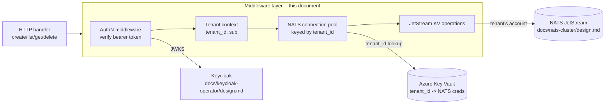
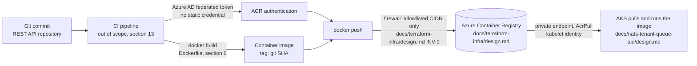

# Tenant AuthN/AuthZ and NATS middleware (Go)

> **Status:** Proposed for review

**Extraction, not a new component.** `docs/nats-tenant-queue-api/design.md` (section 4, Components and responsibilities) already specifies a Go REST API service that bundles HTTP handling, OIDC token verification, and JetStream KV operations into one binary. This document takes two of that service's components, the AuthN/AuthZ middleware and the per-tenant NATS connection pool, plus the JetStream KV operations they gate, and specifies them as one focused Go middleware layer, in enough detail to build and review on its own. It introduces no new system behavior, no new invariant, and no new component the parent design does not already assume; where this document restates an invariant or acceptance criterion from the parent design, it keeps that ID (`INV-1` through `INV-4` below are the same rules, not new ones). It also specifies how the binary this layer lives inside is packaged into a container image and published to the Azure Container Registry `docs/terraform-infra/design.md` provisions (that document's section 4, Decisions), since AKS has nothing to pull and run until that packaging step exists.

## 1. Executive summary

Today `docs/nats-tenant-queue-api/design.md` describes this middleware only as two bullet points inside a larger system design: "AuthN/AuthZ middleware" and "Per-tenant NATS connection pool." Nobody can build or review it from that alone, since it has no function signatures, no defined failure states, and no test plan of its own. This document fixes that: it specifies a Go middleware layer, sitting inside the same REST API binary, that verifies a Keycloak-issued OIDC bearer token, extracts and trusts only the token's verified `tenant_id` claim, resolves that tenant ID to NATS user credentials cached from Azure Key Vault, and executes JetStream Key-Value operations (create, list, get, delete) against that tenant's bucket. It is the one place in the whole system where a user's identity turns into a specific tenant's NATS connection, so a bug here is the highest-impact bug the system can ship. It also specifies the Dockerfile that packages that binary, the tag scheme, and the authenticated push to the Azure Container Registry (ACR) `docs/terraform-infra/design.md` provisions, so there is one documented, reproducible path from source code to a runnable image AKS can pull, rather than an ad hoc build step nobody has written down. The main downside carried over from the parent design: this document and `docs/nats-tenant-queue-api/design.md` describe the same rules from two angles, so a future change to one that is not mirrored in the other is a real risk (see Risks and tradeoffs).

## 2. Context and scope

There is no existing implementation; this is a design for new code inside a not-yet-built service. `docs/nats-tenant-queue-api/design.md` scopes the whole REST API service, including its HTTP routes, its request/response shapes, and its relationship to Keycloak, NATS, HUG, and Azure Key Vault at the system level. This document narrows to just the middleware layer inside that service: token verification, tenant claim extraction, NATS credential resolution and connection pooling, and the JetStream KV calls that implement create/list/get/delete once a tenant's connection is in hand. In scope: the Go interfaces and types this layer exposes to HTTP handlers, how it verifies tokens and caches JWKS, how it keys and expires pooled NATS connections, how it turns a CRUD call into a JetStream KV operation, and, as a distinct concern, how the REST API binary that hosts this layer is built into a container image (the Dockerfile, its base image, and its non-root runtime user) and published to the ACR instance `docs/terraform-infra/design.md` provisions (that document's Decisions and section 6). Out of scope: the HTTP route definitions and request/response JSON shapes (already fixed by `docs/nats-tenant-queue-api/design.md` section 6), Keycloak's own deployment (`docs/keycloak-operator/design.md`), the NATS cluster's deployment and Operator/Account bootstrap (`docs/nats-cluster/design.md`), the tenant-provisioning pipeline that creates NATS accounts and writes credentials to Key Vault (out of scope in both parent designs), and the CI/CD platform pipeline configuration that invokes the build and push described here (out of scope in `docs/terraform-infra/design.md` section 13 for the same reason: this document specifies what gets run, not the CI platform that runs it).

## 3. System context



The middleware layer sits entirely inside the REST API's own process, between the HTTP handler and the outside systems it talks to. It never accepts a network connection directly; HUG (`docs/haproxy-unified-gateway/design.md`) and the HTTP handler layer around this middleware are what the outside world reaches. The boundary this document must preserve, unchanged from `docs/nats-tenant-queue-api/design.md` section 3: this middleware is the only code in the system that holds NATS credentials, and it only ever resolves them from a token claim it has itself cryptographically verified, never from anything else the request carries.

## 4. Proposed design

### How it works

A user at tenant A calls `POST /v1/items` with `Authorization: Bearer <token>`. The HTTP handler calls the middleware chain before touching NATS at all. `AuthMiddleware` reads the bearer token, verifies its signature against Keycloak's JWKS (fetched once and cached, section 7), and rejects the request with `401` if the signature, issuer, or expiry do not check out. It then reads the `tenant_id` and `sub` claims from the now-trusted token payload; if `tenant_id` is missing, the request is rejected with `403` before anything else runs. The verified `tenant_id` is attached to the request's `context.Context`, not to a header or any other request-mutable location, so nothing downstream can override it. The handler calls into the middleware's NATS layer with that `context.Context`; `Pool.Get(ctx)` reads `tenant_id` back out of the context, checks its in-memory cache for an open connection for that tenant, and on a cache miss calls Key Vault to fetch that tenant's NATS user JWT and seed, opens a new `nats.Conn` authenticated as that tenant's account, and caches it with a TTL. `KVStore.Create(ctx, payload)` then generates a ULID, writes it to that tenant's JetStream KV bucket, waits for JetStream's acknowledgment, and returns the stored item to the handler, which serializes the `201` response. At no point after `AuthMiddleware` runs does any function accept a tenant ID as a parameter from outside `ctx`; every NATS-facing call derives it from the same verified context value the auth step set.

### How the image is built and published

A commit lands on the REST API's repository. CI checks out that commit and runs `docker build` against the Dockerfile in section 6, which compiles the Go binary in a builder stage and copies only the resulting static binary into a minimal, non-root final image; nothing else from the builder stage (the Go toolchain, module cache, source tree) reaches the final image. CI tags the resulting image with the short git commit SHA, an immutable identifier, then authenticates to the ACR instance from `docs/terraform-infra/design.md` using a short-lived Azure AD token obtained through its own federated identity (that document's Open questions), never a static registry username/password, and pushes the tagged image. ACR's firewall (`docs/terraform-infra/design.md` `INV-9`) only accepts this push if CI's runner is on the registry's CIDR allowlist; ACR's disabled admin user (`INV-11` in that document) means the push succeeds only because CI presents a valid, `AcrPush`-authorized Azure AD token, not because of network reachability alone. Once pushed, the image is pullable by AKS over ACR's private endpoint using the cluster's `AcrPull`-scoped kubelet identity, the same pull path `docs/terraform-infra/design.md` section 4 already establishes; deploying that specific image tag into the cluster (updating a Kubernetes Deployment's image reference) is a separate, out-of-scope step (section 13).



### Components and responsibilities

- **`AuthMiddleware` (Go `net/http` middleware).** Owns verifying the bearer token's signature, issuer, audience, and expiry against Keycloak's JWKS, and owns extracting `tenant_id` and `sub` from the verified claims into `context.Context`. Rejects any request with a missing, expired, or unverifiable token before calling the next handler. Does not own authorization beyond tenant scoping, and does not own JWKS fetching's HTTP transport details beyond calling into the JWKS cache (below).
- **JWKS cache.** Owns fetching and caching Keycloak's signing keys, with a bounded TTL (1 hour, matching `docs/nats-tenant-queue-api/design.md` section 7) and background refresh. Does not own token verification itself, only supplying the keys `AuthMiddleware` verifies against.
- **Health endpoints (`GET /healthz/live`, `GET /healthz/ready`).** Own reporting process liveness and JWKS-cache readiness to the Kubernetes probes `docs/rest-api-workload/design.md` configures against them (section 6). Do not check NATS or Key Vault reachability, and do not require a valid bearer token; both are unauthenticated by design, since a health check gating on the same auth path it is meant to detect failures in would be circular.
- **Tenant context helpers (`TenantIDFromContext`, `SubjectFromContext`).** Own the one sanctioned way to read a verified `tenant_id`/`sub` out of `context.Context`. Return an error (never a zero value that looks valid) if called on a context `AuthMiddleware` never populated, so a missing middleware step in a future handler fails loudly instead of silently resolving an empty tenant.
- **`Pool` (per-tenant NATS connection pool).** Owns caching one `*nats.Conn` per tenant, keyed strictly by the `tenant_id` read from `context.Context` (never a caller-supplied string), with a bounded TTL and a bounded max idle connection count. Does not own credential issuance or tenant provisioning; a cache miss is a read from Key Vault, not a write anywhere.
- **Key Vault credential fetcher.** Owns looking up a tenant's NATS user JWT and seed from Azure Key Vault by `tenant_id`, authenticated via Azure AD Workload Identity (no static credential in the process). Does not own caching (that is `Pool`'s job) and does not own what happens if the tenant has no entry (returns a typed "not provisioned" error, which the handler layer turns into `503`).
- **`KVStore` (JetStream KV operations).** Owns translating `Create`/`List`/`Get`/`Delete` calls into JetStream Key-Value operations against the tenant's bucket, obtained through `Pool`, including ULID generation for `Create` and JetStream acknowledgment before returning success. Does not own HTTP request/response shaping; it returns Go values and typed errors, which the HTTP handler layer (out of scope here) maps to status codes.
- **Dockerfile (container image build).** Owns compiling the REST API binary and assembling the minimal runtime image that ships it, including the choice of base image, the non-root runtime user, and what does and does not end up in the final image layer. Does not own CI orchestration (checkout, triggering, credential injection) and does not own the registry push itself.
- **Image publish step (CI-invoked, this document's build/push commands).** Owns tagging the built image and authenticating to ACR to push it, using a short-lived Azure AD token, never a static registry credential. Does not own provisioning the CI identity that token comes from (`docs/terraform-infra/design.md` Open questions) and does not own deploying the pushed tag into the cluster.

### Decisions

We implement this as a middleware layer and a set of Go packages inside the same REST API binary, not as a separate sidecar process or standalone service, matching `docs/nats-tenant-queue-api/design.md`'s "standalone application... deployed as its own Kubernetes Deployment" framing. A separate sidecar would add a network hop (and a second trust boundary to secure) between the HTTP handler and the code that holds NATS credentials, for no isolation benefit: both would run in the same Pod's trust domain either way. We keep the door open to extracting it later (see Open questions) if a second caller (for example, a background worker) ever needs the same tenant-resolution logic without going through HTTP.

We verify tokens with a cached JWKS client rather than calling Keycloak's introspection endpoint on every request. JWKS verification is a local signature check once the keys are cached, so it adds no per-request network call to Keycloak and keeps working (using the last-cached keys) through a brief Keycloak outage, matching the failure behavior `docs/nats-tenant-queue-api/design.md` section 7 already commits to. Introspection would give faster revocation, but this system has no token revocation requirement today, so we do not pay a per-request Keycloak round trip for it.

We carry `tenant_id` and `sub` on `context.Context`, set exactly once by `AuthMiddleware`, rather than as explicit function parameters threaded through every call, so that no downstream function signature can be called with a tenant ID that did not come from a verified token; a parameter-based design would let a future contributor pass a tenant ID computed some other way (a path segment, a header) by mistake, and the compiler would not catch it. The cost is that `context.Context` misuse is a runtime, not compile-time, failure mode; the typed accessor helpers (`TenantIDFromContext`) are how we bound that cost, by making "context never populated" fail loudly instead of silently.

We key the connection pool strictly by `tenant_id`, with entries evicted on a TTL, rather than keeping every tenant's connection open indefinitely. An unbounded pool means a compromised or buggy caller could exhaust file descriptors or NATS server connection limits by cycling through many tenants; a TTL bounds how long a stale credential (for example, one rotated in Key Vault after a security incident) stays live in a cached connection. The cost is a Key Vault round trip and a fresh NATS connection on every cache-expiry, which is why the TTL is a tunable, not a hardcoded constant (see Open questions).

We build a multi-stage image: a builder stage with the full Go toolchain compiles a statically linked binary, and a separate, minimal final stage (a distroless base, not a general-purpose Linux distribution) copies in only that binary. A single-stage build using a full Go or Debian-based image as the runtime image would ship a shell, a package manager, and every build tool into production, all of which are attack surface this process never needs at runtime and that a distroless base has no equivalent of. The cost is a marginally more complex Dockerfile and slightly harder ad hoc in-container debugging (no shell to `exec` into), which we accept since the middleware's trust boundary (section 8 of this document, and `docs/nats-tenant-queue-api/design.md` section 8) is already the highest-value target in the system, and a smaller image is a smaller thing to secure.

We run the container as a fixed, non-root numeric UID (the distroless `nonroot` variant's UID `65532`), not root. The process needs no privileged operation (no port below 1024, no host filesystem access, no capability beyond making outbound network calls), so running as root would grant nothing the process needs while raising the impact of a container-escape bug from "attacker has an unprivileged user's rights" to "attacker has root." This also satisfies the Kubernetes Pod Security Standards' "restricted" profile requirement of a non-root, non-privilege-escalating container, which the parent design's Deployment (`docs/nats-tenant-queue-api/design.md`) should apply once its manifests are written (out of scope here).

We tag every built image with its immutable short git commit SHA, and never push or deploy from a floating tag such as `latest`. A floating tag means the same tag can point at a different image tomorrow, so "what is actually running" stops being answerable from the Deployment manifest alone; a SHA-tagged image is unambiguous, and rolling back is choosing a prior tag rather than hoping a registry's mutable pointer still points where it used to. The cost is that every deploy needs its manifest updated with a new tag rather than relying on `imagePullPolicy: Always` against `latest`, which is a small, worthwhile amount of extra CI wiring (out of scope here, see `docs/terraform-infra/design.md` section 13) for the traceability it buys.

We authenticate the push to ACR with a short-lived Azure AD token from CI's own federated identity, matching `docs/terraform-infra/design.md`'s `INV-11` (ACR's admin user is disabled) and the no-static-credential stance this document already takes for Key Vault access (section 8). We reject embedding an ACR admin username/password, or a long-lived service principal client secret, in CI configuration or in this repository, for the same reason `docs/terraform-infra/design.md` rejects a static registry credential: a leaked long-lived secret is a standing compromise until manually rotated, while a leaked short-lived federated token expires on its own.

## 5. Invariants and requirements

### Invariants

These restate, at the component level, the same rules `docs/nats-tenant-queue-api/design.md` section 5 already states at the system level; they are not new rules, and keep the same IDs.

- `INV-1`: A request only ever reads, writes, or deletes data in the NATS account and KV bucket belonging to the `tenant_id` asserted by the cryptographically verified access token. `Pool.Get` and every `KVStore` method accept only a `context.Context`, never a tenant ID string parameter, so there is no call signature that could be handed a client-supplied tenant ID.
- `INV-2`: Every stored item has a server-generated ULID assigned at create time by `KVStore.Create`. No `KVStore` method accepts a caller-supplied item ID for create.
- `INV-3`: A pooled NATS connection or credential belonging to tenant X is never returned to a request whose verified `tenant_id` is not X, even when two goroutines call `Pool.Get` concurrently for different tenants (the pool's internal map is guarded by a mutex or `sync.Map` keyed by tenant ID; a cache-miss lookup for tenant Y never returns or blocks on tenant X's in-flight connection setup).
- `INV-4`: Tenant isolation is enforced at the tenant level, not the user level. `TenantIDFromContext` is the only tenant signal any `KVStore` method reads; `SubjectFromContext` (the user's `sub` claim) is available for audit logging only and is never passed to any NATS-facing call.
- `INV-5`: No NATS credential, Key Vault credential, ACR credential, or any other secret is ever baked into the Dockerfile, a build argument, or a container image layer. Every credential this process or its build needs is obtained at runtime (Workload Identity, section 8) or at push time (CI's federated Azure AD token) and is never present in the image itself.
- `INV-6`: The final container image runs as a fixed non-root, non-root-group user; no build produces or publishes an image whose default user is root or UID `0`.

### Requirements

- `AuthMiddleware` runs, and rejects invalid or missing tokens, before any code in this document performs a NATS or Key Vault call.
- `Pool.Get` and `KVStore` methods are safe for concurrent use by multiple goroutines handling different requests at once.
- Every `KVStore` write (`Create`, `Delete`) blocks until JetStream acknowledges it before returning to the caller.
- `List` results are paginated at the `KVStore` layer (a cursor and limit are required parameters, not optional ones), so no method in this layer can return an unbounded result set in one call.
- Every published image is tagged with the immutable short git commit SHA it was built from; no image is pushed or deployed under a floating tag such as `latest`.
- Building the same commit twice produces two images with identical application behavior (the Go module graph is pinned via `go.sum`, and the base image is pinned by digest, not a floating tag such as `:latest` or an unpinned minor version).

## 6. Interfaces and data

This document's interface is a set of Go types and function signatures, not an HTTP API (the HTTP surface itself is `docs/nats-tenant-queue-api/design.md` section 6), with one exception: this layer owns two unauthenticated health endpoints, since they report on state (the JWKS cache) that only this layer holds. `docs/rest-api-workload/design.md`'s Deployment probes call these two paths directly:

- `GET /healthz/live` — liveness. Returns `200` as soon as the process's HTTP server is accepting connections; checks nothing else, and never returns non-`200` while the process is otherwise alive. A process wedged badly enough to fail this should be killed and restarted, not just marked not-ready.
- `GET /healthz/ready` — readiness. Returns `200` once the JWKS cache has completed at least one successful fetch (matching section 7's startup behavior exactly), `503` otherwise. Never checks NATS or Key Vault reachability: those are per-tenant, cache-miss-time dependencies (section 7), not a precondition for accepting any traffic at all.

```go
// AuthMiddleware verifies the bearer token and attaches tenant_id/sub to ctx.
// Responds 401 (missing/invalid token) or 403 (valid token, no tenant_id claim)
// and does not call next if verification fails.
func AuthMiddleware(jwks JWKSClient) func(next http.Handler) http.Handler

func TenantIDFromContext(ctx context.Context) (string, error)
func SubjectFromContext(ctx context.Context) (string, error)

type Pool interface {
    // Get returns a cached or freshly opened *nats.Conn for the tenant_id
    // carried on ctx. Returns ErrTenantNotProvisioned on a Key Vault miss.
    Get(ctx context.Context) (*nats.Conn, error)
}

type KVStore interface {
    Create(ctx context.Context, payload json.RawMessage) (Item, error)
    List(ctx context.Context, cursor string, limit int) (items []ItemSummary, nextCursor string, err error)
    Get(ctx context.Context, id string) (Item, error)
    Delete(ctx context.Context, id string) error
}

type Item struct {
    ID        string          // server-generated ULID, INV-2
    CreatedAt time.Time
    Data      json.RawMessage
}
```

### Container image and publishing

```dockerfile
# syntax=docker/dockerfile:1

FROM golang:1.25-bookworm@sha256:<pin the exact digest at time of writing> AS build
WORKDIR /src
COPY go.mod go.sum ./
RUN go mod download
COPY . .
RUN CGO_ENABLED=0 GOOS=linux GOARCH=amd64 \
    go build -trimpath -ldflags="-s -w" -o /out/nats-auth-middleware ./cmd/nats-auth-middleware

FROM gcr.io/distroless/static-debian12:nonroot@sha256:<pin the exact digest at time of writing>
COPY --from=build /out/nats-auth-middleware /nats-auth-middleware
USER nonroot:nonroot
ENTRYPOINT ["/nats-auth-middleware"]
```

Both base images are pinned by digest, not by a floating tag, so a rebuild of the same commit does not silently pick up a new, unreviewed base image (Requirements). `CGO_ENABLED=0` produces a statically linked binary with no libc dependency, which is what makes running it on a distroless base (no libc, no shell) possible at all. Build and push, after CI has authenticated to Azure (`az login` with the federated token, out of scope here) and to the registry:

```console
az acr login --name <acr_name>   # exchanges the Azure AD token for registry auth, no password
IMAGE="<acr_login_server>/nats-auth-middleware:$(git rev-parse --short HEAD)"
docker build -t "$IMAGE" .
docker push "$IMAGE"
```

`<acr_login_server>` is the `acr_login_server` output from `docs/terraform-infra/design.md` section 6, resolved to ACR's public endpoint (reachable only from an allowlisted CIDR, that document's `INV-9`) when this runs outside the VNet, which is the normal case for a CI runner. The repository name `nats-auth-middleware` matches this document's own directory (`docs/nats-auth-middleware/`) and is the same name `docs/nats-tenant-queue-api/design.md`'s REST API Deployment references in its container image field (out of scope here, since that Deployment manifest belongs to the parent design).

### Naming and identity

- **Container image tag**: the short git commit SHA (`git rev-parse --short HEAD`) the image was built from, an immutable identifier never reused for a different image (Requirements). No image is ever pushed as `latest`. If a build needs re-running for the exact same commit (for example, a failed push retried), it produces a byte-identical image and pushes to the same tag, which ACR allows since the tag's content is unchanged.
- **Item ID**: a ULID generated inside `KVStore.Create`, never accepted as an input parameter (`INV-2`). If ULID generation fails, `Create` returns an error and performs no JetStream write, matching `docs/nats-tenant-queue-api/design.md` section 6.
- **Tenant ID**: read once, by `AuthMiddleware`, from the verified token's `tenant_id` claim, and carried only on `context.Context` for the lifetime of the request. No function in this layer re-derives it from stored data, a header, or a path segment. If the claim is absent, `AuthMiddleware` itself rejects the request; no code past that point ever runs with an empty or guessed tenant ID.
- **User ID**: the token's `sub` claim, available via `SubjectFromContext` for audit logging only; it never selects a NATS connection or a KV bucket (`INV-4`).

## 7. Failure behavior and lifecycle

- **Keycloak/JWKS unreachable**: the JWKS cache keeps serving its last-fetched keys up to a 1 hour TTL; `AuthMiddleware` keeps verifying tokens against them. If no cached keys exist yet (for example, on a cold start where the first fetch fails), `AuthMiddleware` returns `503` rather than accepting an unverifiable token.
- **Tenant not yet provisioned, or Key Vault miss**: `Pool.Get` returns `ErrTenantNotProvisioned`; the caller maps this to `503`. `KVStore` methods never attempt to create a bucket or account on the fly.
- **Azure Key Vault unavailable or throttled**: a tenant with an already-cached, unexpired connection in `Pool` is unaffected. A cache-miss lookup (new tenant, or a TTL-evicted entry) fails until Key Vault is reachable again; `Pool.Get` returns a typed error the caller maps to `503`.
- **NATS connection drops mid-call**: the in-flight `KVStore` call returns an error the caller maps to `502`. `Get`, `List`, and `Delete` are safe to retry as-is. A retried `Create` produces a second item with a new ULID, since `Create` only returns an ID after JetStream has acknowledged the write, so a client-side retry after a dropped connection cannot produce a duplicate-ID collision.
- **Concurrent `Pool.Get` calls for the same tenant on a cache miss**: only one goroutine performs the Key Vault fetch and NATS connect for that tenant; concurrent callers for the same tenant wait on that single in-flight setup rather than each opening a redundant connection (an in-flight, per-tenant `singleflight`-style guard inside `Pool`).
- **Startup**: the process does not report ready on `GET /healthz/ready` (section 6) — and so is not sent traffic, per `docs/nats-tenant-queue-api/design.md` section 7 — until the JWKS cache has completed at least one successful fetch. `GET /healthz/live` reports `200` from the moment the HTTP server starts listening, independent of JWKS state.
- **Shutdown**: `Pool` calls `Drain()` (not `Close()`) on every open `*nats.Conn` it holds, so in-flight JetStream writes flush before the process exits, matching `docs/nats-tenant-queue-api/design.md` section 7's 10-second termination grace period.
- **`docker build` fails** (a compile error, a `go.sum` mismatch, an unreachable module proxy): CI fails the build step and no image is tagged or pushed; the previously published tag from the last successful commit remains the newest available image, so a broken commit never overwrites a working one in the registry.
- **`docker push` rejected by ACR's firewall**: the CI runner's source IP is not on `acr_firewall_allowed_cidrs` (`docs/terraform-infra/design.md` `INV-9`); the push fails before authentication is even evaluated, and CI reports a network-level error, not an auth error, which is the fastest way to tell these two failure modes apart in practice.
- **`docker push` rejected by ACR authorization**: the CI runner's source IP is allowlisted but its Azure AD token lacks `AcrPush` on this registry (a misconfigured or expired federated credential); the push fails with an authorization error even though the network path succeeded. No image reaches the registry either way.
- **Push succeeds but the tag is never deployed**: pushing an image to ACR has no effect on what AKS is running until a separate, out-of-scope deployment step updates the cluster's Deployment manifest to reference the new tag; a pushed-but-undeployed image is inert.

## 8. Security, privacy, and operations

- **Trust boundary**: this middleware layer is the only code in the process holding NATS credentials or Key Vault access; HTTP handlers above it never see a NATS credential directly, they only call `Pool`/`KVStore` methods that accept a `context.Context`.
- **Authorization**: enforced exactly once, in `AuthMiddleware`, from the verified token's `tenant_id` claim (`INV-1`). No other function in this layer re-checks or re-derives authorization from request input.
- **Cloud credentials**: Key Vault access uses Azure AD Workload Identity; no Azure credential is embedded in this code, its build, or its container image.
- **Shared limits**: `Pool`'s max cached connection count and per-connection TTL are process-level limits protecting the REST API's own file descriptor budget and the NATS server's total connection count; at the cap, the least-recently-used entry is evicted (closed via `Drain()`, not a hard `Close()`) to make room for a new tenant's connection.
- **Operational dependency**: Key Vault is a hard dependency for any tenant not already cached in `Pool`; an outage degrades gracefully for already-cached tenants and fails closed (typed error, mapped to `503`) for everyone else, matching `docs/nats-tenant-queue-api/design.md` section 8.
- **Image trust boundary**: the published image is the artifact AKS actually runs, so a compromised build (a poisoned dependency, a tampered CI step) is as consequential as a compromised source repository. The image carries no embedded secret (`INV-5`) and runs as non-root (`INV-6`), so a container-escape or dependency-confusion bug starts from an unprivileged position rather than root with credentials in hand.
- **Registry push authorization**: pushing to ACR requires both network reachability (an allowlisted CI source IP, `docs/terraform-infra/design.md` `INV-9`) and a valid `AcrPush`-scoped Azure AD token from a short-lived federated credential (`INV-11` in that same document); no static registry username/password exists to leak, matching the no-static-credential stance this document already takes for Key Vault access.
- **Vulnerability scanning**: the base images pinned in section 6 should be scanned for known CVEs before each build (Microsoft Defender for Cloud's registry scanning, or a CI-integrated scanner such as Trivy, gating the push on the scan result) rather than assumed safe because they are minimal; a distroless base has a smaller surface than a full distribution, not a zero surface (see Open questions for the specific gating policy).

## 9. Acceptance criteria

- `AC-1`: A request with a valid Keycloak token and a resolvable `tenant_id` reaches `KVStore` with that exact `tenant_id` available via `TenantIDFromContext`, and no other value is reachable through any other code path in this layer.
- `AC-2`: A request with a valid token but no `tenant_id` claim is rejected by `AuthMiddleware` before `Pool.Get` or any `KVStore` method is called.
- `AC-3`: Under concurrent requests from two tenants, `Pool.Get` never returns a `*nats.Conn` opened for tenant A to a call whose context carries tenant B's `tenant_id` (`INV-3`).
- `AC-4`: Two concurrent cache-miss calls to `Pool.Get` for the same tenant result in exactly one Key Vault fetch and one NATS connection attempt, not two.
- `AC-5`: `KVStore.Create` called twice with the same payload (simulating a client retry after a dropped connection) produces two items with two distinct ULIDs, never a collision or a silently-deduplicated write.
- `AC-6`: Running the Dockerfile from section 6 against a clean checkout produces an image whose default user is the non-root `nonroot` user (`INV-6`), whose entrypoint runs the compiled binary directly with no shell, and which contains no `.env` file, credential, or build argument value anywhere in its layers (`INV-5`).
- `AC-7`: The image built and tagged per section 6 pushes successfully to the ACR instance from `docs/terraform-infra/design.md` when CI's source IP is allowlisted and its token carries `AcrPush`; the same push attempt fails, and no image reaches the registry, when either condition is not met (section 7).

## 10. Test approach

- Unit tests on `AuthMiddleware` cover valid tokens, expired tokens, bad signatures, and tokens missing `tenant_id`, asserting the exact status code and that `next` is never called on rejection (`INV-1`, `AC-2`).
- Unit tests on `Pool` use a fake Key Vault client and two tenants' fake credentials to prove cache keying, TTL eviction, and that a cache-miss for tenant B never returns tenant A's connection under concurrent calls (`INV-3`, `AC-3`), and that concurrent same-tenant misses collapse to one fetch (`AC-4`).
- Unit tests on `KVStore.Create` assert ULID generation happens exactly once per call, is never caller-supplied, and that two calls with identical payloads yield distinct IDs (`INV-2`, `AC-5`).
- An integration test runs `AuthMiddleware` in front of a real `http.Handler`, driven by tokens from a local Keycloak test realm plus an embedded/local NATS server with two provisioned tenant accounts, and proves `AC-1` end to end.
- A fault-injection test closes the NATS connection mid-call and asserts the documented error mapping and safe-retry behavior from section 7.
- A CI build step runs `docker build` against section 6's Dockerfile on every commit, failing the pipeline (and publishing nothing) on any compile error, proving the build-failure behavior in section 7.
- An image inspection step (`docker inspect` or an equivalent scripted check) run once per build asserts the resulting image's user is non-root and that its entrypoint has no shell in its process tree, proving `AC-6`.
- A scheduled or on-demand push test against a sandbox ACR instance proves `AC-7`'s two branches: a push from an allowlisted IP with a valid `AcrPush` token succeeds, and a push from either a non-allowlisted IP or with a token lacking `AcrPush` fails, mirroring the test approach `docs/terraform-infra/design.md` section 10 already uses for that registry's own `AC-8`.

## 11. Risks and tradeoffs

- This document and `docs/nats-tenant-queue-api/design.md` describe overlapping rules (`INV-1` through `INV-4` here restate that document's section 5) from two angles; a future edit to one that is not mirrored in the other is a real risk. Mitigation: treat this document as the implementation-level source of truth for the middleware's own interfaces and behavior, and the parent document as the system-level source of truth for the HTTP contract and cross-component boundaries; a reviewer changing either should check the other.
- Keeping this layer inside the same binary as the HTTP handlers (Decisions, section 4) means a future need to reuse tenant resolution from a non-HTTP caller (a background worker, a CLI tool) requires either importing this package directly or extracting it into its own module later; this document does not attempt to predict that need now (see Open questions).
- The connection pool's TTL and max-size values are a real tuning surface with no production traffic yet to tune them against; an initial value picked too small causes excess Key Vault/NATS reconnect churn, one picked too large keeps a rotated or revoked credential alive longer than intended.
- Pinning both base images by digest (Decisions, section 6) means a security fix in a newer base image build does not reach this image automatically; someone has to notice, re-pin the digest, and rebuild. An unpinned floating tag would pick up fixes automatically but also picks up unreviewed changes automatically, which is the tradeoff this document deliberately takes the other way (see Open questions for a scheduled re-pin cadence).
- This document specifies the Dockerfile and the build/push commands but not the CI platform that runs them (out of scope, section 13); until that platform-specific wiring exists, everything in this section is a specification with nothing yet exercising it end to end.

## 12. Open questions

- What TTL and max cached connection count should `Pool` use by default? Recommended default: 15 minute TTL, 500 max cached connections, both as process configuration (flags or environment variables), not hardcoded constants. Does not block starting work; revisit once real tenant counts and traffic are known.
- Which Go libraries implement JWKS fetching/caching and JWT verification, and JetStream KV access? Recommended default: `github.com/coreos/go-oidc` (or `github.com/lestrrat-go/jwx/v2`) for JWKS and token verification, and `github.com/nats-io/nats.go`'s `jetstream` package for KV operations, both widely used, actively maintained options with no known blocker for this design. Does not block starting work.
- Should this middleware layer be extracted into its own importable Go module now, ahead of any second caller actually needing it, or only once one exists? Recommended default: keep it as an internal package inside the REST API's module until a concrete second caller is identified, per the reasoning in Decisions. Does not block starting work.
- Should token verification also check a `sub`-level block list (for a disabled individual user) rather than relying entirely on Keycloak to stop issuing tokens to disabled users? Recommended default: rely on Keycloak (a disabled user cannot obtain a new token, and existing tokens expire within the JWKS/token TTL window) and revisit only if a faster individual-user revocation requirement emerges. Does not block starting work.
- Which vulnerability scanner gates the push, and what severity threshold blocks it? Recommended default: Trivy as a CI step, blocking the push on any `CRITICAL` finding with no available fix and warning (not blocking) on `HIGH`, revisited once real findings volume is known. Does not block starting work.
- Who owns re-pinning the base image digests in section 6 when a security fix lands upstream, and on what cadence? Recommended default: a scheduled (weekly) CI job that checks for a newer digest of the same tag and opens a pull request, reviewed like any other dependency bump, rather than a manual, easy-to-forget process. Does not block starting work.
- Should the image also be signed (for example with `cosign`) and carry a generated SBOM, so a deploy step could verify provenance before pulling? Recommended default: not for the first version of this pipeline; add signing once a second, independent verification step (an admission controller, or a deploy-time gate) actually consumes it, since a signature nobody checks adds process without adding security. Does not block starting work.
- Which CI platform runs the build and push commands in section 6, and how is its federated Azure AD identity provisioned? Recommended default: this is the same open question `docs/terraform-infra/design.md` section 12 already tracks (the CI/CD identity with `AcrPush`); this document does not duplicate it, only consumes its outcome. Blocks the first real push, not this document's own specification work.

## 13. Out of scope

- HTTP route definitions, request/response JSON shapes, and status code mapping beyond what section 7 states about error-to-status mapping (`docs/nats-tenant-queue-api/design.md` section 6 owns the full HTTP contract).
- Keycloak's own deployment, realm configuration, and the `tenant_id` protocol mapper (`docs/keycloak-operator/design.md`; `docs/nats-tenant-queue-api/design.md` section 6, Naming and identity).
- The NATS cluster's deployment, Operator/Account/JWT-resolver bootstrap, and per-tenant Account/bucket provisioning (`docs/nats-cluster/design.md`).
- The tenant-provisioning pipeline that creates a tenant's NATS account, bucket, and Key Vault credential entry (out of scope in both `docs/nats-tenant-queue-api/design.md` section 13 and `docs/nats-cluster/design.md` section 9).
- Rate limiting, per-tenant storage quotas, and other request-shaping concerns above this middleware layer (`docs/nats-tenant-queue-api/design.md` section 8).
- Extracting this layer into a standalone Go module or a separate service (see Open questions).
- The CI/CD platform configuration that invokes the build and push commands in section 6 (which CI product, its trigger conditions, its pipeline YAML), and provisioning the federated Azure AD identity with `AcrPush` that authenticates the push (both out of scope in `docs/terraform-infra/design.md` section 13 and its Open questions; this document only specifies what that identity must be able to do).
- Deploying a pushed image tag into the AKS cluster (updating the Deployment manifest's image reference); this document stops at the image existing in ACR, pullable.
- Image signing, SBOM generation, and provenance attestation (see Open questions).
- Provisioning or configuring the vulnerability scanner referenced in section 8 and its exact severity gating policy (see Open questions).
