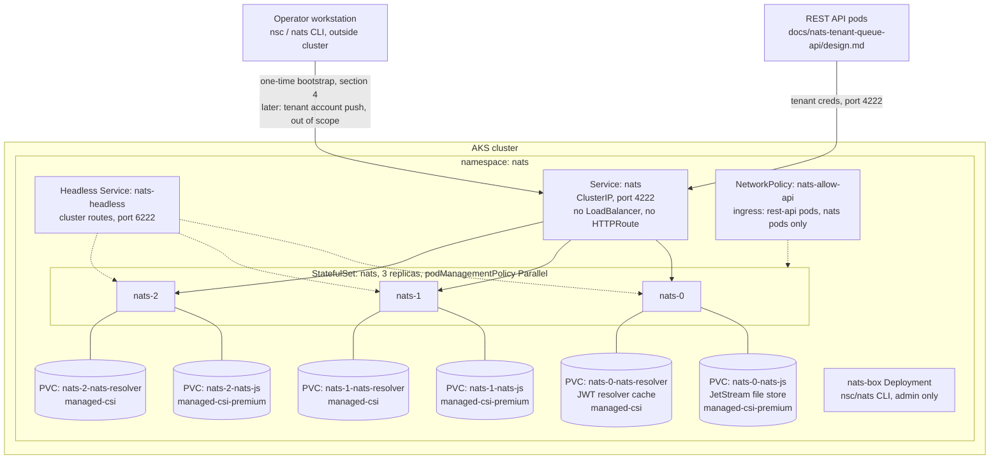

# Deploying NATS on AKS via Helm (`nats/nats` chart)

> **Status:** Implementation guide — companion to `docs/nats-tenant-queue-api/design.md` (section 4, which specifies an in-cluster NATS cluster with JetStream and per-tenant NATS Accounts as the isolation boundary) and `docs/terraform-infra/design.md` (which provisions the AKS cluster this chart deploys into, but stops before any Helm release — its own section 13, "Out of scope"). **This is a POC configuration**, matching `docs/haproxy-unified-gateway/design.md` section 9 and `docs/keycloak-operator/design.md`'s status banner: no TLS on any NATS protocol port, and cluster route authentication is a shared username/password rather than mTLS.

## 1. Purpose and scope

`docs/nats-tenant-queue-api/design.md` assumes a NATS cluster is already running in-cluster, reachable only from the REST API's pods, with JetStream enabled and hard tenant isolation enforced by the NATS server itself through per-tenant Accounts (its section 4, Decisions: "isolation is enforced by the NATS server itself; a coding bug in tenant resolution can, at worst, cause the API to fail to find credentials"). `docs/terraform-infra/design.md` provisions the AKS cluster and stops at the point where Helm takes over; it creates no NATS namespace, no storage class beyond what AKS ships by default, and no Operator/Account/User identity for NATS. This document is the missing implementation step: installing the official `nats/nats` Helm chart ([Artifact Hub](https://artifacthub.io/packages/helm/nats/nats), [source](https://github.com/nats-io/k8s/tree/main/helm/charts/nats)) as a clustered, JetStream-enabled StatefulSet backed by Azure Managed Disks, and bootstrapping the NATS Operator/SYS-account/JWT-resolver identity hierarchy that per-tenant Accounts (`docs/nats-tenant-queue-api/design.md` section 4) depend on to exist before any tenant can be provisioned.

In scope: the one-time `nsc`-driven bootstrap of the NATS Operator, its SYS account, and the built-in JWT resolver's preload data; the chart's `values.yaml` overrides for clustering, JetStream, and the resolver on AKS; the resulting Helmfile-driven install/upgrade workflow; Azure Disk storage class selection for the two PVCs the chart creates (JetStream file store, resolver JWT cache); and a `NetworkPolicy` restricting inbound access to the NATS pods to only the REST API's pod selector and NATS's own inter-node traffic, per `docs/nats-tenant-queue-api/design.md` section 8. Out of scope: provisioning the AKS cluster and its default storage classes (`docs/terraform-infra/design.md`), creating per-tenant NATS Accounts, their JetStream KV buckets, and writing their credentials to Azure Key Vault (`docs/nats-tenant-queue-api/design.md` section 13 already tracks this as its own tenant-provisioning workstream — section 9 below only describes the boundary this document hands off to it), the REST API's own connection-pool code, and TLS for any NATS protocol port (POC scope, per the status banner above).

## 2. Prerequisites

- An AKS cluster with `kubectl` context pointed at it (`docs/terraform-infra/design.md`, `modules/aks`) and its default Azure Disk CSI storage classes available (`managed-csi`, `managed-csi-premium`) — this document does not provision a custom `StorageClass`, it selects from what AKS ships out of the box (see section 6). AKS node VM size bounds how many Azure Managed Disks a node can attach, which in turn bounds how many NATS pods (each with two PVCs, section 3) a single node can host; `docs/terraform-infra/design.md` section 12 leaves the production node VM size an open question, recommending `Standard_D4s_v5` as a starting default — carry that same constraint forward here rather than re-deciding it.
- Helm **3.7+**, [Helmfile](https://github.com/helmfile/helmfile) **0.150+** with the `helm-diff` plugin — the same floor `docs/haproxy-unified-gateway/design.md` section 2 and `docs/keycloak-operator/design.md` section 2 already set.
- [`nsc`](https://github.com/nats-io/nsc) **v2.15.0** and the [NATS CLI](https://github.com/nats-io/natscli) (`nats`) **v0.4.0**, installed on the operator's own workstation, not in the cluster — both are used once, in section 4, to bootstrap the Operator/SYS-account identity; re-check their release pages before following these steps against a newer version, since `nsc generate config` output has changed shape across major `nsc` versions before.
- Chart version pinned in this document: **2.14.5** (`nats/nats`, `appVersion: 2.14.5`, server image `nats:2.14.5-alpine`, current at time of writing per the chart's own `Chart.yaml`). Re-check `helm search repo nats/nats --versions` before following these steps against a newer release.

## 3. Architecture on AKS



Users never reach NATS directly, matching `docs/nats-tenant-queue-api/design.md` section 3 ("Users never connect to NATS or Keycloak's admin interface directly"): the chart's `Service` stays its default `ClusterIP` (`service.enabled: true`, no `LoadBalancer` type override), no HUG `Gateway`/`HTTPRoute` targets it (`docs/haproxy-unified-gateway/design.md` routes only `/v1/*` and `/auth/*`), and the `NetworkPolicy` in section 8 restricts even in-cluster reachability to the REST API's pod selector plus NATS's own inter-node cluster-route traffic. Each pod carries two PVCs: the JetStream file store (`config.jetstream.fileStore.pvc`, defaults to name `<fullname>-js`) holding every tenant's JetStream KV bucket data, and the resolver directory (`config.resolver.pvc`, defaults to name `<fullname>-resolver`) holding the cached account JWTs the built-in resolver serves once section 4's bootstrap and the (out-of-scope) tenant-provisioning workstream have pushed them. `nats-box` is the chart's own admin/debug pod (`natsBox.enabled`), used to run `nats`/`nsc` commands from inside the cluster's network when needed; it is not part of any request path.

## 4. Bootstrap the Operator, SYS account, and JWT resolver

`docs/nats-tenant-queue-api/design.md` chose NATS Accounts, not a shared account with a subject-prefix convention, specifically so isolation is "enforced by the NATS server itself" rather than by API code (its section 4, Decisions). The mechanism that gives NATS server-enforced, dynamically-provisionable Accounts is its Operator/Account/User JWT hierarchy served through the built-in **full resolver** — a directory-backed JWT cache the server consults on every connection — not the chart's `config.merge.accounts` shorthand (a fixed, statically-declared account/user list baked into `values.yaml`, unsuitable for onboarding tenants without a chart upgrade for each one). The server cannot start in this mode without an Operator JWT and a System (`SYS`) account already defined, so that identity hierarchy has to exist before the first `helmfile apply` in section 7, on the bootstrapping operator's own workstation, never inside the cluster:

```console
nsc add operator --generate-signing-key natssaas
nsc add account SYS
nsc edit operator --system-account SYS
nsc add user -a SYS sys
nsc generate config --nats-resolver --sys-account SYS -o resolver.conf
```

`nsc generate config --nats-resolver` emits a ready-to-use NATS server config fragment: the Operator JWT (`operator: <JWT>`), the `SYS` account's public key (`system_account: <pubkey>`), a `resolver: { type: full, dir: ..., allow_delete: false, interval: "2m", limit: 1000 }` block, and a `resolver_preload: { <SYS pubkey>: <SYS JWT> }` entry — the last of which matters specifically because the resolver's PVC starts empty on first boot, and without a preloaded `SYS` JWT the server has no way to validate its own system account until something pushes one. Only two pieces of `resolver.conf` get carried into the chart's values in section 6: everything except `resolver.dir` (already set by `config.resolver.dir`, section 6) and `listen` (the chart derives the listen port from `config.nats.port` and its own container/Service wiring, and setting it again in `config.merge` would conflict). Paste the rest — `operator`, `system_account`, `resolver` (merged so it *extends* `config.resolver.dir` rather than replacing it — see section 6), and `resolver_preload` — into `config.merge` verbatim; the chart's own documented merge semantics (`values.yaml`'s `config.merge`/`config.patch` comment block) pass through any key with no dedicated `values.yaml` field unchanged, which is exactly what `operator`, `system_account`, and `resolver_preload` are here.

**What stays outside the cluster.** The Operator's own signing keys (the `.nk` seed files `nsc` manages under its local `~/.nsc`/`~/.local/share/nats/nsc` working directory) are the one credential in this whole system that can mint a new, trusted Account from nothing — they never enter the cluster, never go into a `values.yaml`, and are not what section 6 pastes in; only the Operator's JWT (public, self-verifying, safe to embed in a ConfigMap) and the `SYS` account's JWT (same) do. This is a stricter version of the same reasoning `docs/terraform-infra/design.md` applies to Key Vault's own credential (`INV-3`, no static credential in a `.tf` file) and `docs/keycloak-operator/design.md` applies to Keycloak's database password (Key Vault + Workload Identity, never a pod spec) — here there is no chart-native place to put it at all, because the JWT hierarchy is designed to keep the signing material off every machine except the one(s) an operator explicitly trusts. Where that `nsc` working directory itself is backed up, so a lost workstation does not mean losing the ability to ever sign a new tenant Account again, is called out as an open question (section 14 of `docs/nats-tenant-queue-api/design.md` already tracks the tenant-provisioning workstream this decision blocks; this document adds the operator-identity-backup half of that same open question).

Creating the actual per-tenant Accounts (`nsc add account <tenant>`, generating their JetStream KV bucket, and pushing the tenant's Account JWT and User credentials to this resolver and to Azure Key Vault) is the tenant-provisioning workstream `docs/nats-tenant-queue-api/design.md` section 13 already lists as out of scope for that design — this document's bootstrap only gets the server far enough (an Operator and a `SYS` account it trusts) for that later workstream to have something to push against (see section 9).

## 5. Declare the release with Helmfile

Following the same pattern `docs/haproxy-unified-gateway/design.md` section 4 and `docs/keycloak-operator/design.md` section 6 already use — one `helmfile diff` previews every object before anything changes, and `helm history`/`helm rollback` give this release a revision trail a one-off `helm install` never would:

```yaml
# helmfile.yaml
repositories:
  - name: nats
    url: https://nats-io.github.io/k8s/helm/charts/

releases:
  - name: nats
    namespace: nats
    createNamespace: true
    chart: nats/nats
    version: 2.14.5
    values:
      - values-nats-aks.yaml
```

```console
helmfile repos
helm search repo nats/nats --versions
```

## 6. `values.yaml` overrides for AKS

Every key below is a real key from the chart's `values.yaml` ([source](https://github.com/nats-io/k8s/blob/main/helm/charts/nats/values.yaml)); nothing here is invented. Save as `values-nats-aks.yaml`, with the `operator`/`system_account`/`resolver`/`resolver_preload` block from section 4's `resolver.conf` pasted into `config.merge` where marked:

```yaml
# values-nats-aks.yaml
config:
  cluster:
    enabled: true
    replicas: 3          # must be 2+ when jetstream is enabled; matches
                          # docs/nats-tenant-queue-api/design.md's open-questions
                          # recommended default of 3 JetStream stream replicas —
                          # a stream cannot have more replicas than server nodes
    routeURLs:
      user: "route-user"           # POC: shared route auth, not TLS (status banner)
      password: "<generate — store like any other credential, section 8>"

  jetstream:
    enabled: true
    fileStore:
      enabled: true
      pvc:
        enabled: true
        size: 50Gi                  # starting default across all tenants sharing
                                     # this store; revisit per docs/nats-tenant-queue-api/
                                     # design.md section 12's per-tenant quota question
        storageClassName: managed-csi-premium   # AKS built-in Azure Disk Premium SSD

  resolver:
    enabled: true                   # built-in full resolver, not config.merge.accounts —
                                     # see section 4 for why
    dir: /data/resolver
    pvc:
      enabled: true
      size: 1Gi
      storageClassName: managed-csi   # small, low-IOPS JWT cache; Standard SSD is enough

  monitor:
    enabled: true                   # cluster-internal only; no Service port exposed
                                     # (service.ports.monitor.enabled stays false, default)

  # operator, system_account, resolver (extends config.resolver.dir above with
  # type/allow_delete/interval/limit), and resolver_preload — pasted verbatim
  # from section 4's `nsc generate config --nats-resolver` output, minus its
  # `listen` line and its `resolver.dir` line (both already set above)
  merge:
    operator: "<Operator JWT from resolver.conf>"
    system_account: "<SYS account public key from resolver.conf>"
    resolver:
      type: full
      allow_delete: false
      interval: "2m"
      limit: 1000
    resolver_preload:
      "<SYS account public key>": "<SYS account JWT>"

container:
  resources:
    requests:
      cpu: 500m
      memory: 1Gi
    limits:
      memory: 2Gi          # no CPU limit: JetStream fsync/compaction bursts
                            # should not be throttled mid-write

service:
  ports:
    leafnodes:
      enabled: false        # unused by docs/nats-tenant-queue-api/design.md
    websocket:
      enabled: false        # unused — clients only ever reach the REST API,
    mqtt:                    # never NATS itself
      enabled: false

podDisruptionBudget:
  enabled: true              # chart default: maxUnavailable: 1 (source:
                              # files/pod-disruption-budget.yaml) — tolerates
                              # exactly one voluntary disruption at a time
                              # across the 3-node cluster

podTemplate:
  topologySpreadConstraints:
    kubernetes.io/hostname:
      maxSkew: 1
      whenUnsatisfiable: DoNotSchedule   # 3 replicas across 3 distinct nodes;
                                          # AKS's managed-csi* storage classes
                                          # default to WaitForFirstConsumer, so
                                          # each pod's PVCs bind in whichever
                                          # zone/node it actually lands on

natsBox:
  enabled: true            # admin/debug pod; not part of any request path
```

`config.cluster.tls.enabled` and `config.nats.tls.enabled` both stay at their chart defaults (`false`) for this POC, matching the status banner: cluster routes authenticate with the shared username/password above (`config.cluster.routeURLs`), and client connections authenticate with per-tenant NATS User credentials (JWT-based, once section 9's tenant-provisioning workstream issues them) rather than with TLS client certificates. `service.ports.nats.enabled` stays at its chart default (`true`); no other service change is needed to keep the `Service` a plain `ClusterIP` — the chart never sets `type: LoadBalancer` unless a values override asks for it, and this file does not.

## 7. Install the chart

```console
helmfile diff
helmfile apply

kubectl get pods -n nats -l app.kubernetes.io/instance=nats
kubectl get pvc -n nats
kubectl get statefulset nats -n nats
kubectl exec -n nats nats-box-<pod-suffix> -- nats server list --context default
```

A healthy 3-node cluster shows all three `nats-N` pods `Running` and `1/1 Ready` — `readinessProbe` (`/healthz?js-server-only=true`, chart default) only turns green once JetStream itself is up, not just the process — and `nats server list` from the `nats-box` pod reports three cluster members that agree on the same cluster name. `kubectl get pvc -n nats` shows six PVCs total (three `*-js`, three `*-resolver`, section 3), each `Bound` to an Azure Disk of the storage class configured in section 6.

## 8. Restrict network access — `NetworkPolicy`

The chart has no built-in `NetworkPolicy` resource (absent from its `values.yaml`, unlike `podDisruptionBudget` or `serviceAccount`); its own `extraResources` extension point — "add arbitrary user-generated resources" ([source](https://github.com/nats-io/k8s/blob/main/helm/charts/nats/values.yaml), bottom of file) — is what adds one, folded into this same release rather than a second local chart (unlike `docs/haproxy-unified-gateway/design.md`'s `hug-app` or `docs/keycloak-operator/design.md`'s `keycloak-app`, which each needed several coordinated Gateway API/Operator objects; this document needs exactly one extra object). Append to `values-nats-aks.yaml`:

```yaml
# values-nats-aks.yaml — appended
extraResources:
  - apiVersion: networking.k8s.io/v1
    kind: NetworkPolicy
    metadata:
      name:
        $tplYaml: >
          {{ include "nats.fullname" $ | quote }}
      namespace:
        $tplYaml: >
          {{ include "nats.namespace" $ | quote }}
      labels:
        $tplYaml: |
          {{ include "nats.labels" $ }}
    spec:
      podSelector:
        $tplYaml: |
          {{ include "nats.selectorLabels" $ | toYaml }}
      policyTypes:
        - Ingress
      ingress:
        - from:
            - podSelector:
                $tplYaml: |
                  {{ include "nats.selectorLabels" $ | toYaml }}
          ports:
            - port: 6222   # cluster routes — NATS pods to each other only
        - from:
            - namespaceSelector:
                matchLabels:
                  kubernetes.io/metadata.name: nats-saas-api   # REST API's namespace,
                                                                 # docs/nats-tenant-queue-api/design.md
              podSelector:
                matchLabels:
                  app: rest-api
          ports:
            - port: 4222   # client connections — REST API pods only
```

This is the same `$tplYaml`/`include` pattern the chart's own `values.yaml` comment documents for `extraResources` (its worked example templates a `VirtualService` name and labels the identical way); `nats.selectorLabels` and `nats.namespace` are the chart's own named templates, so this policy's selector always matches whatever labels the StatefulSet's pods actually carry, even across a chart upgrade that changes them. No other in-cluster workload — not `nats-box`, not a future unrelated Deployment — can reach either NATS port after this applies; `nats-box` still works because it lives in the same pod-selector-exempt admin path only via `kubectl exec` (never a network connection subject to this policy) for the commands in section 7. Re-run `helmfile apply` to add this policy to an already-running cluster; it is additive to everything in section 6, not a replacement values file.

## 9. Tenant onboarding — the boundary this document hands off

`docs/nats-tenant-queue-api/design.md` section 13 already scopes "Tenant self-service signup and the automated NATS account/credential/Keycloak-user provisioning pipeline" as its own, separate workstream. What this document's bootstrap (section 4) and install (sections 5-7) leave ready for that workstream: an Operator and `SYS` account the resolver already trusts, a `resolver` block configured to accept pushed Account JWTs (`allow_delete: false` — a tenant Account, once pushed, cannot be removed by a later push without a separate delete operation, a deliberate safety default from `nsc generate config` itself, not something this document overrides), and a `NetworkPolicy` (section 8) that already permits the REST API's pods, but nothing else in-cluster, to open client connections once tenant User credentials exist. Creating a tenant's Account (`nsc add account <tenant>`, `nsc add user -a <tenant> ...`), its JetStream KV bucket, and pushing both to this resolver (`nsc push -A`, authenticated as an identity the Operator's signing key trusts) and to Azure Key Vault (the REST API's own credential lookup path, `docs/nats-tenant-queue-api/design.md` section 4) is exactly that separate workstream's job, not this document's.

## 10. Scaling and availability

- `config.cluster.replicas: 3` is the floor for a JetStream cluster to tolerate one node loss without losing quorum on any Raft-replicated resource (streams, KV buckets, and the resolver's own JWT store, all use the same underlying replication); it is also the ceiling on how many replicas any individual tenant's JetStream KV bucket can request, matching `docs/nats-tenant-queue-api/design.md` section 12's own recommended default of 3 stream replicas for production tenants — that default cannot be raised without also raising this value.
- `podDisruptionBudget.enabled: true` (chart default `maxUnavailable: 1`, section 6) means a voluntary disruption (node drain, cluster upgrade) can only ever take one of the three pods down at a time, so JetStream quorum survives any single planned disruption; two simultaneous voluntary disruptions are blocked by the budget itself, not merely discouraged.
- `podTemplate.topologySpreadConstraints` with `whenUnsatisfiable: DoNotSchedule` (section 6) is a hard requirement, not a preference: with only 3 replicas and `maxSkew: 1`, the scheduler refuses to place two `nats-N` pods on the same node rather than silently degrading to a same-node placement that would turn one node failure into a quorum loss instead of a tolerated single-node event.
- Scaling the cluster itself (beyond 3) is a `helmfile apply` with a higher `config.cluster.replicas`; scaling storage per pod (the `10Gi`/`50Gi` file-store PVC) is not live-resizable through this chart once created (`volumeClaimTemplates` on an existing `StatefulSet` cannot be edited via `kubectl apply`/`helm upgrade` — a Kubernetes-level restriction, not a chart one), so the JetStream file-store size in section 6 should be set with headroom rather than tuned tightly, revisited before it becomes a binding constraint.

## 11. Upgrade and rollback

```console
helmfile diff
helmfile apply

helm history nats -n nats
helm rollback nats <REVISION> -n nats
```

`helmfile apply` runs `helm upgrade --install`, which for a `StatefulSet` performs a rolling update one pod at a time (`podManagementPolicy: Parallel` governs initial creation and scale-out, not the update strategy, which stays the `StatefulSet` default `RollingUpdate`) — each `nats-N` pod restarts in turn, and JetStream quorum survives as long as the `PodDisruptionBudget` (section 10) is respected, which the rolling update itself already does by construction. `helm rollback` reverts every chart-managed object (the `StatefulSet`, its `Service`s, `ConfigMap`, `PodDisruptionBudget`, and the `NetworkPolicy` from section 8) to a prior revision, but not the PVCs' own contents: JetStream data written between the old and new revision, and any Account JWTs the resolver's PVC accumulated via `nsc push` in the meantime (section 9), are unaffected by a `StatefulSet` rollback either way, since neither is stored in a chart-managed Kubernetes object. One AKS-specific note absent from `docs/haproxy-unified-gateway/design.md`'s equivalent section: `storageClassName` on an existing PVC is immutable, so changing `managed-csi-premium` to a different storage class in section 6 after the fact needs a new PVC and a JetStream-level data migration (`nats stream backup`/`restore`, or standing up a fresh cluster and replicating in), not a `helm upgrade`.

## 12. Uninstall

```console
helmfile destroy
kubectl get pvc -n nats     # PVCs survive; StatefulSet PVC deletion is opt-in, not automatic
kubectl delete pvc -n nats -l app.kubernetes.io/instance=nats   # only for a full, data-destroying teardown
```

`helmfile destroy` runs `helm uninstall`, removing the `StatefulSet`, `Service`s, `ConfigMap`, `PodDisruptionBudget`, `NetworkPolicy` (section 8), and `nats-box` `Deployment` — but, matching standard Kubernetes `StatefulSet` behavior (not a chart-specific choice), it never deletes the `volumeClaimTemplates`-generated PVCs, so every tenant's JetStream data and the resolver's cached Account JWTs survive a `helmfile destroy` by default; deleting them is a separate, explicit `kubectl delete pvc` a reinstall does not require. The Operator's own signing keys (section 4) live entirely outside this cluster and are unaffected by any of the above either way — losing this cluster's PVCs loses data and pushed JWTs, but not the ability to re-bootstrap a fresh resolver and re-push accounts from the same `nsc` identity.

## 13. Troubleshooting

- **`resolver` rejects every connection, including from `nats-box`**: the resolver's PVC starts empty on first boot; if `resolver_preload` (section 6) is missing or does not contain the `SYS` account's own JWT, the server cannot validate its own system account, and `nats server list` fails even from inside the cluster. Re-run `nsc generate config --nats-resolver --sys-account SYS -o resolver.conf` (section 4) and diff its `resolver_preload` block against what is actually in `config.merge`.
- **Pod stuck `Pending`, event mentions volume node affinity conflict**: AKS's `managed-csi*` storage classes default to `volumeBindingMode: WaitForFirstConsumer`, so a PVC only picks its zone once its pod is scheduled — if the `topologySpreadConstraints` from section 6 force a pod onto a node in a zone where an *existing* sibling PVC from an earlier, differently-zoned attempt already bound, the two conflict. Delete the orphaned PVC (only if it holds no data worth keeping) and let the `StatefulSet` recreate it against the newly scheduled pod's actual zone.
- **Cluster forms but a stream/KV bucket refuses to reach quorum**: `config.cluster.replicas` (server node count) is the ceiling on any individual stream's `replicas` setting (section 10); a tenant Account/bucket requesting more replicas than the cluster has nodes never reaches quorum, and this is invisible in `kubectl get statefulset` since the *server* cluster itself is healthy — check `nats stream info <name>` for its own reported replica count against `config.cluster.replicas`.
- **`extraResources`' `NetworkPolicy` (section 8) blocks the REST API even though its `podSelector` looks right**: `kubernetes.io/metadata.name` is only auto-populated by Kubernetes 1.21+ (present on any AKS version this document targets, section 2) — confirm the REST API's actual namespace label with `kubectl get ns nats-saas-api --show-labels` before assuming the policy's `namespaceSelector` is the bug; a mismatched `app: rest-api` pod label on the API's own Deployment is the more common cause in practice.
- **`helm upgrade` hangs mid-rollout**: a `StatefulSet` rolling update waits for each `nats-N` pod's readiness probe (`/healthz?js-server-only=true`) before proceeding to the next; a pod that never becomes ready (commonly a JetStream file-store PVC that failed to reattach after a node drain) blocks every pod after it in the roll — `kubectl describe pod nats-N -n nats` and `kubectl get events -n nats` before assuming the chart or the new version is at fault.

## 14. References

- [NATS Helm chart — Artifact Hub](https://artifacthub.io/packages/helm/nats/nats)
- [nats-io/k8s — `helm/charts/nats` source, `values.yaml`, chart templates](https://github.com/nats-io/k8s/tree/main/helm/charts/nats)
- [NATS docs — JetStream clustering](https://docs.nats.io/running-a-nats-service/configuration/clustering/jetstream_clustering)
- [NATS docs — JWT-based account resolvers](https://docs.nats.io/running-a-nats-service/configuration/securing_nats/auth_intro/jwt/resolver)
- [nats-io/nsc — Operator/Account/User JWT tooling](https://github.com/nats-io/nsc)
- [nats-io/natscli — the `nats` CLI](https://github.com/nats-io/natscli)
- [Storage options for applications in AKS — Microsoft Learn](https://learn.microsoft.com/en-us/azure/aks/concepts-storage)
- [Helmfile](https://github.com/helmfile/helmfile) — declarative `helm` release management; this document's release is driven the same way `docs/haproxy-unified-gateway/design.md` section 4 and `docs/keycloak-operator/design.md` section 6 drive theirs
- `docs/nats-tenant-queue-api/design.md` — parent system design; section 4 specifies NATS Accounts + JetStream as the isolation boundary, section 13 tracks the tenant-provisioning workstream this document hands off to (section 9)
- `docs/terraform-infra/design.md` — AKS cluster and default Azure Disk storage classes this document builds on
