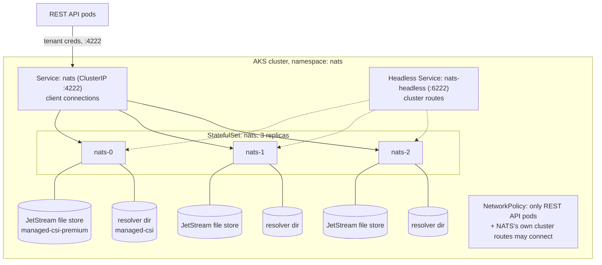
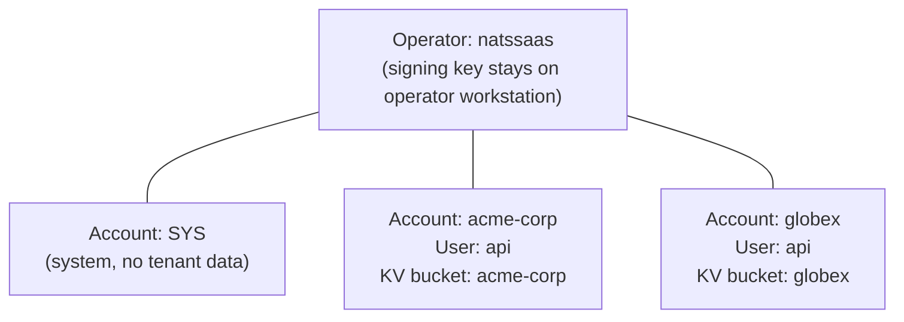
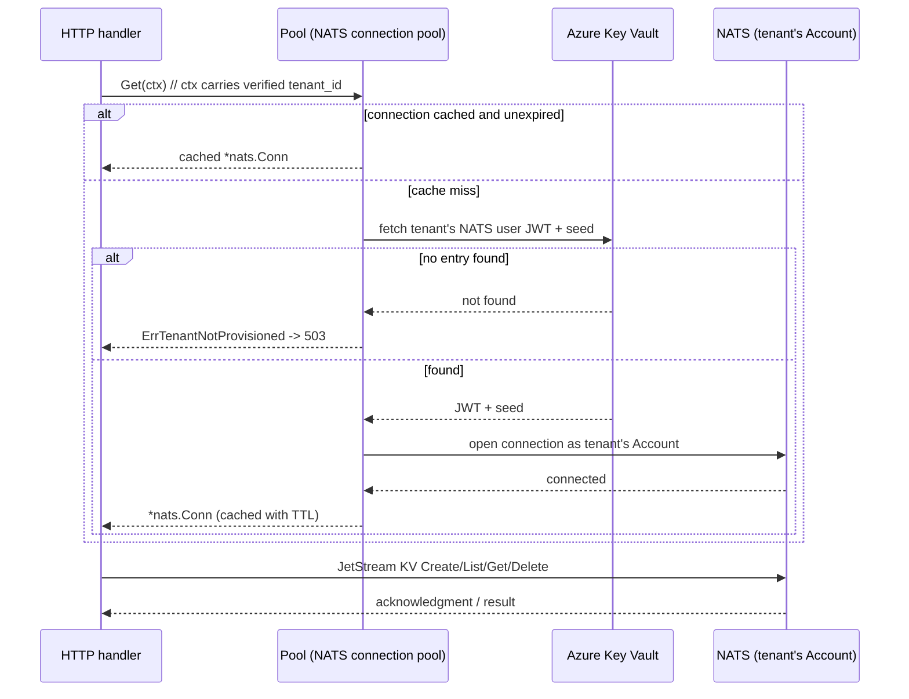

# NATS — user guide

> **Audience:** engineers and operators working on this project who need to understand NATS's core concepts and how this project configures and uses them. This is an explanatory guide, not a design document — for the authoritative specification and rationale behind any decision described here, see `docs/nats-tenant-queue-api/design.md`, `docs/nats-cluster/design.md`, `docs/nats-auth-middleware/design.md`, and `docs/tenant-provisioning/design.md`.

## 1. Why NATS is here

This project stores every tenant's data in NATS JetStream instead of a conventional database. NATS is also this project's **tenant isolation boundary**: rather than trusting API code alone to keep Company A's data away from Company B, each tenant gets its own NATS Account, a first-class NATS concept the server itself enforces. A bug in the API's tenant-scoping logic can, at worst, fail to find the right credentials and return an error — it cannot open the wrong tenant's account, because the server itself refuses that connection.

## 2. Core NATS concepts

This section explains each concept generically; section 3 explains exactly how this project uses it.

### Server and cluster
A **NATS server** is the process that routes messages and, with JetStream enabled, persists data. Multiple servers can form a **cluster**, replicating data across nodes so no single server is a single point of failure. Servers in a cluster talk to each other over dedicated **cluster routes**, separate from the port clients connect on.

### JetStream
**JetStream** is NATS's built-in persistence layer. Without it, NATS is a pure at-most-once pub/sub message bus; with it, messages can be durably stored, replicated across cluster nodes, and replayed. JetStream underlies both of NATS's persistent data structures: **streams** (ordered, append-only logs, built for ack-once consumption) and **Key-Value (KV) buckets** (get/set/delete by key, built on top of a stream internally, but exposing random-access semantics a plain stream does not).

### Operator, Account, and User — the JWT identity hierarchy
NATS has its own three-level identity and trust hierarchy, independent of any external identity provider:

- An **Operator** is the root of trust for one NATS deployment. It has a signing key that only ever needs to exist on a trusted operator's own workstation — it never runs inside the server or the cluster itself.
- An **Account** is an isolated namespace within that deployment: subjects, streams, and KV buckets in one Account are invisible to another Account, unless explicitly exported/imported (a feature this project does not use). This is the mechanism NATS gives you for genuine multi-tenancy inside one cluster.
- A **User** is a specific set of credentials (a public/private key pair) that connects as a member of one Account. A User can do only what its Account allows.

Trust flows downward and is proven with JWTs: the Operator signs an Account's JWT (vouching "this Account is real and belongs to this deployment"), and that Account signs its Users' JWTs. A server configured with the Operator's JWT can verify any Account or User JWT signed under it, without the Operator's private signing key ever being present on that server.

### The resolver
The **resolver** is how a running NATS server actually looks up Account JWTs at connection time. This project uses NATS's built-in **full resolver**: a directory-backed JWT cache the server consults on every connection, populated by an operator pushing signed Account JWTs into it (`nsc push`). This is different from statically declaring accounts in the server's own config file — a full resolver lets new Accounts be added while the server keeps running, which is what makes onboarding a new tenant possible without restarting or redeploying NATS itself.

### SYS account
The **SYS** (system) account is a special, always-present Account used for the server's own internal monitoring and control operations. Every NATS deployment using the Operator/Account/User hierarchy needs one; it holds no tenant data.

### `nsc`
**`nsc`** is the CLI tool that creates and signs Operators, Accounts, and Users, and pushes their JWTs to a resolver. It is the only tool in this project that ever touches the Operator's private signing key.

## 3. How this project configures NATS

### 3.1 A three-node JetStream cluster on AKS

NATS runs in-cluster on AKS via the official `nats/nats` Helm chart, as a 3-replica `StatefulSet` with JetStream enabled. Three nodes is not an arbitrary choice: it is the floor for a JetStream cluster to tolerate one node loss without losing quorum on any Raft-replicated resource (streams, KV buckets, and the resolver's own JWT store all use the same replication), and it is also the *ceiling* on how many replicas any individual tenant's JetStream KV bucket can request — a stream cannot have more replicas than there are server nodes to host them.

Each NATS pod carries two separate Azure Managed Disk volumes:
- a **JetStream file store** (`managed-csi-premium`, higher IOPS) — where every tenant's KV bucket data actually lives;
- a **resolver directory** (`managed-csi`, lower IOPS) — the cached Account JWTs the full resolver serves.



Users, and every other in-cluster workload, are never allowed to reach NATS directly: there is no `LoadBalancer` Service and no HUG `HTTPRoute` targeting it, and a `NetworkPolicy` restricts inbound connections to the REST API's own pod selector plus NATS's own inter-node cluster-route traffic. The only path to NATS is through the REST API.

### 3.2 Bootstrapping the Operator, `SYS` account, and resolver (one-time)

Before NATS can be configured for per-tenant Accounts at all, an operator runs a one-time bootstrap **from their own workstation, never inside the cluster**:

```console
nsc add operator --generate-signing-key natssaas
nsc add account SYS
nsc edit operator --system-account SYS
nsc add user -a SYS sys
nsc generate config --nats-resolver --sys-account SYS -o resolver.conf
```

This produces the Operator's JWT, the `SYS` account's JWT and public key, and a full-resolver config block. Only the JWTs (public, self-verifying, safe to embed in the chart's values) are pasted into the NATS Helm chart's `config.merge` — the Operator's actual signing key stays on the operator's workstation permanently. This is the same principle this project applies everywhere else it holds sensitive credentials (Workload Identity for Azure, Key Vault for database passwords): the one secret that could forge a new trusted identity from nothing never enters the cluster.

This step happens exactly once, ever, for the whole deployment — never again per tenant.

### 3.3 A NATS Account per tenant, not a shared account

The core multi-tenancy decision: **every tenant gets its own NATS Account**, not a single shared account with a subject-prefix naming convention. A subject-prefix approach (`tenantA.items`, `tenantB.items` in one account) would be cheaper to operate, but isolation would then live entirely in API code — one wrong string interpolation and one tenant's request could touch another tenant's subject or bucket. With per-tenant Accounts, the NATS server itself refuses a connection or an operation that doesn't belong to the account it authenticated as; a bug in the API's tenant-resolution code can at worst fail closed (an error), never open the wrong account.



Each tenant's Account holds exactly one JetStream KV bucket, named identically to the `tenant_id` (see `docs/keycloak-authentication-guide.md` section 3.3 for the naming rule shared across Keycloak, NATS, and Key Vault). Buckets are configured with `history=1` — JetStream KV deletes leave tombstones by default, which count against a bucket's storage until compacted, and `history=1` bounds that accumulation — and a default 1 GiB storage quota per tenant.

### 3.4 Provisioning a tenant's Account (per tenant, repeatable)

Creating a tenant's Account is one step inside the same onboarding script covered in `docs/keycloak-authentication-guide.md` section 3.3 (`./onboard-tenant.sh <tenant_id> <admin_email>`). The NATS-specific part of that script, run from the operator's workstation using the Operator identity from section 3.2:

1. `nsc add account <tenant_id>` — creates the Account, signed by the Operator.
2. `nsc add user -a <tenant_id> api` — creates a User under that Account; this is the identity the REST API itself connects as.
3. `nats kv add <tenant_id> --history=1 --max-bytes=1073741824` — creates the tenant's JetStream KV bucket, run using the tenant's own new User credentials so the bucket is created inside that Account's namespace.
4. `nsc push -a <tenant_id>` — pushes the Account and User JWTs to the running cluster's resolver, so the server actually starts accepting connections authenticated as this Account.
5. The tenant's NATS user JWT and seed (the private half of the User's key pair) are written to Azure Key Vault as two separate secrets — never combined into one `.creds` file — matching the two-secret shape already used for Keycloak's own database credential.

A NATS Account or KV bucket that exists but has no matching Key Vault secret entry is inert by design: the REST API's connection pool only ever resolves credentials through Key Vault, never by querying the NATS resolver directly, so a partially-provisioned tenant fails closed (`503`) rather than serving from an unexpected credential source.

The full resolver's `allow_delete: false` setting (from `nsc generate config`, not overridden by this project) means a pushed Account cannot be silently removed by a later, conflicting push — removing a tenant's Account is a deliberate, separate operation, not a side effect of re-running onboarding.

## 4. How the REST API uses NATS at request time

The REST API is the *only* component in this whole system that ever holds a NATS credential. It never accepts one as a parameter — it always derives it from the caller's already-verified `tenant_id` (see `docs/keycloak-authentication-guide.md`).



Key behaviors:
- The connection pool is keyed **strictly by `tenant_id`**, never by anything else — concurrent requests for different tenants can never cross-resolve each other's connection, even under a race.
- Every write (`Create`, `Delete`) blocks until JetStream acknowledges it before the API reports success to the client — a acknowledged write is durable, not just buffered.
- `List` is always paginated (cursor + limit are required, not optional), so no call can return an unbounded result set.
- On shutdown, the API calls `Drain()` (not a hard `Close()`) on every open NATS connection, so in-flight JetStream writes flush before the process exits.
- Concurrent cache-miss lookups for the *same* tenant collapse into one Key Vault fetch and one NATS connection attempt, not one per concurrent request.

## 5. Where responsibility sits

| Concern | Owner | Not owned by |
|---|---|---|
| NATS cluster deployment, JetStream, storage classes, `NetworkPolicy` | `docs/nats-cluster/design.md` | — |
| Operator/`SYS`-account/resolver bootstrap (one-time) | `docs/nats-cluster/design.md` §4 | Onboarding script |
| Creating a tenant's Account, User, and KV bucket; pushing to the resolver; writing credentials to Key Vault | Onboarding script (`docs/tenant-provisioning/design.md` §4.2) | NATS cluster's one-time bootstrap |
| Resolving a verified tenant to a live NATS connection at request time | `Pool` (`docs/nats-auth-middleware/design.md`) | NATS server itself |
| Translating CRUD calls into JetStream KV operations | `KVStore` (`docs/nats-auth-middleware/design.md`) | HTTP handler layer |
| Deciding which Account/bucket a request may touch | The verified `tenant_id` claim alone, via `Pool`'s cache key | Any header, path segment, or client-supplied value |

## 6. Key invariants worth remembering

- A NATS Account name is identical, byte-for-byte, to the `tenant_id` value used in Keycloak and Key Vault — one shared naming rule governs all three.
- The Operator's private signing key never leaves the operator's own workstation; only its public JWT (and Accounts'/Users' JWTs signed by it) ever reach the cluster.
- A NATS Account or bucket existing with no matching Key Vault entry can never serve a request — `Pool` only resolves credentials through Key Vault, never by querying the resolver directly.
- A connection pooled for tenant X is never returned to a request whose verified tenant is not X, even under concurrent access.
- No endpoint ever returns an unbounded list; every write is JetStream-acknowledged before the API reports success.
- Cluster route authentication (shared username/password) and client TLS are both POC-scope gaps — no TLS on any NATS protocol port yet; revisit as a cross-cutting change alongside the rest of this system's TLS story, not in isolation.

## 7. References

- `docs/nats-cluster/design.md` — deploying NATS on AKS, the Operator/`SYS`/resolver bootstrap, storage and networking configuration.
- `docs/tenant-provisioning/design.md` — the per-tenant onboarding script, including its NATS Account/User/bucket steps in full detail.
- `docs/nats-auth-middleware/design.md` — how a verified tenant identity becomes a pooled NATS connection and JetStream KV operations inside the REST API.
- `docs/nats-tenant-queue-api/design.md` — parent system design; section 4 (Decisions) is the source of the per-tenant-Account isolation rationale.
- `docs/keycloak-authentication-guide.md` — companion guide covering the identity half of tenant onboarding and the shared `tenant_id` naming rule.
