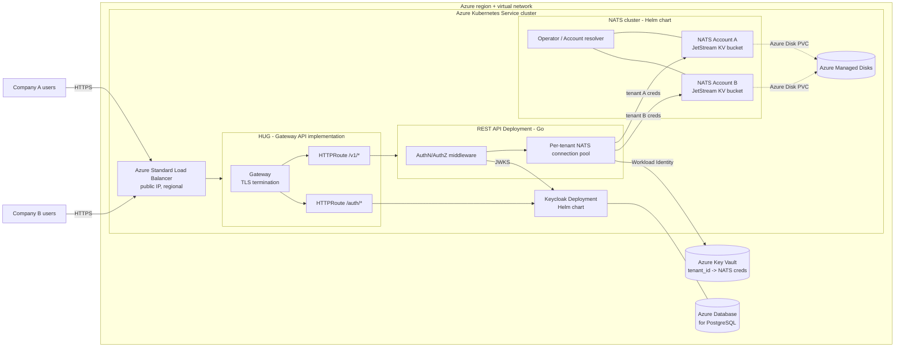

# Multi-tenant NATS-backed data API on AKS

> **Status:** Proposed for review

## 1. Executive summary

Today there is no system. This design describes a new REST API where each company (tenant) can create, list, read, and delete records, with NATS JetStream as the storage and transport layer underneath, all hosted in a single Azure Kubernetes Service (AKS) cluster in one Azure region. Both Keycloak and the REST API are exposed externally through HAProxy Unified Gateway (HUG), an in-cluster implementation of the Kubernetes Gateway API, fronted by an Azure Standard Load Balancer. The main risk is that NATS multi-tenancy is enforced at two layers (API authorization and NATS account boundaries), which costs extra operational setup (issuing and rotating per-tenant NATS credentials) compared to a single shared NATS account. We accept that cost because it means a bug in the API's tenant-scoping code cannot, by itself, leak one company's data into another's: the API process would still need that tenant's NATS credentials to reach the wrong data, and those credentials are looked up strictly from the verified caller identity. A second, related risk is that everything (identity, queue, API, ingress) lives in one AKS cluster in one region: a cluster-level or region-level outage takes the whole system down at once (see section 11).

Note on identity provider: Auth0 was the originally requested IdP, but Auth0 is a hosted SaaS product with no official self-hosted Helm chart, so it cannot be deployed inside AKS as requested. This design substitutes **Keycloak**, which does have an official Helm-deployable path and is designed to be self-hosted, and treats "Auth0" in the original request as "a self-hosted OIDC provider."

## 2. Context and scope

This is a greenfield service (no existing system to preserve). In scope: a REST API for authenticated users of a tenant to create, list, read, and delete arbitrary JSON records, using NATS JetStream as the datastore, with hard tenant isolation enforced by NATS Accounts. The whole system (NATS, Keycloak, the REST API) is deployed in one Azure Kubernetes Service (AKS) cluster: NATS and Keycloak via their official Helm charts, the REST API as a standalone Go application built and deployed as its own Kubernetes Deployment. The solution is regional: the AKS cluster, its Azure Standard Load Balancer, Azure Database for PostgreSQL, Azure Key Vault, and the Managed Disks backing JetStream all live in a single Azure region and a single virtual network in that region. Both Keycloak and the REST API are reached externally only through HUG, the in-cluster Kubernetes Gateway API implementation, exposed via that region's Azure Standard Load Balancer. Multi-region deployment and cross-region disaster recovery are out of scope (section 13). Out of scope items are listed in section 13.

## 3. System context

Users never connect to NATS or Keycloak's admin interface directly; all external traffic enters through the Azure Standard Load Balancer and is handed to HUG, the in-cluster Kubernetes Gateway API implementation. HUG's `Gateway` resource terminates TLS, and its `HTTPRoute` resources route by path to the API's Service or Keycloak's Service. Both HUG's control plane and its HAProxy data plane run as pods inside AKS; the Load Balancer only exposes HUG's data-plane Service, never the API, Keycloak, or NATS Services directly. The API is the sole holder of NATS credentials and is the only trust boundary between a tenant's HTTP request and that tenant's data. Keycloak, NATS, and HUG all run as in-cluster workloads deployed from their official Helm charts. The Load Balancer, Azure Database for PostgreSQL, and Azure Key Vault are Azure-managed dependencies outside the AKS cluster itself, but all within the same region and virtual network.

## 4. Proposed design

### How it works

A user at Company A signs in through Keycloak (the in-cluster OIDC identity provider), reaching it through the Azure Standard Load Balancer and HUG's `/auth/*` HTTPRoute, and gets an access token carrying a `tenant_id` claim and a `sub` (user id) claim. The user calls `POST /v1/items` through the same Load Balancer. HUG's `/v1/*` HTTPRoute sends the request to the API's Service, which verifies the token's signature against Keycloak's JWKS endpoint, reads `tenant_id` from the verified claims (never from anything the client supplies directly), and uses it to fetch that tenant's NATS user credentials from Azure Key Vault. The API opens (or reuses a cached) NATS connection authenticated as tenant A's account, generates a server-side ULID as the item ID, and writes the JSON payload into that tenant's JetStream Key-Value bucket under that ID. It returns `201` with the item. A `GET /v1/items` from a Company B user, authenticated with a token carrying `tenant_id=B`, can only ever resolve credentials for account B, so it lists keys from B's bucket and never sees A's data, regardless of what path or body the client sends.

### Components and responsibilities

- **REST API service (Go).** A standalone application built independently and deployed as its own Kubernetes Deployment/Service in AKS (not part of the NATS or Keycloak Helm releases). Owns HTTP handling, OIDC token verification, mapping verified claims to a tenant, and translating CRUD requests into JetStream KV operations. Does not own identity (delegates to Keycloak) and does not own NATS account provisioning.
- **AuthN/AuthZ middleware.** Owns verifying the bearer token and extracting `tenant_id` and `sub`. Rejects any request where `tenant_id` is missing or unverifiable. Does not own authorization beyond tenant scoping; all users within a tenant have equal access to that tenant's data (see Invariants).
- **Per-tenant NATS connection pool.** Owns caching one NATS connection per tenant, keyed strictly by the verified `tenant_id`, with a bounded TTL. Does not own credential issuance.
- **Keycloak (in-cluster, official Helm chart).** Owns user authentication, login/consent flows, and issuing OIDC tokens with a `tenant_id` claim (see Naming and identity). Backed by Azure Database for PostgreSQL Flexible Server for its own state (realms, users, sessions). Does not own tenant data or NATS credentials.
- **Azure Key Vault (credential store).** Owns securely storing each tenant's NATS user JWT and seed, outside the cluster. The API reads from it using Azure AD Workload Identity (a federated identity bound to the API's Kubernetes ServiceAccount, no static cloud credentials in the pod). Does not own request-time authorization.
- **NATS cluster (Accounts + JetStream, official Helm chart, in-cluster).** Owns the actual isolation boundary: each tenant is a separate NATS Account with its own JetStream KV bucket, backed by Azure Managed Disks (Azure Disk CSI driver) for JetStream's file store. Does not own HTTP-facing concerns.
- **HUG (HAProxy Unified Gateway, in-cluster, official Helm chart).** Owns TLS termination (via its `Gateway` resource) and routing external HTTPS traffic, by path (via `HTTPRoute` resources), to the API's Service and to Keycloak's public Service. Does not route external traffic directly to NATS or to Keycloak's admin console, since no `HTTPRoute` targets them.
- **Azure Standard Load Balancer (regional, outside the cluster).** Owns exposing HUG's data-plane Service on a public IP in the region. Does not do any path-based routing itself; that is entirely owned by HUG.
- **Tenant provisioning flow.** Owns creating a new NATS Account, its JetStream KV bucket, its credentials (written to Key Vault), and the corresponding tenant identity in Keycloak when a company signs up. Not covered in detail here (see section 13).

### Decisions

We use a JetStream **Key-Value bucket** per tenant, not a plain stream consumed by a worker, as the storage for items. A plain JetStream stream is built for ordered, ack-once consumption; it does not offer get/list/delete by arbitrary key, which the requirement (create, list, read, delete individual records) needs directly. KV buckets are built on streams internally, so this still satisfies "NATS as the queue/storage layer," while giving native random-access semantics. We rejected keeping a plain stream and building a separate index, because that index would become a second source of truth that isolation and consistency logic would need to protect separately.

We use **NATS Accounts per tenant** rather than a single shared account with a subject-prefix convention. The subject-prefix approach is cheaper to operate (one account, no credential issuing pipeline) but isolation lives entirely in API code: one wrong string interpolation in a subject or bucket name and one tenant's request touches another tenant's data. With per-tenant accounts, isolation is enforced by the NATS server itself; a coding bug in tenant resolution can, at worst, cause the API to fail to find credentials (an error), not to open the wrong tenant's connection with the wrong tenant's credentials. The cost is operational: every new tenant requires an account-creation step, and credential rotation is a real process to build (see section 12).

We use **Keycloak** as a self-hosted OIDC identity provider, deployed in AKS via its official Helm chart, rather than the originally requested Auth0. Auth0 does not offer a self-hostable, Helm-deployable product; substituting Keycloak is the closest match to "IdP deployed inside the AKS cluster." This means we now own Keycloak's uptime, patching, and backups, which a SaaS IdP would otherwise have carried (see section 11).

We back Keycloak with **Azure Database for PostgreSQL Flexible Server** (a managed service outside the cluster) rather than running PostgreSQL in-cluster. Identity data (users, sessions, realm config) is the one dataset in this system we cannot afford to lose or fail to back up correctly; a managed database gives us point-in-time restore and automated backups without building that operational capability ourselves. The cost is one more Azure resource to provision and network to the cluster.

We use **Azure Key Vault with Azure AD Workload Identity** as the credential store for NATS tenant credentials, rather than a Kubernetes Secret or a self-hosted Vault instance. This keeps NATS credentials outside the cluster's etcd, avoids running another stateful in-cluster service, and lets us grant the API's Kubernetes ServiceAccount Key Vault access without embedding any static Azure credential in the pod or its image.

We front both Keycloak and the REST API with **HUG**, an in-cluster implementation of the Kubernetes Gateway API, exposed through a plain Azure Standard Load Balancer, rather than Azure Application Gateway. This keeps routing configuration as native Kubernetes resources (`Gateway`, `HTTPRoute`) managed the same way as the rest of the cluster, and follows the Gateway API's role separation between the `Gateway` (infrastructure-owned) and `HTTPRoute` (route-owner-managed) objects, which the older Ingress API does not have. The cost is that we now run and operate the gateway's data plane (HAProxy pods) ourselves inside AKS, instead of delegating TLS termination and edge routing to a fully managed Azure PaaS resource; HUG's own availability is bounded by AKS pod scheduling and node capacity like any other in-cluster workload, not by a separate Azure SLA. We also lose Application Gateway's built-in WAF_v2 option; an equivalent web application firewall in front of HUG is called out as an open question rather than assumed.

## 5. Invariants and requirements

### Invariants

- `INV-1`: A request only ever reads, writes, or deletes data in the NATS account and KV bucket belonging to the `tenant_id` asserted by the cryptographically verified access token. No code path derives the target account or bucket from a client-supplied tenant ID, header, or path segment.
- `INV-2`: Every stored item has a server-generated ULID assigned at create time. The API never accepts a client-supplied item ID for create.
- `INV-3`: A NATS connection or credential belonging to tenant X is never used to serve a request whose verified `tenant_id` is not X, even if a cache lookup races with another request.
- `INV-4`: Isolation is at the tenant level, not the user level. Any authenticated user of tenant X can create, list, read, and delete any item belonging to tenant X.

### Requirements

- List responses are paginated; no endpoint returns an unbounded result set in one response.
- Every write (create, delete) is acknowledged by JetStream before the API returns success to the client.
- The API rejects any request without a valid bearer token before it does any NATS work.

## 6. Interfaces and data

All endpoints require `Authorization: Bearer <OIDC access token>`.

- `POST /v1/items` — body: arbitrary JSON object (subject to a max payload size, see section 8). Returns `201 {id, created_at, data}`.
- `GET /v1/items?cursor=&limit=` — Returns `200 {items: [{id, created_at}], next_cursor}`. Does not inline full payloads, to keep list responses small; clients fetch individual items via `GET /v1/items/{id}`.
- `GET /v1/items/{id}` — Returns `200 {id, created_at, data}` or `404` if the ID does not exist in the caller's tenant bucket (including when it exists only in a different tenant's bucket).
- `DELETE /v1/items/{id}` — Returns `204` on success, `404` if not found in the caller's tenant bucket.
- Errors use a consistent JSON body: `{"error": "<short_code>", "message": "<human readable>"}`.

### Naming and identity

- **Item ID**: a ULID generated by the API at create time. Time-sortable, collision-resistant, carries no tenant or user information. If ULID generation fails (should not happen in practice), the create request fails with `500` rather than falling back to a client-supplied or non-unique value.
- **Tenant ID**: since Keycloak is self-hosted and under our control, each user is created with a `tenant_id` custom attribute at provisioning time, and a Keycloak protocol mapper copies that attribute into a `tenant_id` claim on every issued access token. The API only trusts the value from the verified token claim, never a client-supplied one. If the claim is absent (for example, a user provisioned without the attribute), the request is rejected with `403` and no NATS operation is attempted. Tenant ID is never re-derived later from stored data; if a tenant's ID changes in Keycloak after data already exists, that is a tenant migration event out of scope for this design (see section 13).
- **User ID**: the token's `sub` claim, recorded only for audit logging. It does not affect authorization (see `INV-4`).

## 7. Failure behavior and lifecycle

- **Keycloak/JWKS unreachable**: the API serves requests using its cached JWKS up to a 1 hour TTL. If no valid cache exists and the fetch fails, the API returns `503` rather than accepting unverifiable tokens. A Keycloak pod restart alone does not cause this, since the API talks to Keycloak's ClusterIP Service, which routes to any healthy replica.
- **Keycloak's PostgreSQL unavailable**: new logins and token issuance fail at Keycloak, but access tokens already issued and cached in the API's JWKS cache continue to verify, so already-authenticated users are unaffected until their token expires.
- **Tenant not yet provisioned or Key Vault miss**: the API returns `503 {"error": "tenant_not_provisioned"}`. It does not create a bucket or account on the fly from a request path.
- **Azure Key Vault unavailable or throttled**: cached tenant NATS connections keep serving requests. A cache-miss lookup (new tenant, or evicted TTL entry) fails with `503` until Key Vault is reachable again.
- **NATS connection drops mid-request**: the in-flight request fails with `502`. Reads, lists, and deletes are safe to retry. A create retried by the client produces a second item with a new ID (accepted; list is not content-deduplicated), because an ID is only returned after JetStream acknowledges the write.
- **NATS pod rescheduled or Azure Disk PVC temporarily unavailable**: in-flight requests to the affected account fail with `502`; JetStream's own replication (if the stream is configured with multiple replicas) or the pod's PVC reattachment on a new node restores availability without operator intervention. A single-replica JetStream store with a lost disk needs a restore from Azure Disk snapshot, which is a data-loss risk if snapshots are infrequent (see Open questions).
- **API or Keycloak backend unhealthy**: HUG stops routing to individual API or Keycloak pods that fail their Kubernetes readiness probes, so single-pod failures do not cause client-visible errors as long as at least one healthy replica remains behind the `HTTPRoute`. If every pod behind a route is unhealthy, HUG returns `502` to the client.
- **HUG pod unhealthy or evicted**: since HUG's data plane runs as regular AKS pods, running multiple HUG replicas behind the Load Balancer means one HUG pod failing does not remove external access; a single-replica HUG deployment would turn any HUG pod restart into a brief full outage (see Open questions).
- **Azure Standard Load Balancer or regional outage**: because the solution is single-region, an outage of the Load Balancer or of the Azure region removes all external access to both the API and Keycloak; there is no cross-region failover (see section 11 and section 13).
- **Startup**: the API does not accept traffic (fails readiness probe, which also removes it from HUG's healthy backend set) until it has successfully fetched Keycloak's JWKS at least once and confirmed connectivity to the NATS operator/resolver.
- **Shutdown**: the API stops accepting new connections, waits up to 10 seconds for in-flight requests to complete (matching the Kubernetes pod termination grace period), and calls `Drain()` on open NATS connections rather than closing them abruptly, so pending KV writes are flushed.

## 8. Security, privacy, and operations

- **Trust boundary**: the API service is the only component that holds NATS credentials. End users authenticate only to Keycloak and the API; they never receive NATS credentials, never reach Keycloak's admin console, and never connect to NATS directly. HUG only defines `HTTPRoute` resources for the API's `/v1/*` routes and Keycloak's public auth endpoints; NATS ports and Keycloak's admin port have no `HTTPRoute` and are only reachable inside the cluster.
- **Network isolation inside the cluster**: a Kubernetes `NetworkPolicy` restricts inbound connections to the NATS pods to only the API's pod selector (and NATS's own inter-node traffic), so no other in-cluster workload can reach NATS even on the internal network.
- **Authorization**: enforced once, in the AuthN/AuthZ middleware, from the verified token's `tenant_id` claim (`INV-1`). Downstream code receives an already-resolved tenant context and cannot override it from request input.
- **Cloud credentials**: the API authenticates to Azure Key Vault using Azure AD Workload Identity, federating its Kubernetes ServiceAccount token to a scoped Azure AD identity. No Azure credential is stored in the pod, its image, or a Kubernetes Secret.
- **Sensitive data**: item payloads are opaque JSON and may contain tenant-sensitive data. We recommend enabling JetStream's at-rest encryption for the KV buckets, with the encryption key itself stored in Azure Key Vault; this design defers detailed key-management/rotation procedure to the security/infra team (see Open questions).
- **Shared limits**: each tenant account has a JetStream storage quota (`max_bytes` on its KV bucket, backed by an Azure Managed Disk sized to the AKS node's attach limits) and a per-item payload size limit (default 1 MiB, matching NATS's default max message size). At the storage quota, further writes are rejected but existing data stays readable; raising the quota is an operational (not code) change. The API also applies a per-tenant request rate limit to protect the shared NATS cluster from one noisy tenant affecting others; at that limit, requests get `429`. AKS node pool CPU/memory capacity is a cluster-wide shared limit; Kubernetes resource requests/limits on the API, Keycloak, and NATS pods keep one component from starving the others.
- **Operational dependency**: Azure Key Vault is a hard dependency for onboarding new tenants and for cache-miss lookups. If it is unavailable, tenants with an already-cached NATS connection are unaffected; new connections or newly provisioned tenants fail with `503`. Azure Database for PostgreSQL is a hard dependency for Keycloak logins (see section 7).

## 9. Acceptance criteria

- `AC-1`: A user authenticated for tenant A creates an item and receives `201` with a server-generated ID; the item appears in tenant A's list and is not visible in tenant B's list.
- `AC-2`: A request with a valid IdP token but no resolvable `tenant_id` is rejected with `403` before any NATS call is made.
- `AC-3`: A `GET` or `DELETE` for an item ID that exists only in another tenant's bucket returns `404`, not `403` or `200`.
- `AC-4`: Under concurrent requests from two tenants, no NATS connection keyed for tenant A is ever used to serve a request whose verified tenant is B.
- `AC-5`: When a tenant's KV bucket is at its storage quota, a create request fails with a documented error code and existing items in that tenant remain readable via list and read.

## 10. Test approach

- Unit tests on the AuthN/AuthZ middleware cover claim extraction and rejection paths (`INV-1`, `AC-2`).
- Unit tests on the connection pool cover cache keying and TTL expiry using fake credentials for two tenants (`INV-3`, `AC-4`).
- Integration tests run an embedded/local NATS server with two provisioned tenant accounts and drive the real HTTP API to prove cross-tenant reads/deletes 404 and lists never mix (`INV-1`, `INV-2`, `AC-1`, `AC-3`).
- A fault-injection test drops the NATS connection mid-request and asserts the documented `502` and safe-retry behavior (section 7).
- A quota test fills a tenant's bucket to its configured `max_bytes` and asserts writes fail while reads keep working (`AC-5`).

## 11. Risks and tradeoffs

- Per-tenant NATS Accounts require building an account-provisioning and credential-rotation pipeline before the first real tenant onboards; this is real upfront work traded for a stronger isolation guarantee than subject-prefixing would give.
- Substituting self-hosted Keycloak for the originally requested Auth0 means we now own identity infrastructure uptime, security patching, and backups (via Azure Database for PostgreSQL) that a SaaS IdP would otherwise carry. This is a direct consequence of the "everything inside one AKS cluster" requirement.
- All components (NATS, Keycloak, the API, and now HUG) share one AKS cluster; a cluster-level incident (control plane outage, bad cluster upgrade, cluster-wide network policy misconfiguration) affects identity, storage, API, and ingress simultaneously, with no independent failure domain. Mitigating this with a multi-cluster or multi-region setup is out of scope (section 13) but should be revisited before this is relied on for production traffic at scale.
- Choosing HUG over Azure Application Gateway moves the internet-facing edge from a managed Azure PaaS resource into an in-cluster workload we operate ourselves (upgrades, HA configuration, and capacity planning for the HAProxy data plane are now our responsibility) and drops Application Gateway's built-in WAF_v2 option; a replacement WAF strategy, if needed, is an open question.
- JetStream KV deletes leave tombstones by default, which count against a bucket's storage until compacted; we recommend configuring `history=1` on tenant buckets to bound this, but that is an operational config choice, not enforced by this design.

## 12. Open questions

- What is the default per-tenant KV storage quota, and is it uniform or tier-based? Recommended default: 1 GiB per tenant, adjustable later. Does not block starting work.
- Who owns building the tenant provisioning flow (NATS account creation, Key Vault credential write, Keycloak user/attribute setup) referenced in section 4 and section 11? Recommended default: treat it as a prerequisite workstream tracked separately, stubbed here with a manual provisioning script for the first tenants. Blocks production launch, not the API implementation itself.
- How many replicas does each JetStream stream/KV bucket use, and how often are the backing Azure Managed Disks snapshotted? Recommended default: 3 replicas per tenant bucket for production tenants (tolerates one NATS pod/node loss without data loss) plus daily Azure Disk snapshots as a second line of defense; single-replica is acceptable only for early, non-production tenants. Blocks production launch.
- Is a single Keycloak replica acceptable at this stage, or does launch require a clustered Keycloak (multiple replicas behind the in-cluster Service)? Recommended default: start with 2 replicas for basic availability; defer full multi-node cache tuning. Does not block starting work.
- With Application Gateway's WAF_v2 no longer in the path, is a web application firewall required in front of HUG from day one (for example, HAProxy's own WAF module, or Azure Front Door/WAF placed ahead of the Load Balancer), or is it acceptable to launch without one? Recommended default: add a WAF layer before general availability, since both endpoints are internet-facing from launch; acceptable to defer past an initial internal/pilot launch. Blocks general-availability launch, not initial development.
- How many HUG replicas run behind the Load Balancer, and how is its own configuration (Gateway/HTTPRoute reconciliation) kept highly available? Recommended default: at least 2 HUG replicas with a `PodDisruptionBudget`, matching the availability bar set for the API and Keycloak. Does not block starting work.
- Given the solution is single-region, what is the acceptable downtime if the region is impaired (no cross-region failover exists per section 13)? Recommended default: accept region-level downtime as a known limitation for this phase and revisit multi-region only if a concrete availability target requires it. Does not block starting work, but should be confirmed with whoever owns the availability commitment.

## 13. Out of scope

- Tenant self-service signup and the automated NATS account/credential/Keycloak-user provisioning pipeline (assumed to exist as a prerequisite).
- Any asynchronous worker or pub/sub notification when an item is created (this design only covers the synchronous CRUD path).
- Billing, metering, or per-tenant usage reporting.
- Multi-region or multi-cluster deployment, and disaster recovery across regions.
- AKS cluster sizing, node pool topology, and autoscaling configuration.
- Keycloak realm theming, branding, or advanced flows (MFA, social login) beyond issuing a token with a `tenant_id` claim.
- An admin/support API for cross-tenant access.
- Tenant ID migration (what happens if a company's tenant ID changes after data already exists).
