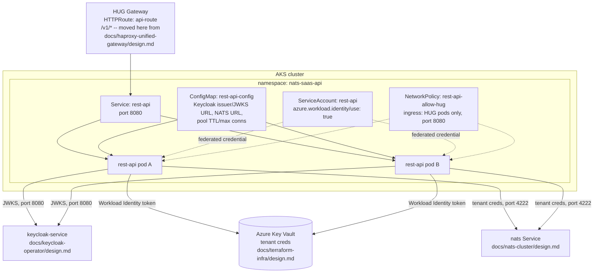

# REST API workload deployment on AKS

> **Status:** Proposed for review

## 1. Executive summary

Every other piece of this system has a document that turns its design into something actually running on AKS: `docs/keycloak-operator/design.md` deploys Keycloak, `docs/nats-cluster/design.md` deploys NATS, `docs/haproxy-unified-gateway/design.md` deploys HUG. The REST API service itself does not. `docs/nats-tenant-queue-api/design.md` specifies its behavior and `docs/nats-auth-middleware/design.md` specifies how its binary is built and pushed to the Azure Container Registry (ACR), but nothing creates the Kubernetes namespace, Deployment, Service, or ServiceAccount that actually runs that image, and nothing wires it to Azure Key Vault the way `docs/nats-auth-middleware/design.md` section 8 already assumes ("Key Vault access uses Azure AD Workload Identity"). Without this document, the image `docs/nats-auth-middleware/design.md` builds has nowhere to run, and HUG's `api-route` (`docs/haproxy-unified-gateway/design.md` section 7), already configured to send `/v1/*` traffic to a Service named `rest-api` on port `8080`, points at a Service that does not exist. This document is that missing step: it specifies the Deployment, Service, ServiceAccount, and supporting objects that run the REST API's container image in the `nats-saas-api` namespace, and it corrects a real defect this system's Terraform project currently has, where the Key Vault access role meant for this workload's Workload Identity is granted to AKS's kubelet identity instead (section 4, Decisions). The main downside: this is the fourth near-identical Helmfile-driven local chart in this system (after HUG's, Keycloak's, and NATS's own), so a future change to the shared pattern (chart layout, probe conventions, PodDisruptionBudget defaults) now has to be applied in four places, not one.

## 2. Context and scope

There is no Kubernetes manifest, Helm chart, or Terraform identity for the REST API workload today. `docs/nats-tenant-queue-api/design.md` describes the REST API as "a standalone application built independently and deployed as its own Kubernetes Deployment/Service in AKS" but stops there; `docs/nats-auth-middleware/design.md` stops at a pushed, pullable image in ACR ("this document stops at the image existing in ACR, pullable"); `docs/terraform-infra/design.md` provisions the AKS cluster, Key Vault, and ACR the workload will depend on, but explicitly stops before any Helm release. This document fills the remaining gap: the namespace, ServiceAccount and its Workload Identity federation, Deployment, Service, ConfigMap, NetworkPolicy, and PodDisruptionBudget that turn a pushed image into a running, reachable workload, plus the Terraform identity and role assignment that workload's Key Vault access depends on.

In scope: the `nats-saas-api` namespace, the REST API's ServiceAccount and its Workload Identity wiring, the Deployment (probes, resources, security context, rollout strategy), the `rest-api` Service HUG's `api-route` already targets, the `HTTPRoute` that sends `/v1/*` traffic to it (moved here from `docs/haproxy-unified-gateway/design.md`, see Decisions), a `NetworkPolicy` restricting inbound access to the workload to HUG's pods only, non-secret runtime configuration (Keycloak issuer/JWKS URLs, NATS server address, connection pool tuning), and the dedicated Azure identity and Key Vault role assignment this workload's Workload Identity needs, extending `docs/terraform-infra/design.md`'s root module. Out of scope: the REST API's own Go code and HTTP/middleware behavior (`docs/nats-tenant-queue-api/design.md`, `docs/nats-auth-middleware/design.md`), building and pushing the container image (`docs/nats-auth-middleware/design.md` section 4), the CI/CD pipeline that updates this Deployment's image tag on a new release (`docs/nats-auth-middleware/design.md` section 13, still out of scope here for the same reason), TLS anywhere in the request path (POC scope, matching `docs/haproxy-unified-gateway/design.md` section 9), and per-tenant NATS/Key Vault provisioning (`docs/tenant-provisioning/design.md`).

## 3. System context



This document sits between two already-specified boundaries and does not change either. Upstream, `docs/haproxy-unified-gateway/design.md`'s `hug-gateway` Gateway already terminates all external traffic and its `Gateway` resource's `allowedRoutes.namespaces.from: All` already permits an `HTTPRoute` in any namespace to attach to it; this document adds the `HTTPRoute` that does so for `/v1/*`, moved out of HUG's own chart (Decisions). Downstream, the REST API's own trust boundary (it is the only code holding NATS credentials and Key Vault access, `docs/nats-auth-middleware/design.md` section 8) is unchanged; this document only gives that code a Kubernetes identity and a place to run. The boundary this document must preserve: the REST API's pods are reachable only from HUG's pods on port `8080`, never from any other in-cluster workload or from the internet directly, matching the same "users never connect directly" boundary `docs/nats-tenant-queue-api/design.md` section 3 and `docs/nats-cluster/design.md` section 3 already state for NATS and Keycloak.

## 4. Proposed design

### How it works

An operator has already run `docs/nats-auth-middleware/design.md`'s build-and-push steps, so `acrnatssaasprod.azurecr.io/nats-auth-middleware:<git-sha>` exists in ACR. They set that tag as `image.tag` in this chart's values file and run `helmfile apply`. Helm creates the `nats-saas-api` namespace, a `ServiceAccount` named `rest-api` carrying the Workload Identity client ID annotation from Terraform's new output (section 4, Decisions), a `ConfigMap` holding non-secret runtime configuration, a two-replica `Deployment` whose pods mount none of that ConfigMap's values as a Kubernetes Secret (there is no fixed set of secrets to mount; the process reads per-tenant NATS credentials from Key Vault at request time, see Decisions), a `Service` named `rest-api` on port `8080`, an `HTTPRoute` attaching to `hug-gateway` for `/v1/*`, and a `NetworkPolicy` permitting inbound port `8080` only from HUG's own pod selector. Once both pods pass their readiness probe (JWKS fetched at least once, matching `docs/nats-auth-middleware/design.md` section 7), HUG starts routing `/v1/*` traffic to them, and a request through `api.natssaas.example.com/v1/items` reaches a running `AuthMiddleware`/`Pool`/`KVStore` chain for the first time.

### Components and responsibilities

- **`Deployment: rest-api`.** Owns running the REST API's container image as a set of stateless, horizontally identical pods, their resource requests/limits, their readiness/liveness probes, and their rolling-update behavior. Does not own the application's own HTTP or NATS logic (`docs/nats-tenant-queue-api/design.md`, `docs/nats-auth-middleware/design.md`), and does not own building or selecting the image it runs (an operator-supplied tag, section 6).
- **`ServiceAccount: rest-api`.** Owns carrying the Workload Identity annotation (`azure.workload.identity/client-id`) and label (`azure.workload.identity/use: "true"`) that let this workload's pods exchange their Kubernetes-issued token for an Azure AD token scoped to Key Vault, the same mechanism `docs/keycloak-operator/design.md` section 6.1 already uses for Keycloak's own ServiceAccount. Does not own the Azure-side identity or role assignment (Terraform, section 4, Decisions).
- **`Service: rest-api`.** Owns exposing the Deployment's pods on a stable ClusterIP at port `8080`, the exact name and port `docs/haproxy-unified-gateway/design.md` section 7 already configured `api-route`'s `backendRef` to target. Does not own routing decisions (HUG's `HTTPRoute`, below) and does not own TLS (POC scope, out of scope everywhere in this system today).
- **`HTTPRoute: api-route`.** Owns matching `/v1/*` on `hug-gateway` and forwarding to the `rest-api` Service. Moved into this chart from `docs/haproxy-unified-gateway/design.md`'s `hug-app` chart (Decisions); does not own the `Gateway` or `GatewayClass` it attaches to, which stay in `hug-app`.
- **`ConfigMap: rest-api-config`.** Owns the non-secret runtime configuration the binary reads at startup: Keycloak's issuer and JWKS URLs, the NATS cluster's internal address, and the connection pool's TTL and max-connection tuning (`docs/nats-auth-middleware/design.md` section 12's open question, given a concrete default here). Does not own any credential; nothing in this ConfigMap is sensitive.
- **`NetworkPolicy: rest-api-allow-hug`.** Owns restricting inbound connections to the REST API's pods to HUG's own pod selector on port `8080` only, the same restriction pattern `docs/nats-cluster/design.md` section 8 already applies to NATS itself. Does not own egress (the pods still need outbound access to Keycloak, NATS, and Key Vault, which this policy does not restrict).
- **Azure identity and role assignment (Terraform, extends `docs/terraform-infra/design.md`).** Owns a dedicated user-assigned managed identity for this workload, its federated credential scoped to `system:serviceaccount:nats-saas-api:rest-api`, and the `Key Vault Secrets User` role assignment against it. Does not own any other Azure resource; it extends the root module the same way `docs/keycloak-operator/design.md` section 4.1 already extends it for Keycloak's own identity.

### Decisions

We create a dedicated user-assigned managed identity for the REST API, named `id-rest-api`, with its own federated credential and its own `Key Vault Secrets User` role assignment, rather than reusing an existing identity. `docs/terraform-infra/design.md`'s root module currently grants `Key Vault Secrets User` to `module.aks.kubelet_identity_object_id` (its `main.tf`, section 6, the `azurerm_role_assignment.aks_key_vault_secrets_user` resource) even though its own prose, three sentences apart, describes this as "the API's Kubernetes ServiceAccount token" exchanging for an Azure AD token. Those are not the same thing: the kubelet identity authenticates AKS *nodes* for operations like pulling images from ACR, it has no federated credential a pod's ServiceAccount can exchange a token against, and nothing in that Terraform project ever creates one. As written, `docs/nats-auth-middleware/design.md`'s Key Vault credential fetcher has no working Azure AD path to authenticate with. This document's Terraform snippet below replaces that one role assignment with a correct one, following the exact pattern `docs/keycloak-operator/design.md` section 4.1 already established for Keycloak's own identity: keeping each workload's Key Vault access independently auditable and revocable, rather than sharing a broad node-level identity across unrelated workloads.

We do not use the Key Vault Secrets Store CSI driver (the pattern `docs/keycloak-operator/design.md` section 6.2 uses for Keycloak's database password) for this workload. That pattern fits a fixed, known-at-deploy-time set of secrets synced into a Kubernetes Secret once at pod startup. The REST API's `Pool` does the opposite by design (`docs/nats-auth-middleware/design.md` section 4): it resolves a *different* Key Vault secret per tenant, on a cache miss, for tenants that do not exist yet when this Deployment is created. A CSI-synced Secret would need to be re-synced (or re-created) for every new tenant onboarded after the pods are already running, which defeats the point of `Pool`'s own lazy, on-demand credential fetch. Instead, the REST API's own process calls the Key Vault SDK directly, authenticated via the Workload Identity token its ServiceAccount projects into the pod automatically; no Secret object is ever created for tenant credentials in this cluster.

We move `api-route`'s `HTTPRoute` out of `docs/haproxy-unified-gateway/design.md`'s `hug-app` chart and into this one, and we drop that chart's `allow-hug-to-api` `ReferenceGrant` entirely. `docs/haproxy-unified-gateway/design.md` section 7 puts `api-route` in `hug-app` with a `ReferenceGrant` because, at the time that document was written, the REST API's own Service had no chart of its own to live in. `docs/keycloak-operator/design.md` section 9 already made this same call for `keycloak-route`, for the same reason: a route "shares this chart's release lifecycle" with the Service it targets, not with the Gateway it attaches to, and moved it into `keycloak-app` accordingly, needing no `ReferenceGrant` because the route and its backend Service both end up in the same namespace (`keycloak`). The same fact is true here once `api-route` moves into this document's chart: it lives in `nats-saas-api`, and so does the `rest-api` Service it targets, so a `ReferenceGrant` (needed only for a cross-namespace backend reference) is dead weight. The only cross-namespace reference left is the route's `parentRef` to `hug-gateway` in `haproxy-unified-gateway`, already permitted by that `Gateway`'s own `allowedRoutes.namespaces.from: All`, exactly as `docs/keycloak-operator/design.md` section 9 already notes for `keycloak-route`.

We add a `NetworkPolicy` restricting inbound traffic to the REST API's pods to HUG's pod selector only, on port `8080`. Without it, any other pod in the cluster (a future unrelated workload, a compromised pod in another namespace) could call the REST API directly, bypassing nothing about its own auth (`AuthMiddleware` still runs), but bypassing HUG's role as the single, auditable ingress point the rest of this system already assumes. `docs/nats-cluster/design.md` section 8 already applies the identical restriction to NATS itself; this document closes the same gap for the REST API's own Service, which nothing in this system's existing documents did.

We run **two replicas** with a `PodDisruptionBudget` (`minAvailable: 1`), matching the same floor `docs/haproxy-unified-gateway/design.md` section 8 sets for HUG and `docs/keycloak-operator/design.md` section 10 sets for Keycloak: one replica turns any pod restart into a full outage of the whole system's one write/read path. We do not enable autoscaling in this POC (`replicas` stays a fixed value in `values.yaml`), consistent with every other component in this system today; revisit once real traffic volume is known (Open questions).

## 5. Invariants and requirements

### Invariants

- `INV-1`: The REST API's pods are reachable on port `8080` only from pods matching HUG's own pod selector; no other in-cluster workload, and no internet source, can open a connection to them directly (`NetworkPolicy: rest-api-allow-hug`).
- `INV-2`: The REST API's ServiceAccount (`rest-api`, namespace `nats-saas-api`) is the only Kubernetes identity in the cluster whose federated credential is scoped to the `id-rest-api` Azure identity; no other ServiceAccount's federated credential shares that subject.
- `INV-3`: No NATS credential, Key Vault credential, or any other secret is ever present in this Deployment's pod spec, its `ConfigMap`, or a Kubernetes `Secret` object; every credential the process needs is obtained at runtime through Workload Identity (Key Vault) or through `docs/nats-auth-middleware/design.md`'s own `Pool` (NATS), matching that document's `INV-5`.
- `INV-4`: A rolling update of this Deployment never drops the number of `Ready` pods below what the `PodDisruptionBudget`'s `minAvailable` allows, so `/v1/*` traffic has at least one healthy backend behind `api-route` throughout any deploy.

### Requirements

- The Deployment's `terminationGracePeriodSeconds` is at least 10, matching the 10-second grace period `docs/nats-tenant-queue-api/design.md` section 7 already commits to for `Pool`'s `Drain()` call on shutdown.
- The Deployment's readiness probe reports not-ready until the process's JWKS cache has completed at least one successful fetch, matching `docs/nats-auth-middleware/design.md` section 7's own readiness criterion exactly; this document does not add a stricter or looser condition.
- Every container in this Deployment runs as the same fixed, non-root numeric UID the image itself is built to run as (`docs/nats-auth-middleware/design.md` section 4, Decisions: the distroless `nonroot` UID `65532`), enforced again at the pod's `securityContext` so a misbuilt image cannot silently run as root.
- The image tag deployed is always the immutable short git commit SHA `docs/nats-auth-middleware/design.md` section 4 tags every build with; this chart's `values.yaml` never defaults to or falls back to a floating tag such as `latest`.

## 6. Interfaces and data

This document's interface is a Helm chart (`charts/rest-api-app`), deployed via Helmfile, and a Terraform extension to `docs/terraform-infra/design.md`'s root module.

### Terraform extension (`docs/terraform-infra/design.md` root module)

```hcl
# root module — replaces the existing azurerm_role_assignment.aks_key_vault_secrets_user
# (currently bound to module.aks.kubelet_identity_object_id, section 4, Decisions)

resource "azurerm_user_assigned_identity" "rest_api" {
  name                = "id-rest-api"
  resource_group_name = module.resource_group_platform.name
  location            = module.resource_group_platform.location
}

resource "azurerm_federated_identity_credential" "rest_api" {
  name                = "rest-api-workload-identity"
  resource_group_name = module.resource_group_platform.name
  parent_id           = azurerm_user_assigned_identity.rest_api.id
  issuer              = module.aks.oidc_issuer_url
  subject             = "system:serviceaccount:nats-saas-api:rest-api"
  audience            = ["api://AzureADTokenExchange"]
}

resource "azurerm_role_assignment" "rest_api_key_vault_secrets_user" {
  scope                = module.key_vault.id
  role_definition_name = "Key Vault Secrets User"
  principal_id         = azurerm_user_assigned_identity.rest_api.principal_id
}

output "rest_api_identity_client_id" {
  value = azurerm_user_assigned_identity.rest_api.client_id
}
```

### Helm chart layout

```
charts/rest-api-app/
  Chart.yaml
  values.yaml
  templates/
    serviceaccount.yaml
    configmap.yaml
    deployment.yaml
    service.yaml
    httproute.yaml
    networkpolicy.yaml
    poddisruptionbudget.yaml
```

```yaml
# charts/rest-api-app/values.yaml
namespace: nats-saas-api

serviceAccount:
  name: rest-api
  azureClientId: ""        # rest_api_identity_client_id, Terraform output above

image:
  repository: ""             # acr_login_server, docs/terraform-infra/design.md, plus /nats-auth-middleware
  tag: ""                    # immutable short git commit SHA — never "latest"

replicaCount: 2

resources:
  requests:
    cpu: 250m
    memory: 128Mi
  limits:
    memory: 256Mi

config:
  keycloakIssuerURL: "https://auth.natssaas.example.com/auth/realms/natssaas"
  keycloakJWKSURL: "http://keycloak-service.keycloak.svc.cluster.local:8080/auth/realms/natssaas/protocol/openid-connect/certs"
  natsURL: "nats://nats.nats.svc.cluster.local:4222"
  poolTTL: "15m"                 # docs/nats-auth-middleware/design.md section 12's recommended default
  poolMaxConns: "500"             # same section
  jwksCacheTTL: "1h"               # matches docs/nats-tenant-queue-api/design.md section 7

hug:
  gatewayName: hug-gateway
  gatewayNamespace: haproxy-unified-gateway   # docs/haproxy-unified-gateway/design.md
  hostname: api.natssaas.example.com
  pathPrefix: /v1
```

```yaml
# charts/rest-api-app/templates/serviceaccount.yaml
apiVersion: v1
kind: ServiceAccount
metadata:
  name: {{ .Values.serviceAccount.name }}
  namespace: {{ .Values.namespace }}
  annotations:
    azure.workload.identity/client-id: {{ .Values.serviceAccount.azureClientId | quote }}
  labels:
    azure.workload.identity/use: "true"
```

```yaml
# charts/rest-api-app/templates/configmap.yaml
apiVersion: v1
kind: ConfigMap
metadata:
  name: rest-api-config
  namespace: {{ .Values.namespace }}
data:
  KEYCLOAK_ISSUER_URL: {{ .Values.config.keycloakIssuerURL | quote }}
  KEYCLOAK_JWKS_URL: {{ .Values.config.keycloakJWKSURL | quote }}
  NATS_URL: {{ .Values.config.natsURL | quote }}
  POOL_TTL: {{ .Values.config.poolTTL | quote }}
  POOL_MAX_CONNS: {{ .Values.config.poolMaxConns | quote }}
  JWKS_CACHE_TTL: {{ .Values.config.jwksCacheTTL | quote }}
```

```yaml
# charts/rest-api-app/templates/deployment.yaml
apiVersion: apps/v1
kind: Deployment
metadata:
  name: rest-api
  namespace: {{ .Values.namespace }}
  labels:
    app: rest-api
spec:
  replicas: {{ .Values.replicaCount }}
  strategy:
    type: RollingUpdate
  selector:
    matchLabels:
      app: rest-api
  template:
    metadata:
      labels:
        app: rest-api
        azure.workload.identity/use: "true"
    spec:
      serviceAccountName: {{ .Values.serviceAccount.name }}
      terminationGracePeriodSeconds: 10
      securityContext:
        runAsNonRoot: true
        runAsUser: 65532
        runAsGroup: 65532
      containers:
        - name: rest-api
          image: "{{ .Values.image.repository }}/nats-auth-middleware:{{ .Values.image.tag }}"
          envFrom:
            - configMapRef:
                name: rest-api-config
          ports:
            - name: http
              containerPort: 8080
          readinessProbe:
            httpGet:
              path: /healthz/ready
              port: http
            periodSeconds: 5
          livenessProbe:
            httpGet:
              path: /healthz/live
              port: http
            periodSeconds: 10
          resources:
            {{- toYaml .Values.resources | nindent 12 }}
      topologySpreadConstraints:
        - maxSkew: 1
          topologyKey: kubernetes.io/hostname
          whenUnsatisfiable: ScheduleAnyway
          labelSelector:
            matchLabels:
              app: rest-api
```

```yaml
# charts/rest-api-app/templates/service.yaml
apiVersion: v1
kind: Service
metadata:
  name: rest-api
  namespace: {{ .Values.namespace }}
spec:
  selector:
    app: rest-api
  ports:
    - name: http
      port: 8080
      targetPort: http
```

```yaml
# charts/rest-api-app/templates/httproute.yaml
apiVersion: gateway.networking.k8s.io/v1
kind: HTTPRoute
metadata:
  name: api-route
  namespace: {{ .Values.namespace }}
spec:
  parentRefs:
    - name: {{ .Values.hug.gatewayName }}
      namespace: {{ .Values.hug.gatewayNamespace }}
  hostnames:
    - {{ .Values.hug.hostname | quote }}
  rules:
    - matches:
        - path:
            type: PathPrefix
            value: {{ .Values.hug.pathPrefix }}
      backendRefs:
        - name: rest-api
          port: 8080
```

```yaml
# charts/rest-api-app/templates/networkpolicy.yaml
apiVersion: networking.k8s.io/v1
kind: NetworkPolicy
metadata:
  name: rest-api-allow-hug
  namespace: {{ .Values.namespace }}
spec:
  podSelector:
    matchLabels:
      app: rest-api
  policyTypes:
    - Ingress
  ingress:
    - from:
        - namespaceSelector:
            matchLabels:
              kubernetes.io/metadata.name: haproxy-unified-gateway
      ports:
        - port: 8080
```

```yaml
# charts/rest-api-app/templates/poddisruptionbudget.yaml
apiVersion: policy/v1
kind: PodDisruptionBudget
metadata:
  name: rest-api
  namespace: {{ .Values.namespace }}
spec:
  minAvailable: 1
  selector:
    matchLabels:
      app: rest-api
```

**Declare the release with Helmfile**, alongside the `hug`/`hug-app` and `keycloak-app` releases already declared in their own documents:

```yaml
# helmfile.yaml
releases:
  - name: rest-api-app
    namespace: nats-saas-api
    createNamespace: true
    chart: ./charts/rest-api-app
    values:
      - values-rest-api-aks.yaml
    needs:
      - haproxy-unified-gateway/hug   # wait for hug's Gateway API CRDs, same reason
                                        # docs/haproxy-unified-gateway/design.md section 7
                                        # gives for hug-app's own needs
```

```console
helmfile diff
helmfile apply

kubectl get pods -n nats-saas-api -l app=rest-api
kubectl get svc rest-api -n nats-saas-api
kubectl get httproute api-route -n nats-saas-api -o yaml   # confirm ResolvedRefs: True
```

### Naming and identity

- **Namespace**: `nats-saas-api`, matching the value `docs/haproxy-unified-gateway/design.md`'s `api-route` and `docs/nats-cluster/design.md`'s `NetworkPolicy` already assumed before this document existed.
- **ServiceAccount**: `rest-api`, in `nats-saas-api`; its federated credential subject (`system:serviceaccount:nats-saas-api:rest-api`) is fixed at Terraform-apply time and never changes without also updating the federated credential resource (section 6, Terraform extension).
- **Service**: `rest-api`, port `8080`, the exact name and port `docs/haproxy-unified-gateway/design.md` section 7 already configured `api-route`'s `backendRef` to target; this document does not choose that name freely, it satisfies an existing constraint.
- **Image tag**: the immutable short git commit SHA `docs/nats-auth-middleware/design.md` section 4 tags every build with. This chart never defaults `image.tag` to a value; an operator (or, once it exists, the out-of-scope CD pipeline) sets it explicitly on every deploy.
- **Azure identity**: `id-rest-api`, a dedicated user-assigned managed identity distinct from Keycloak's `id-keycloak` (`docs/keycloak-operator/design.md` section 4.1) and from AKS's own kubelet identity, so each workload's Key Vault access stays independently auditable and revocable.

## 7. Failure behavior and lifecycle

- **Image pull fails (`ImagePullBackOff`)**: the pod stays `Pending`/not-ready; existing replicas (if any) keep serving traffic behind `api-route`, since Kubernetes never removes a `Ready` pod to make room for a failing rollout. Matches the same failure shape `docs/terraform-infra/design.md` section 7 already documents for a not-yet-propagated `AcrPull` role assignment.
- **Workload Identity token exchange fails (Key Vault access denied)**: every request that reaches `Pool.Get` on a cache miss fails with the typed error `docs/nats-auth-middleware/design.md` section 7 already defines, mapped to `503`; the pod itself stays `Ready` (this is an application-level dependency failure, not a pod health failure), matching that document's own failure behavior exactly. Check the federated credential's `subject` (section 6) matches `system:serviceaccount:nats-saas-api:rest-api` exactly, and that the `rest-api` ServiceAccount carries both the Workload Identity annotation and label, the same pair `docs/keycloak-operator/design.md` section 13 already documents this exact failure mode for.
- **JWKS unreachable at cold start**: the pod's readiness probe stays failing (no successful JWKS fetch yet, `docs/nats-auth-middleware/design.md` section 7), so HUG never routes traffic to it; this is not a crash and not a restart, the pod simply never joins the `Ready` backend set until Keycloak becomes reachable.
- **Rolling update**: `RollingUpdate` strategy plus the `PodDisruptionBudget` (`minAvailable: 1`) means at most one pod is unavailable at a time during a deploy; `api-route` always has at least one healthy backend as long as `replicaCount` is 2 or more.
- **Pod evicted or node drained**: the `PodDisruptionBudget` blocks a voluntary eviction that would drop below `minAvailable`, the same protection `docs/haproxy-unified-gateway/design.md` section 10 and `docs/nats-cluster/design.md` section 10 already rely on for their own workloads.
- **Shutdown**: the container receives `SIGTERM`, has up to `terminationGracePeriodSeconds: 10` to finish in-flight requests and call `Pool`'s `Drain()` on open NATS connections (`docs/nats-tenant-queue-api/design.md` section 7), and is sent `SIGKILL` if it has not exited by then.
- **`NetworkPolicy` blocks a legitimate caller**: if `api-route` reports `ResolvedRefs: True` but requests still fail to reach a pod, check `kubectl get ns haproxy-unified-gateway --show-labels` for the auto-populated `kubernetes.io/metadata.name` label this policy's `namespaceSelector` depends on, the same troubleshooting step `docs/nats-cluster/design.md` section 13 documents for its own `NetworkPolicy`.

## 8. Security, privacy, and operations

- **Trust boundary**: unchanged from `docs/nats-auth-middleware/design.md` section 8; this document only gives that trust boundary a Kubernetes identity and a network position. The REST API's pods remain the only workload in the cluster holding NATS credentials or Key Vault access.
- **Network isolation**: `rest-api-allow-hug` (section 4, Decisions) is this document's own addition, closing a gap no earlier document addressed: without it, any in-cluster workload could call the REST API directly, bypassing HUG as the system's single ingress point (though not bypassing `AuthMiddleware` itself, which still runs on every request regardless of network path).
- **Cloud credentials**: the REST API's pods authenticate to Key Vault using Azure AD Workload Identity, federated to the dedicated `id-rest-api` identity (section 6); no Azure credential is stored in the pod spec, its image, or a Kubernetes Secret, matching `docs/nats-auth-middleware/design.md`'s own `INV-5`.
- **Non-root**: every container runs as UID `65532`, enforced at both the image (`docs/nats-auth-middleware/design.md` section 6) and the pod's `securityContext`, satisfying the Kubernetes Pod Security Standards "restricted" profile's non-root requirement, the same target `docs/nats-auth-middleware/design.md` section 4 already calls out.
- **Shared limits**: `resources.requests`/`limits` (section 6) bound this workload's share of AKS node CPU/memory, alongside NATS, Keycloak, and HUG's own requests/limits (`docs/nats-cluster/design.md` section 6, `docs/keycloak-operator/design.md` section 8); `Pool`'s own `poolMaxConns` (section 6) bounds how many NATS connections a single pod can hold open at once, protecting the NATS cluster's total connection count the same way `docs/nats-auth-middleware/design.md` section 8 already describes.
- **Operational dependency**: this Deployment depends on Keycloak (JWKS), NATS (the `nats` Service), and Key Vault all being reachable for full functionality, but a pod already `Ready` keeps serving already-cached-tenant traffic through any one of those being briefly unavailable, matching the graceful-degradation behavior `docs/nats-auth-middleware/design.md` section 7 already documents in detail.

## 9. Acceptance criteria

- `AC-1`: Running `helmfile apply` against a cluster where `docs/terraform-infra/design.md`'s Terraform (including this document's identity extension), `docs/haproxy-unified-gateway/design.md`'s `hug` release, `docs/keycloak-operator/design.md`'s releases, and `docs/nats-cluster/design.md`'s release are all already applied results in two `Ready` `rest-api` pods, a `rest-api` Service, and `api-route` reporting `ResolvedRefs: True`.
- `AC-2`: A pod's `rest-api` ServiceAccount, using Workload Identity, retrieves a secret from Key Vault with no Azure credential present in the pod spec, its image, or a Kubernetes Secret, proving the Terraform fix in section 4 actually works (this exercises the same path `docs/terraform-infra/design.md`'s own `AC-2` describes, now against the correct identity).
- `AC-3`: A request to `https://api.natssaas.example.com/v1/items` (POC: plain HTTP, matching `docs/haproxy-unified-gateway/design.md` section 9) with a valid Keycloak token reaches a running `rest-api` pod and receives the response `docs/nats-tenant-queue-api/design.md`'s `AC-1` already describes.
- `AC-4`: A request sent directly to the `rest-api` Service's ClusterIP from a pod outside the `haproxy-unified-gateway` namespace is rejected at the network layer (`INV-1`).
- `AC-5`: Killing one of the two `rest-api` pods during a rolling update never drops `api-route`'s healthy backend count to zero (`INV-4`).
- `AC-6`: Deleting the `rest-api` ServiceAccount's Workload Identity annotation (simulating drift) causes new Key Vault lookups to fail with the documented `503`, while already-cached tenant connections in already-running pods continue to succeed, matching `docs/nats-auth-middleware/design.md` section 7's cache-miss-only failure behavior.

## 10. Test approach

- `AC-1` is proved by a full `helmfile apply` against a sandbox cluster with every dependency chart already applied, followed by the `kubectl` verification commands in section 6.
- `AC-2` is proved the same way `docs/terraform-infra/design.md` section 10 already proves its own `AC-2`: a throwaway pod (or the `rest-api` pod itself, via a debug endpoint) reads a known Key Vault secret and the read succeeds with no credential material anywhere in its spec.
- `AC-3` is proved by an end-to-end test that logs into Keycloak, obtains a token, and drives a real `POST`/`GET`/`DELETE` against `api.natssaas.example.com/v1/items` through HUG, reusing the integration test `docs/nats-auth-middleware/design.md` section 10 already describes but now exercising it through the deployed Service and route rather than an in-process `http.Handler`.
- `AC-4` is proved by attempting a request to the `rest-api` Service's ClusterIP from a pod in an unrelated namespace and asserting the connection is refused or times out.
- `AC-5` is proved by triggering a rolling update (a values change bumping `image.tag`) while polling `api-route`'s backend health, asserting at least one pod stays `Ready` throughout.
- `AC-6` is proved by a fault-injection test that removes the Workload Identity annotation from a running ServiceAccount, drives a request for a not-yet-cached tenant (expect `503`), and confirms a request for an already-cached tenant on an already-running pod still succeeds.

## 11. Risks and tradeoffs

- This is the fourth Helmfile-driven local chart in this system, after `hug-app`, `keycloak-app`, and NATS's own release; a future change to the shared conventions (probe paths, PDB defaults, topology spread) has to be applied in up to four places by hand, since nothing in this system currently factors them into a shared chart or library. Mitigation: none proposed here; revisit if a fifth workload makes the duplication painful enough to justify a shared base chart.
- Moving `api-route` out of `docs/haproxy-unified-gateway/design.md`'s `hug-app` chart into this one (section 4, Decisions) is the same kind of cross-document drift risk `docs/nats-auth-middleware/design.md` section 11 already calls out for its own overlap with `docs/nats-tenant-queue-api/design.md`. `docs/haproxy-unified-gateway/design.md` section 7 has since been edited to remove `httproute-api.yaml` and the `allow-hug-to-api` `ReferenceGrant` from `hug-app`'s templates and note the move, closing this drift for now; the residual risk is the same as any two-document overlap, a future edit to one side not mirrored in the other.
- The Terraform identity fix in section 4/6 corrects `docs/terraform-infra/design.md`; that document's root module example has since been edited to remove the broken `aks_key_vault_secrets_user` role assignment (previously bound to kubelet identity) and point at this document instead, so a reader following that document alone no longer provisions the broken wiring.
- No autoscaling and a fixed two-replica floor means a real traffic spike degrades (queued or refused requests behind HUG) rather than scaling out automatically; acceptable for a POC, revisit before production load (Open questions).

## 12. Open questions

- Should this workload's HPA be enabled once real traffic patterns are known, and on what metric (CPU, matching HUG's own approach in `docs/haproxy-unified-gateway/design.md` section 8, or a custom NATS-connection-count metric)? Recommended default: stay fixed at 2 replicas until production load data exists, consistent with every other component in this system today. Does not block starting work.

## 13. Out of scope

- The REST API's own Go code, HTTP handlers, and middleware behavior (`docs/nats-tenant-queue-api/design.md`, `docs/nats-auth-middleware/design.md`).
- Building and pushing the container image this Deployment runs (`docs/nats-auth-middleware/design.md` section 4).
- The CI/CD pipeline that updates `image.tag` on a new release and runs `helmfile apply` automatically (out of scope in `docs/nats-auth-middleware/design.md` section 13 for the same reason).
- TLS anywhere in the request path (POC scope, matching every other document in this system).
- Editing `docs/haproxy-unified-gateway/design.md` and `docs/terraform-infra/design.md` in place to reflect the `api-route` move and the Key Vault role-assignment fix this document specifies (see Open questions).
- Horizontal autoscaling (see Open questions).
- Per-tenant NATS Account, JetStream bucket, and Key Vault credential provisioning (`docs/tenant-provisioning/design.md`).
