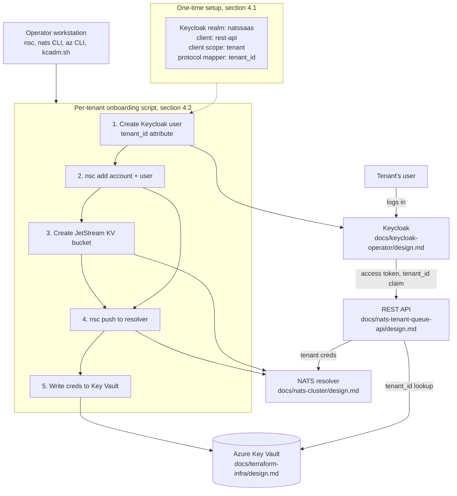

# Tenant provisioning: onboarding a new company onto Keycloak and NATS

> **Status:** Proposed for review

## 1. Executive summary

Today, when a new company wants to use this system, nothing actually creates its access. `docs/nats-tenant-queue-api/design.md` (section 13), `docs/keycloak-operator/design.md` (section 1), `docs/nats-cluster/design.md` (section 9), and `docs/nats-auth-middleware/design.md` (Out of scope) all assume a "tenant-provisioning workstream" exists and each explicitly hands off to it, but none of them specify it. A new tenant needs two things wired together before its users can call the API at all: a Keycloak identity that carries a `tenant_id` claim on every access token, and a NATS Account plus JetStream Key-Value bucket that the REST API can reach using credentials it can look up by that same `tenant_id`. This document specifies both halves as one onboarding procedure: a single idempotent script an operator runs once per tenant, plus a one-time realm/client setup in Keycloak that only has to happen once, ever. The main downside: onboarding stays a manual, operator-run script rather than tenant self-service, so every new tenant is a human running a command, not a company signing itself up.

## 2. Context and scope

There is no tenant-provisioning code today. `docs/keycloak-operator/design.md` deploys Keycloak itself but stops short of any realm, client, or user configuration. `docs/nats-cluster/design.md` bootstraps the NATS Operator and `SYS` account but explicitly stops before creating any tenant Account. `docs/nats-tenant-queue-api/design.md` assumes a `tenant_id` claim and a resolvable NATS credential exist for every tenant the API serves, but never says how either comes to exist. This document fills that gap: it specifies the one-time Keycloak realm/client/protocol-mapper setup, the per-tenant onboarding script (Keycloak user creation, NATS Account and bucket creation, Azure Key Vault credential write), and the naming rule that ties a `tenant_id` value together across all three systems. In scope: the one-time Keycloak configuration this depends on, the per-tenant script's steps and ordering, the `tenant_id` naming rule, and failure/idempotency behavior. Out of scope: tenant self-service signup (a UI or public API a company would use to sign itself up), billing, and tenant offboarding/deletion (see section 13).

## 3. System context



The operator's workstation is the same trust boundary `docs/nats-cluster/design.md` section 4 already establishes for the NATS Operator's signing keys: this script runs from that same workstation (or one with equivalent access), never from inside the cluster, since it needs the `nsc` identity that can mint a new Account. It also needs Keycloak realm-admin credentials and an Azure AD identity with write access to Key Vault (section 8). The boundary this document must preserve, unchanged from the three documents it completes: the REST API never creates a NATS Account, a KV bucket, or a Keycloak user itself, and a user never receives a NATS credential directly. Everything this document adds runs before a tenant's first request, not in response to one.

## 4. Proposed design

### How it works

**One-time setup (section 4.1)** happens once, before the first tenant is ever onboarded, and never again per tenant: an operator creates a `natssaas` realm in Keycloak, a `rest-api` client for the REST API's login flow, a `tenant` client scope holding one protocol mapper that copies each user's `tenant_id` attribute into a `tenant_id` claim on every issued access token, and adds that client scope as a default scope on the `rest-api` client. This is exactly the "Keycloak protocol mapper" `docs/nats-tenant-queue-api/design.md` section 6 (Naming and identity) already assumes exists; this document is where it actually gets specified and created.

**Per-tenant onboarding (section 4.2)** happens once per company, run by an operator as `./onboard-tenant.sh acme-corp admin@acme-corp.example`. The script validates `acme-corp` against the shared naming rule (section 6), then, in order: creates a Keycloak user in the `natssaas` realm with a `tenant_id` attribute set to `acme-corp` and a temporary password the invited admin must reset on first login; creates a NATS Account named `acme-corp` and a User under it (`nsc add account acme-corp`, `nsc add user -a acme-corp api`); creates that tenant's JetStream KV bucket (`history=1`, per the tombstone-accumulation risk `docs/nats-tenant-queue-api/design.md` section 11 already calls out, and the recommended 1 GiB default quota from that document's section 12); pushes the Account and User JWTs to the NATS resolver (`nsc push -a acme-corp --system-account SYS --system-user sys` — the resolver push needs its own authenticated connection, separate from the tenant creds being pushed, and explicit `SYS`/`sys` flags avoid `nsc` guessing the wrong default identity from local context), the same resolver `docs/nats-cluster/design.md` section 4 bootstrapped and section 9 left ready to receive exactly this push; and writes the tenant's NATS user JWT and seed into Azure Key Vault as two secrets keyed by `acme-corp` (section 6). Once the script finishes, the invited admin resets their password, logs in through Keycloak, receives a token with `tenant_id: acme-corp`, and their first API call succeeds: `Pool.Get` (`docs/nats-auth-middleware/design.md` section 4) resolves `acme-corp`'s NATS credentials from the now-populated Key Vault entry on its first, cache-miss lookup.

### Components and responsibilities

- **Keycloak realm/client/protocol-mapper setup (one-time, section 4.1).** Owns making `tenant_id` a real, mappable user attribute and ensuring every access token the `rest-api` client issues carries it as a claim, once a user has that attribute set. Does not own creating any individual tenant's user, and does not own choosing the `tenant_id` value for any tenant.
- **Onboarding script (per-tenant, section 4.2).** Owns creating one tenant's Keycloak user, NATS Account, JetStream KV bucket, resolver push, and Key Vault credential entry, in the fixed order above, and owns validating the `tenant_id` value before touching any system. Does not own the one-time Keycloak setup (a prerequisite it assumes already ran) and does not own the NATS Operator/`SYS` account bootstrap (a prerequisite `docs/nats-cluster/design.md` section 4 already owns). Does not own tenant offboarding (section 13).
- **`tenant_id` naming rule (section 6).** Owns the one constraint every other component in this system already implicitly depends on: that a single string is simultaneously a valid Keycloak user attribute value, a valid NATS Account name, and a valid Azure Key Vault secret name component. Does not own choosing which specific value a given tenant gets; that is a business decision the operator makes when running the script.
- **Azure Key Vault (existing, `docs/terraform-infra/design.md`).** Owns storing the two secrets this script writes per tenant. Does not own generating them; the script writes values `nsc` already generated.

### Decisions

We use a single shared Keycloak realm (`natssaas`) for every tenant, with `tenant_id` as a per-user attribute, rather than a separate realm per tenant. `docs/nats-tenant-queue-api/design.md` section 6 already commits to this shape ("each user is created with a `tenant_id` custom attribute at provisioning time"); a per-tenant realm would mean a per-tenant Keycloak client, a per-tenant JWKS endpoint, and the REST API verifying against whichever realm a request claims to be from, none of which the parent design assumes and all of which would need the request itself to assert a tenant before authentication, which `INV-1` in that document already rules out. The cost of the shared-realm approach is that every tenant's users share one realm's session and rate-limit configuration; Keycloak's own per-realm-vs-per-client isolation options are a real lever if that ever becomes a problem, and are not foreclosed by this decision.

We do the one-time Keycloak setup (realm, client, protocol mapper) as a separate, once-ever procedure (section 4.1) rather than folding it into the per-tenant script with an "if not already configured" check. The one-time setup and the per-tenant script have different blast radii: getting the protocol mapper wrong affects every tenant's tokens at once, while getting one tenant's onboarding wrong affects only that tenant. Keeping them as two separate, separately-reviewable procedures means the high-blast-radius one gets run and checked once, carefully, rather than re-evaluated (and risking a silent drift) on every tenant onboarding.

We create the Keycloak user with a temporary, must-reset password rather than provisioning an initial password the operator communicates directly, or wiring up a self-registration flow. A temporary Keycloak-issued password that must be reset on first login means the operator never learns, and cannot leak, a password the tenant's user will actually use going forward; a self-registration flow would let a company create the *initial* admin user itself, but "how does a self-registration flow assign the correct `tenant_id` attribute without letting the registrant choose it" is exactly the trust problem `INV-1` (below) exists to close off, and is deferred to Open questions rather than solved here.

We order the script's five steps (section 4.2) Keycloak user first, then NATS Account and bucket, then resolver push, then Key Vault write, specifically so that any step failing midway leaves the system in a state that already fails closed rather than one that grants partial access. A Keycloak user existing without a NATS Account is inert: `AuthMiddleware` still verifies the token fine, but `Pool.Get` finds no Key Vault entry and returns `503`, exactly the "tenant not yet provisioned" failure `docs/nats-tenant-queue-api/design.md` section 7 already documents. A NATS Account existing without a Key Vault entry is equally inert, for the same reason. The only step whose failure is not automatically inert is the Key Vault write itself (the last step); if it fails, the script reports exactly that and is safe to re-run (Requirements), since every step before it is idempotent against being re-run with the same `tenant_id`.

We write the tenant's NATS user JWT and seed as two separate Key Vault secrets, not one combined `.creds` file secret, matching `docs/nats-auth-middleware/design.md` section 4's `Pool.Get` description ("fetch that tenant's NATS user JWT and seed") and its use of `nats.UserJWTAndSeed` rather than a filesystem-based credentials file. This also matches the two-secret shape `docs/keycloak-operator/design.md` section 4.1 already uses for Keycloak's own database credential (`keycloak-db-username`/`keycloak-db-password`), so this is not a new pattern in this project's Key Vault.

## 5. Invariants and requirements

### Invariants

- `INV-1`: A `tenant_id` value is never chosen by, or accepted from, the company being onboarded. It is chosen by the operator running the onboarding script, validated against the naming rule (section 6) before any system is touched, and then used identically (byte-for-byte) as the Keycloak user attribute value, the NATS Account name, and the Key Vault secret name component for that tenant.
- `INV-2`: The onboarding script never creates a Keycloak user, NATS Account, or Key Vault secret for a `tenant_id` that already exists in that respective system; re-running the script for an existing `tenant_id` is a no-op for whichever steps already succeeded (Requirements), never a duplicate or an overwrite.
- `INV-3`: A NATS Account or JetStream KV bucket existing for a `tenant_id` with no corresponding Key Vault secret entry can never be used to serve a request; `Pool.Get` (`docs/nats-auth-middleware/design.md`) only ever resolves credentials through Key Vault, never by querying the NATS resolver directly.
- `INV-4`: The one-time Keycloak setup (section 4.1) provisions exactly one `tenant_id` protocol mapper, attached to one client scope, applied as a default scope on the `rest-api` client. No per-tenant Keycloak configuration duplicates or overrides this mapper.

### Requirements

- The onboarding script accepts a `tenant_id` and rejects it before any side effect if it fails the naming rule (section 6).
- Running the script twice in a row with the same `tenant_id` and the same arguments succeeds both times and leaves the same end state as running it once (`INV-2`).
- The script's Key Vault write step is the only step that is not naturally idempotent by construction (the earlier steps use each tool's own "already exists" checks); the script explicitly checks for an existing secret with the same name before writing, rather than relying on `az keyvault secret set` to silently version over it, so a partial re-run never masks a prior write with different content.
- The script prints a clear success or failure result for each of its five steps, so a failure midway is attributable to a specific step, not the run as a whole.

## 6. Interfaces and data

This document's interface is the onboarding script's CLI and the naming rule every system-specific identifier derives from.

```console
./onboard-tenant.sh <tenant_id> <admin_email>
```

### Naming and identity

- **`tenant_id`**: chosen by the operator (`INV-1`), and validated against `^[a-z0-9]([a-z0-9-]{0,61}[a-z0-9])?$` before the script does anything else. This regex is the intersection of three independent constraints: Azure Key Vault secret names allow only alphanumeric characters and dashes (up to 127 characters); NATS Account names (via `nsc`) allow any printable identifier but this project additionally restricts them to the same safe character set so a tenant's Account name is never a surprise to `nsc` tooling or shell scripting around it; and keeping it short and DNS-label-shaped leaves room to reuse the same value as a Kubernetes label or namespace segment later, without a second identifier ever needing to be invented. If a `tenant_id` fails this rule, the script exits before creating anything, and the operator picks a different value; `tenant_id` is never auto-generated, since it should be a recognizable name (matching the company), not an opaque identifier.
- **Keycloak user attribute**: `tenant_id`, set to the exact `tenant_id` value at user-creation time (`kcadm.sh create users` with `-s attributes.tenant_id=<tenant_id>`). Never edited by the onboarding script after creation; changing a tenant's ID after users and data already exist is a tenant-migration event, explicitly out of scope in `docs/nats-tenant-queue-api/design.md` section 6 ("that is a tenant migration event out of scope for this design") and inherited as out of scope here too.
- **NATS Account name**: `nsc add account <tenant_id>`, identical to the `tenant_id` value. `nsc` accounts are looked up by name during onboarding and by public key once pushed to the resolver; the script records both, but only the name (`tenant_id`) is what any other document or component ever needs to reference this Account by.
- **Key Vault secret names**: `tenant-<tenant_id>-nats-jwt` and `tenant-<tenant_id>-nats-seed`, the two secrets `docs/nats-auth-middleware/design.md` section 4's `Pool.Get` fetches on a cache miss. The `tenant-` prefix distinguishes these from the flat, resource-specific secret names Key Vault already holds (`keycloak-db-username`, `postgres-admin-password`), so listing secrets by prefix cleanly separates tenant credentials from platform credentials.
- **JetStream KV bucket name**: `<tenant_id>`, created inside the tenant's own Account (`nats kv add <tenant_id> --history=1 --max-bytes=1073741824`, using the tenant's own User credentials so the bucket is created inside that Account's namespace, not a shared one), matching `docs/nats-tenant-queue-api/design.md` section 11's `history=1` recommendation and section 12's 1 GiB default quota.

## 7. Failure behavior and lifecycle

- **Keycloak user creation fails** (realm unreachable, `tenant_id` attribute already exists on a different user, and so on): the script exits before touching NATS or Key Vault. Nothing partial exists anywhere; re-running after the underlying issue is fixed is safe (`INV-2`).
- **NATS Account or User creation fails** (`nsc` cannot reach the resolver, or the Operator's local signing key is unavailable on this workstation): the script exits with the Keycloak user already created but inert, since no Key Vault entry exists yet for that `tenant_id` (`INV-3`). Re-running the script skips the already-created Keycloak user (`INV-2`) and retries from the NATS step.
- **JetStream KV bucket creation fails** (storage quota misconfiguration, resolver push not yet propagated): same inert state as above; the Account exists but has no bucket and no Key Vault entry, so no request can be served for this tenant yet.
- **Resolver push (`nsc push`) fails or times out**: the Account and User JWTs exist locally (in the operator's `nsc` working directory) but the running NATS cluster has not yet accepted them, so a User credential minted in this step cannot yet open a connection even if it somehow reached Key Vault. The script does not proceed to the Key Vault write until the push is confirmed, so this failure mode also leaves an inert, safely-retriable state.
- **Key Vault write fails** (network, throttling, an insufficiently-privileged operator identity): every other step already succeeded; the tenant's NATS Account, bucket, and credentials are fully provisioned and pushed, but unreachable until this last write succeeds. The script reports exactly this state on failure ("NATS provisioning complete, Key Vault write failed, re-run to retry") so an operator does not need to inspect four different systems to know what is left to do; re-running the script performs only this last step, since every earlier step's idempotency check finds its work already done.
- **Script run twice for the same `tenant_id` with no failure in between**: every step's own "already exists" check makes the second run a no-op (`INV-2`); the script exits `0` and reports "already provisioned" rather than erroring.
- **A tenant is provisioned but never logs in**: no different from any other unused Keycloak account and unused NATS Account; nothing in this design expires or reclaims an onboarded-but-unused tenant (see Open questions).

## 8. Security, privacy, and operations

- **Trust boundary**: this script is the only place in the system that mints the binding between a `tenant_id`, a Keycloak identity, and a NATS credential. It runs on an operator's workstation, the same trust boundary `docs/nats-cluster/design.md` section 4 already requires for any `nsc` command that can create a new Account, since the Operator's signing key never leaves that machine.
- **Authorization to run this script**: requires three separate credentials, none of which the REST API, Keycloak, or NATS pods themselves ever hold: Keycloak realm-admin credentials (to create a user via `kcadm.sh` or the Admin REST API), the `nsc` Operator identity (to sign a new Account), and an Azure AD identity with write access to Key Vault. We recommend the operator's own identity be granted the `Key Vault Secrets Officer` role (write), scoped to this Key Vault only, rather than reusing the AKS or Keycloak workload identities from `docs/terraform-infra/design.md` and `docs/keycloak-operator/design.md`, both of which only hold `Key Vault Secrets User` (read) and by design should never gain write access.
- **Sensitive data**: the NATS user seed (the private half of the User's key pair) exists briefly in the script's process memory and in Key Vault; it is never written to disk outside the operator's `nsc` working directory (already covered by `docs/nats-cluster/design.md` section 4's operator-identity-backup open question) and never logged.
- **Tenant admin invitation**: the temporary password and invitation link (or email) are the one piece of this flow that reaches a person outside the operating team; whatever channel delivers them should not be this script's own stdout in a shared terminal (see Open questions for the specific delivery mechanism).
- **Operational dependency**: this script depends on Keycloak, the NATS resolver, and Key Vault all being reachable and healthy; if any is down, onboarding a new tenant is blocked, but this has no effect on already-onboarded tenants' traffic, since none of `docs/nats-tenant-queue-api/design.md`'s runtime request path calls anything this script calls.

## 9. Acceptance criteria

- `AC-1`: Running the onboarding script for a new `tenant_id` results in a Keycloak user with that `tenant_id` attribute, a NATS Account and JetStream KV bucket of the same name pushed to the resolver, and two Key Vault secrets (`tenant-<tenant_id>-nats-jwt`, `tenant-<tenant_id>-nats-seed`) holding that Account's User credentials.
- `AC-2`: After that user resets their temporary password and logs in through Keycloak, the resulting access token's `tenant_id` claim equals the exact `tenant_id` value passed to the script (`INV-1`).
- `AC-3`: A `POST /v1/items` request bearing that token succeeds, and the item is written into that tenant's own JetStream KV bucket, not any other tenant's.
- `AC-4`: Running the script a second time with the same `tenant_id` exits successfully with no duplicate Keycloak user, no duplicate NATS Account, and no changed Key Vault secret values (`INV-2`).
- `AC-5`: A `tenant_id` that fails the naming rule (section 6) is rejected before the script performs any Keycloak, NATS, or Key Vault operation.
- `AC-6`: If the script is interrupted after the NATS steps but before the Key Vault write, a request from that tenant's (already-logged-in) user fails with `503` (matching `docs/nats-tenant-queue-api/design.md` section 7's `tenant_not_provisioned` behavior), and re-running the script to completion makes the same request succeed without any other change.

## 10. Test approach

- A scripted end-to-end test runs the onboarding script against a local Keycloak realm, an embedded/local NATS server, and a test Key Vault (or a mocked Key Vault client), then drives a real login and API call to prove `AC-1` through `AC-3`.
- The same test harness runs the script twice in a row and asserts no duplicate resources and no changed secret values, proving `AC-4` and `INV-2`.
- A table-driven unit test feeds a list of valid and invalid `tenant_id` values through the naming-rule check alone (no side effects), proving `AC-5`.
- A fault-injection test runs the script with the Key Vault write step forced to fail, asserts the tenant's request fails with `503`, then removes the fault and re-runs the script, asserting the same request now succeeds, proving `AC-6` and the failure-behavior claims in section 7.
- A manual review of the one-time Keycloak setup (section 4.1) confirms the `tenant_id` protocol mapper is attached to exactly one client scope, applied as a default scope on the `rest-api` client, and that a decoded access token for a test user carries the claim (`INV-4`).

## 11. Risks and tradeoffs

- The script is a manual, operator-run procedure, not tenant self-service; every new tenant is a human running a command on a workstation with three separate sets of credentials. This matches the recommended default `docs/nats-tenant-queue-api/design.md` section 12 already calls out ("stubbed here with a manual provisioning script for the first tenants") but is a real scaling limit once onboarding volume grows past what one or two operators can handle by hand.
- The onboarding script's five steps are not a single atomic transaction across three independent systems; a failure between steps leaves a real, if inert and safely-retriable, partial state (section 7). A more robust design would use a durable job queue or a reconciling controller instead of a linear script, at real implementation cost this document does not take on now (see Open questions).
- Running this script requires an operator's workstation to hold three high-value credentials at once (Keycloak realm-admin, the NATS Operator signing key, and a Key Vault write-capable Azure AD identity); compromising that workstation compromises the ability to onboard a rogue tenant or read every existing tenant's NATS credentials from Key Vault. This is the same concentration-of-trust tradeoff `docs/nats-cluster/design.md` section 4 already accepts for the NATS Operator identity alone; this document extends it to two more credentials on the same machine.

## 12. Open questions

- Should onboarding move from a manual script to a self-service flow (a signup form that creates the Keycloak user, or a reconciling controller that watches for new tenants) once volume justifies it? Recommended default: keep the manual script until real onboarding volume or operator bandwidth data says otherwise, consistent with `docs/nats-tenant-queue-api/design.md` section 12's own recommended default. Does not block starting work.
- How does the invited tenant admin actually receive their temporary Keycloak password: Keycloak's own "send invite email" flow (requires Keycloak SMTP configuration, not yet specified anywhere), or a manual, out-of-band message the operator sends? Recommended default: configure Keycloak's built-in email actions (`UPDATE_PASSWORD` required action plus SMTP settings) so the operator never handles the password directly, deferred as a follow-up to this document's realm setup (section 4.1). Blocks a production-safe rollout, not initial script development.
- Should this script become a durable, resumable job (tracking per-tenant onboarding state in a small database or a file) rather than a linear shell script relying on each step's own idempotency check? Recommended default: start with the linear script, since the per-step idempotency checks in section 4.2 already make re-runs safe, and revisit only if onboarding volume or failure frequency makes manual re-running impractical. Does not block starting work.
- Who is authorized to run this script, and is that access itself audited (who onboarded which tenant, when)? Recommended default: restrict the three required credentials (section 8) to a small, named set of operators, and log each script run's `tenant_id` and operator identity to a location outside the script's own stdout. Blocks a production-safe rollout, not initial script development.
- Should a `tenant_id` ever be reusable after a tenant is offboarded (see Out of scope), or permanently retired once used? Recommended default: permanently retired, so a Key Vault secret, NATS Account, or Keycloak attribute value can never be misread as belonging to a different, later company. Does not block starting work.

## 13. Out of scope

- Tenant self-service signup (a UI or public API a company would use to onboard itself without an operator running this script).
- Tenant offboarding and deletion (removing a tenant's Keycloak users, NATS Account, JetStream bucket, and Key Vault secrets). `docs/nats-cluster/design.md` section 9 already notes the resolver's `allow_delete: false` default makes Account removal a deliberate, separate operation, not a reversal of this document's push step.
- Tenant ID migration (changing a `tenant_id` after data already exists), already out of scope in `docs/nats-tenant-queue-api/design.md` section 6.
- Billing, metering, or per-tenant usage reporting, already out of scope in `docs/nats-tenant-queue-api/design.md` section 13.
- Keycloak email/SMTP configuration for the tenant-admin invitation flow (see Open questions).
- A durable job queue or reconciling controller replacing the linear onboarding script (see Open questions).
- The NATS Operator/`SYS` account bootstrap and the Keycloak realm/client/protocol-mapper's underlying deployment; this document assumes `docs/nats-cluster/design.md` section 4 and `docs/keycloak-operator/design.md` have already run.
