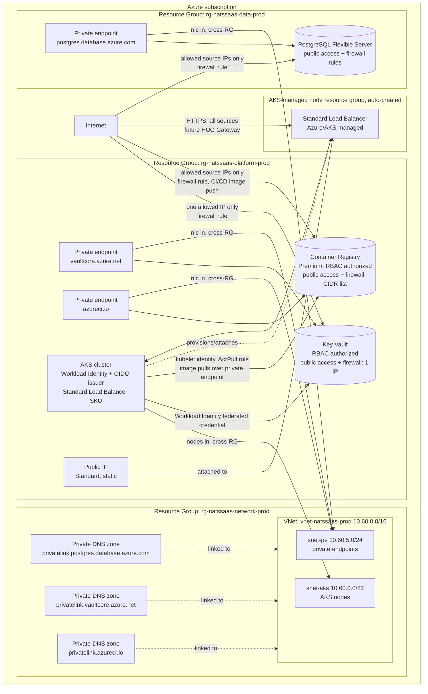

# Terraform project for the nats-saas Azure infrastructure

> **Status:** Proposed for review

## 1. Executive summary

Today there is no infrastructure at all for the system described in `docs/nats-tenant-queue-api/design.md`: no Resource Group, no network, no Kubernetes cluster, no database, no secret store. Someone would otherwise have to click these five pieces together by hand in the Azure Portal, which is slow, unrepeatable, and leaves no record of what was actually configured. This design describes a Terraform project that provisions, in order, three Resource Groups (one for the network, one for the AKS cluster and Key Vault, one for PostgreSQL), an Azure Virtual Network, an AKS cluster with a public, internet-facing Standard Load Balancer, an Azure Database for PostgreSQL Flexible Server, an Azure Key Vault, and an Azure Container Registry (ACR) that stores the container image for the middleware application described in `docs/nats-auth-middleware/design.md`, wired together the way the application design already assumes (AKS workloads reach Key Vault and PostgreSQL only from inside the network, using Workload Identity instead of stored credentials, and AKS nodes pull images from ACR using a managed identity instead of a stored registry password). Key Vault, PostgreSQL, and ACR each get a private endpoint for in-VNet traffic plus a public path restricted by a firewall, so operators and tooling outside the VNet can also reach them directly: PostgreSQL's firewall allows a configurable list of source CIDR ranges, Key Vault's firewall allows exactly one configured public IP address, and ACR's firewall allows a configurable list of source CIDR ranges for the CI/CD tooling that pushes images. The main downside: those public paths are a materially larger attack surface than VNet-only access would be, mitigated only by deny-by-default firewalls (section 8) that admit nothing until an environment explicitly configures an allowed source, and Key Vault's exposure is the most consequential of the three, since Key Vault also holds PostgreSQL's own admin credential; ACR's public path is the second most consequential, since anything able to push to it can put an image onto the cluster that AKS will pull and run. Splitting resources across three Resource Groups instead of one also means the AKS cluster and the PostgreSQL server must be explicitly granted network access into a VNet they do not own, rather than inheriting it by being created alongside it. The AKS cluster's public exposure is different in kind from Key Vault's and PostgreSQL's: it is not an extra, risk-accepted convenience path, it is the one entry point the whole system in `docs/nats-tenant-queue-api/design.md` is built to serve traffic through, so this project treats it as a required, always-on public path rather than a deny-by-default one.

## 2. Context and scope

This is greenfield infrastructure-as-code work; there is no existing Terraform state or hand-created Azure resources to reconcile against. In scope: a Terraform project that creates three Resource Groups (network, platform, data), one Virtual Network with its subnets (in the network Resource Group), one AKS cluster with Workload Identity and its OIDC issuer enabled, configured with the Standard Load Balancer SKU and a static, Terraform-managed public IP so cluster workloads are reachable from the internet, one Azure Key Vault RBAC-authorized with dual connectivity, a private endpoint for traffic from inside the VNet plus public network access restricted by its firewall to a single allowed public IP address, and one Azure Container Registry, Premium SKU, also RBAC-authorized with dual connectivity, a private endpoint for AKS's own image pulls plus public network access restricted by firewall rules for the CI/CD tooling that pushes images (all three in the platform Resource Group), and one Azure Database for PostgreSQL Flexible Server also with dual connectivity, a private endpoint for traffic from inside the VNet plus public network access restricted by firewall rules for traffic from the internet (in the data Resource Group), all in a single Azure region. Out of scope: deploying NATS, Keycloak, HUG, or the REST API into the cluster (that is Helm/`kubectl` work layered on top of this infrastructure, not part of this Terraform project), the CI/CD pipeline that builds the middleware application's image and pushes it to the registry this project creates, DNS and TLS certificate provisioning, and multi-region or multi-environment topology beyond what section 12 recommends as a default.

## 3. System context



This Terraform project creates the ground everything in `docs/nats-tenant-queue-api/design.md` stands on. It does not create or configure NATS, Keycloak, HUG, or the REST API itself; it stops at the point where `kubectl` and Helm can take over, and at the point where the API's Kubernetes ServiceAccount can already exchange its token for a Key Vault secret without embedding any static Azure credential in a pod, matching the trust boundary that design already commits to. The boundary this project must preserve: Key Vault, PostgreSQL, and ACR are all reachable from inside the VNet over their private endpoints, and from the internet only from source IPs explicitly present in their respective firewalls, exactly one IP for Key Vault and a configurable list of CIDR ranges for PostgreSQL and for ACR, with no other public source accepted by any of the three. AKS pulls the middleware application's image from ACR over ACR's private endpoint, using the cluster's kubelet identity, and never over ACR's public path; that public path exists only for the CI/CD tooling (out of scope, section 13) that builds and pushes the image from outside the VNet. The AKS cluster's own data-plane path is the one deliberate exception to "restricted by default": it is provisioned with a Standard Load Balancer and a static public IP so that, once the application layer (`docs/nats-tenant-queue-api/design.md`, section 3) deploys HUG's Gateway as a Kubernetes `LoadBalancer` Service, the whole system is reachable from any internet source, gated by the application layer's own TLS termination and routing, not by an infrastructure-level firewall. A second boundary this project introduces: the network Resource Group holds only network plumbing (the VNet, its subnets, the private DNS zones); no compute or data resource is ever created inside it, so the team that owns network security review only ever reviews network-shaped resources there.

## 4. Proposed design

### How it works

Someone runs this project for the first time against a brand-new Azure subscription. First, a one-time bootstrap script (outside Terraform, see Decisions) creates a Storage Account and blob container to hold Terraform's own state, since Terraform cannot manage the state store it depends on to run. With that in place, `terraform init` points at the `azurerm` backend, and `terraform apply` walks a single dependency graph: it creates the three Resource Groups first (network, platform, data; everything else references one of their names and locations), then, inside the network Resource Group, the Virtual Network with its three subnets and its two private DNS zones, then, inside the platform Resource Group, the Key Vault (public network access enabled, firewall default-deny with no IP rule until the environment's `key_vault_allowed_public_ip` variable supplies one) and its private endpoint (whose network interface joins `snet-pe` across the Resource Group boundary) and the AKS cluster (whose nodes join `snet-aks` the same cross-RG way, with Workload Identity enabled, the Standard Load Balancer SKU, and outbound type `loadBalancer`), plus a static Standard public IP address in the platform Resource Group that Terraform passes to AKS so any Kubernetes `LoadBalancer` Service created later attaches to that same stable address instead of a fresh, unpredictable one, and the Container Registry (Premium SKU, RBAC authorized, public network access enabled, firewall default-deny with no CIDR rule until the environment's `acr_firewall_allowed_cidrs` variable supplies some) and its private endpoint (also joining `snet-pe`), then a role assignment that needs AKS and ACR to both already exist, so Terraform orders it after both resources automatically, from the resource references alone: granting the AKS cluster's kubelet identity the `AcrPull` role on the registry (`Key Vault Secrets User` for each individual in-cluster workload — Keycloak, the REST API — is a separate role assignment against a separate, dedicated user-assigned identity, granted by that workload's own companion document extending this same root module; see Decisions), then, inside the data Resource Group, the PostgreSQL Flexible Server (public network access enabled, no firewall rules until the environment's `postgres_firewall_allowed_cidrs` variable supplies some) and its own private endpoint (whose network interface also joins `snet-pe`, the same cross-RG way as Key Vault's), and finally a generated admin password written into Key Vault as a secret. Reaching across a Resource Group boundary to join a subnet on an ongoing basis (not just at first apply, but for every future node scale-out) needs an explicit `Network Contributor` role assignment on the network Resource Group, granted to the AKS cluster's identity; Terraform creates this role assignment as part of the same graph, ordered before the AKS cluster resource that needs it. The Key Vault and PostgreSQL private endpoints need no such standing role assignment; creating a private endpoint's network interface in a subnet only requires that Terraform's own deploying identity (already Owner/Contributor across all three Resource Groups) have join rights at apply time, which it already does. One `terraform apply` performs all of this in the correct order; no manual two-phase apply or `-target` flag is needed once the state backend itself exists. The operator sees Terraform's plan list every resource before anything is created, then a single set of outputs at the end: the AKS cluster name, its OIDC issuer URL, its static public IP address, the Key Vault name and URI, the Container Registry's login server hostname, and the PostgreSQL server's private FQDN, everything the next layer (Helm charts, `kubectl`, and the CI/CD pipeline that pushes the middleware application's image) needs to proceed, including the exact IP the HUG Gateway's `LoadBalancer` Service should pin itself to and the exact registry hostname the middleware application's Deployment manifest should reference.

### Components and responsibilities

- **`modules/resource_group`.** Owns a single Resource Group and its location and tags; the root module instantiates it three times (network, platform, data). Does not own anything inside any Resource Group; every other module takes the relevant Resource Group's name as input.
- **`modules/network`.** Deployed into the network Resource Group. Owns the Virtual Network, its two subnets (`snet-aks`, `snet-pe`), and the two private DNS zones (for Key Vault and PostgreSQL private-link names) plus their VNet links. Does not own any resource that lives inside the subnets, and does not own granting any other Resource Group's identities access to itself; it only owns the network shape those resources plug into.
- **`modules/aks`.** Deployed into the platform Resource Group. Owns the AKS cluster, its system and user node pools, Azure CNI Overlay networking, its Standard Load Balancer SKU and outbound type, and enabling Workload Identity plus the OIDC issuer (`oidc_issuer_url`, exposed as a module output, is what every workload-specific federated identity credential is built against downstream). Owns the static Standard public IP address (`azurerm_public_ip`) that AKS's managed Load Balancer attaches to. Does not own any per-workload identity, federated credential, or Key Vault role assignment: those belong to whichever workload needs them (Keycloak's, in `docs/keycloak-operator/design.md` section 4.1; the REST API's, in `docs/rest-api-workload/design.md` section 6), each extending this root module directly rather than being provisioned by this module. Does not own the Load Balancer resource itself, which Azure creates and manages automatically, in AKS's own auto-generated node resource group, the moment the first Kubernetes `LoadBalancer` Service is created; this module only owns the inputs (SKU, public IP) that shape it. Does not own what runs inside the cluster (no Helm releases, no Kubernetes manifests), does not own the ACR role assignment itself (lives in the root module, since it is the join point between two modules' outputs), and does not own the `Network Contributor` role assignment that lets its nodes join a subnet in a different Resource Group (also the root module's job).
- **`modules/key_vault`.** Deployed into the platform Resource Group, alongside AKS. Owns the Key Vault resource, its RBAC authorization mode, purge protection, its public network access setting and single-IP firewall rule, and its private endpoint (whose NIC joins `snet-pe` in the network Resource Group). Does not own who gets access; role assignments are granted from the root module once the principal (AKS's identity) exists.
- **`modules/container_registry`.** Deployed into the platform Resource Group, alongside AKS and Key Vault. Owns the Container Registry resource, its Premium SKU, RBAC authorization (`admin_enabled = false`, matching Key Vault's own no-static-credential stance), its public network access setting and CIDR-list firewall rule, and its private endpoint (whose NIC joins `snet-pe` in the network Resource Group, the same subnet Key Vault's and PostgreSQL's private endpoints use). Does not own who gets `AcrPull`/`AcrPush` access; those role assignments are granted from the root module once the relevant principal exists, and does not own the CI/CD pipeline or credential that actually pushes an image (out of scope, section 13).
- **`modules/postgresql`.** Deployed into the data Resource Group, alone. Owns the PostgreSQL Flexible Server, its SKU, storage, backup retention, its public network access setting, its firewall rules (one `azurerm_postgresql_flexible_server_firewall_rule` per entry in the allowed-CIDR list), and its private endpoint (whose NIC joins `snet-pe` in the network Resource Group, the same subnet Key Vault's private endpoint uses). Does not own the admin credential's lifecycle beyond initial creation; it accepts the password as an input variable rather than generating it itself, so the root module can write that same value to Key Vault.
- **Root module.** Owns wiring the child modules together, the `Network Contributor` role assignment on the network Resource Group for AKS, the `AcrPull` role assignment on the Container Registry for AKS's kubelet identity, and the `random_password` resource for the PostgreSQL admin credential. Does not own any workload's `Key Vault Secrets User` role assignment (each workload's companion document extends this root module with its own, see `modules/aks` above) and does not duplicate any resource definition that already lives in a child module.

### Decisions

We provision one VNet and one instance of each resource, matching the application design's single-region, single-VNet assumption. A per-environment or per-region split is deferred (see Open questions) rather than built now, because there is no second environment to serve yet and building for it speculatively would add module parameters nothing currently exercises.

We split the resources across three Resource Groups instead of one: `rg-natssaas-network-prod` for the VNet, subnets, and private DNS zones; `rg-natssaas-platform-prod` for the AKS cluster and Key Vault; `rg-natssaas-data-prod` for the PostgreSQL Flexible Server. This gives each a separate lifecycle and a separate RBAC boundary, so, for example, someone can be granted Contributor on the data Resource Group to manage PostgreSQL without also getting any access to the AKS cluster or the network. It also means a `terraform destroy` or an access grant scoped to one Resource Group cannot reach the resources in another by accident. The cost is real: AKS now reaches into a VNet it does not own, which needs an explicit `Network Contributor` role assignment on the network Resource Group (see Components and responsibilities), and every cross-Resource-Group reference (AKS's nodes, and both private endpoints) is one more place a `terraform plan` can surface a permissions error instead of a clean diff. We rejected keeping everything in one Resource Group, which is simpler to reason about and has no cross-RG role assignments to get wrong, because it gives every operator with Contributor on that one Resource Group full control over the network, the cluster, the secret store, and the database all at once, which is a wider blast radius than this system should default to.

We bootstrap the Terraform state backend (an Azure Storage Account and blob container) with a short one-time script or manual `az` commands, outside Terraform itself, rather than trying to manage it as a Terraform resource. Terraform cannot create the backend it is about to authenticate against and store its own state in; every practical Terraform-on-Azure setup treats this as a separate, rarely-repeated step. The cost is one manual step that is not captured as code, so it is documented as a short runbook (see section 6) rather than left implicit.

We give Key Vault dual connectivity: a private endpoint for in-VNet traffic, and public network access gated by Key Vault's own firewall (`network_acls`, default action `Deny`) restricted to exactly one allowed public IP address, rather than either a fully private vault or a broader allowlist. Unlike PostgreSQL, Azure Key Vault's private endpoint and its public-access firewall are not mutually exclusive, so this needs no change to how Key Vault sits in the network (it still uses the same `snet-pe` private endpoint as before). We chose a single IP rather than a CIDR list, unlike PostgreSQL's allowlist, because the intended use of this path is one specific known caller (for example, one operator's workstation or one CI runner) rather than a general pool of external clients; if a second caller needs public access later, that is a deliberate one-line change to `key_vault_allowed_public_ip`, not an oversight. The cost is real: Key Vault holds every secret this project manages, including PostgreSQL's own admin credential, so its public path is the single highest-value target in this system, and it stays open to that one IP even though the application design's own trust boundary (Workload Identity, in-cluster-only access) never uses it. Reaching Key Vault from any other public IP, or before `key_vault_allowed_public_ip` is set, still requires network access into the VNet, for example `az aks command invoke` (runs the command from inside the cluster's network) or a bastion host.

We give the Container Registry dual connectivity as well, and we pick the **Premium** SKU specifically to get it: Basic and Standard ACR SKUs do not support Azure Private Link at all, so a private endpoint for AKS's own image pulls is only reachable with Premium. AKS pulls the middleware application's image over that private endpoint, using the `AcrPull` role granted to the cluster's kubelet identity (Decisions, `modules/aks`), never a stored registry password; ACR's `admin_enabled` stays `false` for the same no-static-credential reason `docs/nats-tenant-queue-api/design.md`'s own trust boundary already commits to for Key Vault access. The registry's public path, gated by a CIDR-list firewall (`acr_firewall_allowed_cidrs`, mirroring PostgreSQL's allowlist shape rather than Key Vault's single-IP shape, since a build fleet or CI runner pool is more often a range than one fixed address), exists only so the CI/CD pipeline that builds the middleware application's image (out of scope, section 13) can push to it from outside the VNet; that pipeline still needs its own Azure AD identity with `AcrPush` granted separately; provisioning that identity is out of scope here (see Open questions). We reject a Basic or Standard SKU with public-access-only (no private endpoint) as the alternative, since that would mean every image pull from every AKS node crosses the public internet path, subject to the same firewall allowlist churn problem called out for PostgreSQL below, for traffic that has no reason to ever leave the VNet.

We give PostgreSQL Flexible Server dual connectivity instead: public network access enabled and gated by firewall rules, plus a private endpoint for traffic that originates inside the VNet. AKS's in-cluster traffic (Keycloak's connection pool) reaches PostgreSQL over the private endpoint and never touches the public path; the firewall-gated public path exists so operators, migration scripts, and disaster-recovery tooling outside the VNet can connect directly, without first needing VPN or bastion access into the VNet, unlike Key Vault. Azure Database for PostgreSQL Flexible Server does not support combining a private endpoint with VNet Integration (delegated subnet) mode; choosing dual connectivity means PostgreSQL is no longer VNet-injected, so it no longer needs a delegated subnet at all (`snet-postgres` from the previous revision of this design is retired; PostgreSQL's private endpoint joins `snet-pe` instead, see section 6). We reject leaving the firewall allowlist open to `0.0.0.0/0`, since that would expose an authentication-gated database port to the entire internet; the allowed-CIDR list defaults to empty, so the public path stays closed until an environment explicitly opts a CIDR range in (see Requirements and section 8).

We configure AKS with the Standard Load Balancer SKU (not Basic, which Azure has deprecated for new clusters) and a Terraform-managed static public IP, so the cluster's data plane is reachable from the internet from day one, matching `docs/nats-tenant-queue-api/design.md`'s assumption that HUG sits behind an Azure Standard Load Balancer with a public IP. Terraform itself does not create the Load Balancer resource; Azure creates and manages it automatically, inside AKS's own auto-generated node resource group, the first time a Kubernetes `LoadBalancer` Service (HUG's Gateway Service, at the application layer) asks for one. What Terraform does own is the static public IP that Load Balancer attaches to: without it, Azure would allocate a fresh dynamic IP, which could change on cluster recreation or on some Load Balancer reconfigurations, breaking DNS records that point at it. This is a materially different exposure than Key Vault's and PostgreSQL's: there is no infrastructure-level firewall gating who can reach the AKS Load Balancer, because gating internet traffic is the application layer's job (HUG's TLS termination and routing), not this project's; this project's responsibility stops at making the public IP exist and stay stable.

We use Azure CNI Overlay (not kubenet, not classic Azure CNI) for AKS pod networking. Overlay keeps pod IP consumption off the VNet's address space, so `snet-aks` only needs to size for nodes, not for nodes times max pods per node; this keeps the address plan (section 6) small and avoids a subnet resize later if the node count grows.

We generate the PostgreSQL admin password with Terraform's `random_password` resource and write it to Key Vault as a secret, rather than having PostgreSQL Flexible Server's own Azure AD authentication replace password auth entirely. Keycloak's JDBC driver expects a conventional username/password connection string; building and maintaining an Azure AD token exchange inside Keycloak's datasource config is real extra work this design does not take on now. The cost is that the password value passes through Terraform state at least once, which is why state storage access itself is restricted (see section 8).

## 5. Invariants and requirements

### Invariants

- `INV-1`: PostgreSQL Flexible Server's public network access accepts a connection only from a source IP address explicitly present in its firewall rule allowlist; every other public source is rejected before authentication is attempted.
- `INV-2`: Key Vault's public network access accepts a connection only from the single, explicitly configured `key_vault_allowed_public_ip` address; every other public source is rejected before any operation is attempted, and no operation succeeds from a public source without also presenting a valid Azure AD token authorized by RBAC (network reachability alone grants nothing).
- `INV-3`: No Azure credential (client secret, connection string, admin password) is ever written into a `.tf` file or committed to version control. Generated secrets exist only as Terraform state values and Key Vault secrets.
- `INV-4`: The three Resource Groups, the PostgreSQL server, the Key Vault, and the Container Registry carry `prevent_destroy` lifecycle guards, so a `terraform destroy` or an errant `apply` cannot remove them without first editing the Terraform code to lift the guard.
- `INV-5`: The network Resource Group never contains a compute or data resource (no AKS cluster, no Key Vault, no PostgreSQL server). It contains only the VNet, subnets, and private DNS zones.
- `INV-6`: Traffic to PostgreSQL from inside the VNet, over its private endpoint, is never evaluated against the firewall rule allowlist and never leaves the VNet; only traffic arriving over PostgreSQL's public path is subject to `INV-1`.
- `INV-7`: Traffic to Key Vault from inside the VNet, over its private endpoint, is never evaluated against the firewall's single-IP rule and never leaves the VNet; only traffic arriving over Key Vault's public path is subject to `INV-2`.
- `INV-8`: AKS's public IP address is a Standard SKU, static (never dynamic) IP managed by Terraform; it does not change value across a `terraform apply`, an AKS node pool change, or an AKS-managed Load Balancer reconfiguration.
- `INV-9`: The Container Registry's public network access accepts a connection only from a source IP address explicitly present in its firewall's CIDR allowlist; every other public source is rejected before authentication is attempted.
- `INV-10`: Traffic to the Container Registry from inside the VNet, over its private endpoint, is never evaluated against the firewall's CIDR allowlist and never leaves the VNet; only traffic arriving over the registry's public path is subject to `INV-9`.
- `INV-11`: The Container Registry's admin user is disabled. No Azure credential for it is ever written into a `.tf` file or committed to version control (this is the ACR-specific instance of `INV-3`); AKS pulls images using its kubelet managed identity's `AcrPull` role assignment, never a username/password.

### Requirements

- `terraform plan` run twice in a row with no code change shows zero planned changes (the configuration is idempotent).
- Every resource carries a `Project = "nats-saas"` tag so cost and inventory tooling can find everything this project owns.
- Module inputs (region, address space, SKUs, node counts) are declared as variables with defaults, not hardcoded, so a future second environment can override them without editing module code.
- `postgres_firewall_allowed_cidrs` defaults to an empty list, so PostgreSQL's public path stays closed (`INV-1` admits nothing) until an environment's configuration explicitly adds one or more CIDR ranges.
- `key_vault_allowed_public_ip` defaults to `null`, so Key Vault's public path stays closed (`INV-2` admits nothing) until an environment's configuration explicitly sets exactly one IP address.
- `acr_firewall_allowed_cidrs` defaults to an empty list, so the Container Registry's public push path stays closed (`INV-9` admits nothing) until an environment's configuration explicitly adds one or more CIDR ranges.

## 6. Interfaces and data

This project's interface is its Terraform variables and outputs, not an HTTP API.

**Key input variables:** `location` (default `westeurope`), `network_resource_group_name` (default `rg-natssaas-network-prod`), `platform_resource_group_name` (default `rg-natssaas-platform-prod`), `data_resource_group_name` (default `rg-natssaas-data-prod`), `vnet_address_space` (default `10.60.0.0/16`), `aks_kubernetes_version`, `postgres_sku_name` (default `GP_Standard_D2ds_v5`), `postgres_admin_username`, `postgres_firewall_allowed_cidrs` (list of strings, default `[]`), `key_vault_allowed_public_ip` (single string, default `null`), `acr_firewall_allowed_cidrs` (list of strings, default `[]`).

**Key outputs:** `aks_cluster_name`, `aks_oidc_issuer_url` (consumed by the Helm/manifest layer to finish wiring Workload Identity for the API's ServiceAccount), `aks_public_ip_address` (the static IP the HUG Gateway's `LoadBalancer` Service and its DNS record should target), `key_vault_name`, `key_vault_uri` (the same URI resolves to the private endpoint's IP for clients inside the VNet, and to Key Vault's public IP, reachable only from `key_vault_allowed_public_ip`, for clients outside it), `acr_login_server` (the registry hostname, for example `acrnatssaasprod.azurecr.io`; resolves to the private endpoint's IP for clients inside the VNet, including AKS nodes, and to ACR's public IP, reachable only from `acr_firewall_allowed_cidrs`, for clients outside it, such as a CI/CD runner pushing the middleware application's image), `postgres_fqdn` (PostgreSQL's public DNS name; the private DNS zone linked to the VNet resolves it to the private endpoint's IP for clients inside the VNet, while clients outside the VNet resolve it to the public IP and reach it only if their source IP is on the firewall allowlist).

**Address plan:**

| Subnet | CIDR | Purpose |
|---|---|---|
| `snet-aks` | `10.60.0.0/22` | AKS node NICs (pod IPs are overlay, not VNet-routed) |
| `snet-pe` | `10.60.5.0/24` | Private endpoint NICs (Key Vault and PostgreSQL) |

`10.60.4.0/24` (the previous `snet-postgres` delegated subnet) is retired and left unassigned; PostgreSQL no longer needs a delegated subnet once it runs in public-access-plus-private-endpoint mode instead of VNet Integration (see Decisions).

### Naming and identity

- **Resource names**: `<type>-natssaas-<env>` (for example `vnet-natssaas-prod`, `aks-natssaas-prod`, `kv-natssaas-prod`, `psql-natssaas-prod`), or `rg-natssaas-<purpose>-<env>` for the three Resource Groups (`rg-natssaas-network-prod`, `rg-natssaas-platform-prod`, `rg-natssaas-data-prod`), with `env` defaulted to `prod` since only one environment exists today. If a second environment is added later, `env` becomes a real input instead of a fixed default; existing resource names do not change (see Open questions).
- **Container Registry name**: `acrnatssaas<env>` (for example `acrnatssaasprod`), breaking the `<type>-natssaas-<env>` pattern above on purpose: `azurerm_container_registry` names must be globally unique across all of Azure and may only contain alphanumeric characters, no hyphens, so this is the one resource name in this project that cannot follow the shared convention. `acr_login_server` (section 6) is derived by Azure from this name, not set independently.
- **State backend bootstrap** (one-time, outside Terraform): create a Storage Account and blob container by hand or with a short shell script before the first `terraform init`; every `terraform` command after that references it through the `azurerm` backend block. If that Storage Account is ever lost without a state backup, Terraform loses track of every resource it created; recovery means either restoring the Storage Account from Azure's own soft-delete/versioning or re-importing each Azure resource into a fresh state file by its resource ID.
- **PostgreSQL admin password**: generated once by `random_password` at first apply, stored in Terraform state and mirrored into Key Vault. If it needs rotating, that happens outside Terraform (an `az postgres flexible-server update` plus a Key Vault secret update), because re-running `random_password` inside Terraform on every apply would rotate the credential on every unrelated change, which is not the intended trigger.
- **PostgreSQL firewall rules**: each entry in the `postgres_firewall_allowed_cidrs` list becomes one named, `for_each`-driven `azurerm_postgresql_flexible_server_firewall_rule` resource, so removing a CIDR from the list removes its rule on the next `apply` rather than leaving an orphaned rule behind.
- **Key Vault firewall rule**: `key_vault_allowed_public_ip`, when set, becomes the single `ip_rules` entry in the Key Vault's `network_acls` block (`default_action = "Deny"`). Unset (`null`), the `ip_rules` list is empty and no public IP is allowed at all; changing the variable's value replaces that one entry on the next `apply`, it does not accumulate old values.
- **Container Registry firewall rules**: each entry in the `acr_firewall_allowed_cidrs` list becomes one `ip_rule` block in the registry's `network_rule_set` (`default_action = "Deny"`), the same `for_each`-driven, no-orphaned-rule shape as PostgreSQL's firewall rules above, not the single-value shape Key Vault uses.
- **AKS public IP**: a single `azurerm_public_ip` named `pip-natssaas-prod`, Standard SKU, static allocation, created once in the platform Resource Group. AKS references it by resource ID in its Load Balancer profile, so the address stays the same across `apply`s; if the resource is ever deleted and recreated outside this documented flow, Azure assigns a new address and every Kubernetes `LoadBalancer` Service and DNS record pointing at the old one breaks.

### Example Terraform configuration (azurerm)

Snippets below illustrate the shape of the modules and root wiring described above; they are illustrative, not the full project (error handling for edge cases, all variables, and all outputs are trimmed for brevity).

**`providers.tf`** (root module):

```hcl
terraform {
  required_version = ">= 1.7.0"

  required_providers {
    azurerm = {
      source  = "hashicorp/azurerm"
      version = "~> 3.90"
    }
    random = {
      source  = "hashicorp/random"
      version = "~> 3.6"
    }
  }

  backend "azurerm" {
    resource_group_name  = "rg-natssaas-tfstate"
    storage_account_name = "stnatssaastfstate"
    container_name       = "tfstate"
    key                  = "prod/terraform.tfstate"
  }
}

provider "azurerm" {
  features {
    key_vault {
      purge_soft_delete_on_destroy    = false
      recover_soft_deleted_key_vaults = true
    }
  }
}
```

**`modules/resource_group/main.tf`:**

```hcl
variable "name" {
  type = string
}

variable "location" {
  type = string
}

variable "tags" {
  type = map(string)
}

resource "azurerm_resource_group" "this" {
  name     = var.name
  location = var.location
  tags     = var.tags

  lifecycle {
    prevent_destroy = true # INV-4
  }
}

output "name" {
  value = azurerm_resource_group.this.name
}

output "location" {
  value = azurerm_resource_group.this.location
}
```

**`modules/network/main.tf`** (VNet, subnets, private DNS zones):

```hcl
resource "azurerm_virtual_network" "this" {
  name                = "vnet-natssaas-${var.env}"
  resource_group_name = var.resource_group_name
  location            = var.location
  address_space       = [var.vnet_address_space]
  tags                = var.tags
}

resource "azurerm_subnet" "aks" {
  name                 = "snet-aks"
  resource_group_name  = var.resource_group_name
  virtual_network_name = azurerm_virtual_network.this.name
  address_prefixes     = [var.aks_subnet_cidr] # 10.60.0.0/22
}

resource "azurerm_subnet" "pe" {
  name                 = "snet-pe"
  resource_group_name  = var.resource_group_name
  virtual_network_name = azurerm_virtual_network.this.name
  address_prefixes     = [var.pe_subnet_cidr] # 10.60.5.0/24
}

resource "azurerm_private_dns_zone" "key_vault" {
  name                = "privatelink.vaultcore.azure.net"
  resource_group_name = var.resource_group_name
  tags                = var.tags
}

resource "azurerm_private_dns_zone" "postgres" {
  name                = "privatelink.postgres.database.azure.com"
  resource_group_name = var.resource_group_name
  tags                = var.tags
}

resource "azurerm_private_dns_zone" "acr" {
  name                = "privatelink.azurecr.io"
  resource_group_name = var.resource_group_name
  tags                = var.tags
}

resource "azurerm_private_dns_zone_virtual_network_link" "key_vault" {
  name                  = "link-kv-natssaas-${var.env}"
  resource_group_name   = var.resource_group_name
  private_dns_zone_name = azurerm_private_dns_zone.key_vault.name
  virtual_network_id    = azurerm_virtual_network.this.id
}

resource "azurerm_private_dns_zone_virtual_network_link" "postgres" {
  name                  = "link-psql-natssaas-${var.env}"
  resource_group_name   = var.resource_group_name
  private_dns_zone_name = azurerm_private_dns_zone.postgres.name
  virtual_network_id    = azurerm_virtual_network.this.id
}

resource "azurerm_private_dns_zone_virtual_network_link" "acr" {
  name                  = "link-acr-natssaas-${var.env}"
  resource_group_name   = var.resource_group_name
  private_dns_zone_name = azurerm_private_dns_zone.acr.name
  virtual_network_id    = azurerm_virtual_network.this.id
}
```

**`modules/aks/main.tf`** (static public IP, AKS cluster, Workload Identity):

```hcl
resource "azurerm_public_ip" "aks" {
  name                = "pip-natssaas-${var.env}"
  resource_group_name = var.resource_group_name
  location            = var.location
  allocation_method   = "Static"
  sku                 = "Standard"
  tags                = var.tags
}

resource "azurerm_kubernetes_cluster" "this" {
  name                      = "aks-natssaas-${var.env}"
  resource_group_name       = var.resource_group_name
  location                  = var.location
  dns_prefix                = "aks-natssaas-${var.env}"
  kubernetes_version        = var.kubernetes_version
  oidc_issuer_enabled       = true
  workload_identity_enabled = true

  default_node_pool {
    name           = "system"
    vm_size        = var.system_node_vm_size
    vnet_subnet_id = var.aks_subnet_id # cross-RG: snet-aks in the network RG
    auto_scaling_enabled = true
    min_count      = var.system_node_min_count
    max_count      = var.system_node_max_count
  }

  identity {
    type = "SystemAssigned"
  }

  network_profile {
    network_plugin      = "azure"
    network_plugin_mode = "overlay"
    load_balancer_sku   = "standard"
    outbound_type       = "loadBalancer"
    load_balancer_profile {
      outbound_ip_address_ids = [azurerm_public_ip.aks.id]
    }
  }

  tags = var.tags
}

output "cluster_id" {
  value = azurerm_kubernetes_cluster.this.id
}

output "oidc_issuer_url" {
  value = azurerm_kubernetes_cluster.this.oidc_issuer_url
}

output "kubelet_identity_object_id" {
  value = azurerm_kubernetes_cluster.this.kubelet_identity[0].object_id
}

output "public_ip_address" {
  value = azurerm_public_ip.aks.ip_address
}
```

**`modules/key_vault/main.tf`** (RBAC-authorized vault, single-IP firewall, private endpoint):

```hcl
resource "azurerm_key_vault" "this" {
  name                          = "kv-natssaas-${var.env}"
  resource_group_name           = var.resource_group_name
  location                      = var.location
  tenant_id                     = var.tenant_id
  sku_name                      = "standard"
  enable_rbac_authorization     = true
  purge_protection_enabled      = true
  public_network_access_enabled = true
  tags                          = var.tags

  network_acls {
    default_action = "Deny"
    bypass         = "AzureServices"
    ip_rules       = var.allowed_public_ip == null ? [] : [var.allowed_public_ip] # INV-2
  }

  lifecycle {
    prevent_destroy = true # INV-4
  }
}

resource "azurerm_private_endpoint" "key_vault" {
  name                = "pe-kv-natssaas-${var.env}"
  resource_group_name = var.resource_group_name
  location            = var.location
  subnet_id           = var.pe_subnet_id # cross-RG: snet-pe in the network RG
  tags                = var.tags

  private_service_connection {
    name                           = "psc-kv-natssaas-${var.env}"
    private_connection_resource_id = azurerm_key_vault.this.id
    subresource_names              = ["vault"]
    is_manual_connection           = false
  }

  private_dns_zone_group {
    name                 = "default"
    private_dns_zone_ids = [var.key_vault_private_dns_zone_id]
  }
}

output "id" {
  value = azurerm_key_vault.this.id
}

output "uri" {
  value = azurerm_key_vault.this.vault_uri
}
```

**`modules/container_registry/main.tf`** (Premium SKU, RBAC-only, `for_each` firewall rules, private endpoint):

```hcl
resource "azurerm_container_registry" "this" {
  name                          = "acrnatssaas${var.env}" # no hyphens allowed, see Naming and identity
  resource_group_name           = var.resource_group_name
  location                      = var.location
  sku                           = "Premium" # required for private_endpoint support
  admin_enabled                 = false     # INV-11: no static registry credential
  public_network_access_enabled = true
  tags                          = var.tags

  network_rule_set {
    default_action = "Deny"

    dynamic "ip_rule" {
      for_each = var.firewall_allowed_cidrs # INV-9: empty by default
      content {
        action   = "Allow"
        ip_range = ip_rule.value
      }
    }
  }

  lifecycle {
    prevent_destroy = true # INV-4, same guard as the other platform-tier resources
  }
}

resource "azurerm_private_endpoint" "acr" {
  name                = "pe-acr-natssaas-${var.env}"
  resource_group_name = var.resource_group_name
  location            = var.location
  subnet_id           = var.pe_subnet_id # cross-RG: snet-pe in the network RG, shared with Key Vault's and PostgreSQL's PEs
  tags                = var.tags

  private_service_connection {
    name                           = "psc-acr-natssaas-${var.env}"
    private_connection_resource_id = azurerm_container_registry.this.id
    subresource_names              = ["registry"]
    is_manual_connection           = false
  }

  private_dns_zone_group {
    name                 = "default"
    private_dns_zone_ids = [var.acr_private_dns_zone_id]
  }
}

output "id" {
  value = azurerm_container_registry.this.id
}

output "login_server" {
  value = azurerm_container_registry.this.login_server
}
```

**`modules/postgresql/main.tf`** (Flexible Server, `for_each` firewall rules, private endpoint):

```hcl
resource "azurerm_postgresql_flexible_server" "this" {
  name                          = "psql-natssaas-${var.env}"
  resource_group_name           = var.resource_group_name
  location                      = var.location
  version                       = "16"
  sku_name                      = var.sku_name
  storage_mb                    = var.storage_mb
  backup_retention_days         = var.backup_retention_days
  administrator_login           = var.admin_username
  administrator_password        = var.admin_password
  public_network_access_enabled = true
  tags                          = var.tags

  lifecycle {
    prevent_destroy = true # INV-4
  }
}

resource "azurerm_postgresql_flexible_server_firewall_rule" "allowed" {
  for_each = toset(var.firewall_allowed_cidrs) # INV-1: empty by default

  name             = "allow-${replace(each.value, "/", "-")}"
  server_id        = azurerm_postgresql_flexible_server.this.id
  start_ip_address = cidrhost(each.value, 0)
  end_ip_address   = cidrhost(each.value, -1)
}

resource "azurerm_private_endpoint" "postgres" {
  name                = "pe-psql-natssaas-${var.env}"
  resource_group_name = var.resource_group_name
  location            = var.location
  subnet_id           = var.pe_subnet_id # cross-RG: snet-pe in the network RG, shared with Key Vault's PE
  tags                = var.tags

  private_service_connection {
    name                           = "psc-psql-natssaas-${var.env}"
    private_connection_resource_id = azurerm_postgresql_flexible_server.this.id
    subresource_names              = ["postgresqlServer"]
    is_manual_connection           = false
  }

  private_dns_zone_group {
    name                 = "default"
    private_dns_zone_ids = [var.postgres_private_dns_zone_id]
  }
}

output "fqdn" {
  value = azurerm_postgresql_flexible_server.this.fqdn
}
```

**Root module wiring** (`main.tf`): cross-RG `Network Contributor` grant for AKS, the `AcrPull` grant, and the generated admin password:

```hcl
resource "random_password" "postgres_admin" {
  length  = 32
  special = true
}

resource "azurerm_role_assignment" "aks_network_contributor" {
  scope                = module.network.vnet_id
  role_definition_name = "Network Contributor"
  principal_id         = module.aks.kubelet_identity_object_id
}

module "postgresql" {
  source              = "./modules/postgresql"
  resource_group_name = module.rg_data.name
  location            = var.location
  admin_username      = var.postgres_admin_username
  admin_password      = random_password.postgres_admin.result
  firewall_allowed_cidrs = var.postgres_firewall_allowed_cidrs
  pe_subnet_id        = module.network.pe_subnet_id
  postgres_private_dns_zone_id = module.network.postgres_private_dns_zone_id
  # ...
}

# Key Vault Secrets User for individual in-cluster workloads (Keycloak, the REST API)
# is NOT granted here against a shared AKS identity — each workload gets its own
# dedicated azurerm_user_assigned_identity, federated credential, and role assignment,
# added by that workload's own companion document extending this root module:
#   - Keycloak: docs/keycloak-operator/design.md section 4.1 (azurerm_user_assigned_identity.keycloak)
#   - REST API: docs/rest-api-workload/design.md section 6 (azurerm_user_assigned_identity.rest_api)
# An earlier revision of this module granted this role to module.aks.kubelet_identity_object_id
# instead; that was wrong (the kubelet identity has no federated credential a pod's
# ServiceAccount can exchange a token against) and has been removed, per
# docs/rest-api-workload/design.md section 4, Decisions.

module "container_registry" {
  source                  = "./modules/container_registry"
  resource_group_name     = module.rg_platform.name
  location                = var.location
  firewall_allowed_cidrs  = var.acr_firewall_allowed_cidrs
  pe_subnet_id             = module.network.pe_subnet_id
  acr_private_dns_zone_id  = module.network.acr_private_dns_zone_id
  # ...
}

resource "azurerm_role_assignment" "aks_acr_pull" {
  scope                = module.container_registry.id
  role_definition_name = "AcrPull"
  principal_id          = module.aks.kubelet_identity_object_id

  depends_on = [module.aks, module.container_registry] # both must exist first
}

resource "azurerm_key_vault_secret" "postgres_admin_password" {
  name         = "postgres-admin-password"
  value        = random_password.postgres_admin.result
  key_vault_id = module.key_vault.id
}
```

## 7. Failure behavior and lifecycle

- **`terraform apply` fails partway through**: Terraform's own state tracks what already succeeded; re-running `apply` resumes from the failed resource rather than recreating everything, as long as the state file itself survived. No resource in this project depends on manual cleanup between retries.
- **State lock contention**: the `azurerm` backend uses the Storage Account's native blob lease for locking, so a second `apply` run while one is already in progress waits or fails cleanly with a lock-held error rather than corrupting state; the operator retries once the first run finishes.
- **State file corrupted or deleted**: recovery is Storage Account blob versioning/soft-delete restore first; failing that, every resource must be `terraform import`ed back into a fresh state file, which is slow but possible since every resource here has a stable Azure resource ID.
- **A workload's `Key Vault Secrets User` role assignment fails** (for example, a transient Azure AD propagation delay): this project's own resources are unaffected, since that role assignment lives in the workload's own companion document (`docs/keycloak-operator/design.md` section 4.1, `docs/rest-api-workload/design.md` section 6), not here; that workload's Workload Identity cannot yet reach Key Vault until its own `terraform apply` (against the same root module) is re-run.
- **AKS cluster or ACR creation succeeds but the `AcrPull` role assignment fails or has not yet propagated**: the cluster and registry both exist and are otherwise healthy, but AKS nodes cannot yet pull the middleware application's image; any Pod scheduled in this window sits in `ImagePullBackOff` until Azure AD propagates the role assignment (typically under a few minutes) or `apply` is re-run, whichever comes first, since Terraform's graph already orders the role assignment after both resources.
- **The `Network Contributor` role assignment on the network Resource Group fails or has not yet propagated**: AKS node provisioning fails with a permissions error even though the subnet itself exists; re-running `apply` retries cleanly once the role assignment has propagated, since Terraform's graph already orders the role assignment before the AKS cluster resource that needs it.
- **`prevent_destroy` blocks an intended teardown**: this is deliberate (`INV-4`). Removing the guard requires an explicit code change and a second commit, so an accidental `destroy` (or an accidental removal of a resource block) cannot silently take down the Resource Group, PostgreSQL, or Key Vault.
- **AKS's managed Load Balancer is recreated or reconfigured by Azure** (for example, after changing the Load Balancer profile's outbound rules): as long as the static public IP resource itself is untouched, the recreated Load Balancer reattaches to the same address (`INV-8`); no Kubernetes Service or external DNS record needs to change. If the static public IP resource is deleted (outside this documented flow) and recreated, its address changes, and every Service and DNS record pointing at the old one needs manual updating; this is the one place in this project where a deleted resource's replacement is not a transparent, no-op recovery.

## 8. Security, privacy, and operations

- **Trust boundary**: only Terraform's own execution identity (a service principal or the operator's own Azure AD identity, whichever runs `apply`) has Owner/Contributor rights across all three Resource Groups; day-to-day operators can instead be scoped to just one (for example, Contributor on the data Resource Group only, for someone who only manages PostgreSQL), since the three-way split (`INV-5`) makes that a meaningful boundary rather than a nominal one. The only access one Resource Group has into another is the explicit `Network Contributor` role assignments described in section 4, scoped narrowly to AKS's and PostgreSQL's own managed identities, not to every principal with access to the platform or data Resource Group. After `apply`, the AKS cluster's Workload Identity is the only in-cluster path to Key Vault; no static Azure credential is stored in a Kubernetes Secret or a pod image, matching `INV-3` here and the equivalent commitment in `docs/nats-tenant-queue-api/design.md`.
- **State file sensitivity**: Terraform state contains the generated PostgreSQL admin password in plaintext (a known Terraform limitation, not specific to this project). The backend Storage Account has public network access disabled, uses Azure RBAC (not shared keys) for access, and keeps blob versioning on, so state access is scoped to the same operators who already have Contributor rights on the Resource Group, and a bad `apply` can be rolled back to a prior state version.
- **Public exposure, PostgreSQL**: PostgreSQL Flexible Server's public network access is enabled, gated only by its firewall rule allowlist (`INV-1`) and by TLS-enforced, password-authenticated connections (TLS enforcement applies to both the public and private paths, not just the public one). This is a materially larger attack surface than a VNet-only server; every entry added to `postgres_firewall_allowed_cidrs` should be reviewed at the same rigor as a network firewall change, and entries should be pruned once they are no longer needed (a former operator's home IP, a decommissioned CI runner), since a stale allowlist entry is a standing exposure that Terraform's own drift detection will not flag as wrong (see Open questions).
- **Public exposure, Key Vault**: Key Vault's public network access is enabled, gated by a firewall allowing exactly one IP address (`INV-2`). This is the more consequential of the two public paths in this project: Key Vault holds every secret this project manages, including PostgreSQL's admin password, so a compromise of the one allowed IP (not a firewall misconfiguration, an actual compromise of that caller) puts every secret at risk in a way a PostgreSQL compromise alone would not. The one mitigation `INV-2` calls out that PostgreSQL's firewall does not have: Key Vault's RBAC authorization mode still requires a valid, separately-authorized Azure AD token for every operation, so network reachability from the allowed IP is necessary but not sufficient on its own; an attacker on that IP without a valid token still gets nothing.
- **Public exposure, ACR**: the Container Registry's public network access is enabled, gated by a firewall allowing only the CIDR ranges in `acr_firewall_allowed_cidrs` (`INV-9`). Its admin user is disabled (`INV-11`), so even a source IP on the allowlist gets nothing without a separately RBAC-authorized Azure AD token; the practical exposure this path adds is that whatever holds an `AcrPush`-authorized identity from an allowlisted source can put an arbitrary image into the registry that AKS will later pull and run, so that identity's own credential hygiene (rotation, least-privilege scope to `AcrPush` only, not `Owner` or `AcrDelete`) matters as much as the firewall rule itself; provisioning and rotating that CI/CD identity is out of scope for this project (section 13, Open questions).
- **Public exposure, AKS**: the AKS cluster's data plane is reachable from any internet source through its Standard Load Balancer's static public IP, with no infrastructure-level firewall restricting who can connect, unlike Key Vault and PostgreSQL. This is intentional, not an oversight: it is the system's one public entry point (`docs/nats-tenant-queue-api/design.md`), and the actual gating (TLS termination, routing, authentication) is HUG's and the API's job at the application layer, not this Terraform project's. This project's own responsibility for that boundary is limited to keeping the public IP stable and to whatever the AKS API server's own access policy is set to (see Open questions), not to filtering application traffic.
- **Shared limits**: PostgreSQL Flexible Server's SKU sets a hard connection limit (a `GP_Standard_D2ds_v5` server allows roughly 400 concurrent connections); Keycloak's connection pool size must stay under that ceiling, which is a configuration concern for the layer above this project, not for Terraform itself, but is called out here since it is a direct consequence of the SKU choice in section 4. AKS node pool VM size and count bound total pod capacity; this project defaults to a small autoscaling user pool (see Open questions for production sizing).
- **Cost**: the three private endpoints (Key Vault, PostgreSQL, and ACR), the static Standard public IP, Key Vault's premium features (purge protection), and ACR's Premium SKU (required for its private endpoint, and priced meaningfully above Basic/Standard regardless of image storage volume) each carry a fixed monthly cost beyond the compute/storage cost of AKS and PostgreSQL themselves; no budget or alert is set up by this project (see Out of scope).

## 9. Acceptance criteria

- `AC-1`: Running `terraform apply` against a clean subscription creates the three Resource Groups, VNet, AKS cluster, PostgreSQL Flexible Server, and Key Vault, correctly split across the network, platform, and data Resource Groups, with no manual steps other than the one-time state-backend bootstrap; a subsequent `terraform plan` shows no changes.
- `AC-2`: A pod in the AKS cluster, using a ServiceAccount annotated for Workload Identity, retrieves a secret from the Key Vault without any Azure credential present in the pod spec, its image, or a Kubernetes Secret.
- `AC-3`: A connection attempt to the PostgreSQL server's FQDN from a public source IP that is not present in the firewall allowlist is rejected; a connection from a public source IP that is present in the allowlist succeeds; a connection from inside the VNet (for example, `az aks command invoke`) succeeds over the private endpoint regardless of the firewall allowlist's contents.
- `AC-4`: A request to the Key Vault's public data-plane endpoint from a public IP other than `key_vault_allowed_public_ip` is rejected; a request from `key_vault_allowed_public_ip` itself is admitted by the firewall but still requires a valid, RBAC-authorized Azure AD token to succeed; a request routed through the private endpoint succeeds without needing the firewall's involvement at all.
- `AC-5`: Running `terraform destroy` without first editing the lifecycle blocks in code fails to remove any of the three Resource Groups, the PostgreSQL server, the Key Vault, and the Container Registry.
- `AC-7`: An AKS node, using its kubelet identity, pulls the middleware application's image from the Container Registry over the private endpoint without any registry credential present in the pod spec, its image, or a Kubernetes Secret.
- `AC-8`: A `docker push` (or `az acr login` plus push) to the registry's public endpoint from a source IP that is not present in `acr_firewall_allowed_cidrs` is rejected; a push from an allowlisted IP is admitted by the firewall but still requires a valid, RBAC-authorized Azure AD token carrying `AcrPush` to succeed; a pull from inside the VNet succeeds over the private endpoint regardless of the firewall allowlist's contents.
- `AC-6`: A Kubernetes Service of type `LoadBalancer` created in the AKS cluster, annotated to use the Terraform-managed static public IP, is reachable over the internet at that exact IP address, and a second, unrelated `terraform apply` does not change that address.

## 10. Test approach

- `terraform validate` and `terraform fmt -check` run in CI on every change, catching syntax and formatting drift before review.
- `terraform plan` runs in CI against a real (sandbox) subscription on every pull request, and its output is reviewed before merge, proving the change does what the diff claims.
- A static scan (`tflint` plus a policy tool such as `checkov`) runs in CI and checks that Key Vault's `network_acls.ip_rules` never holds more than the single expected entry (`INV-2`), that no PostgreSQL or ACR firewall rule spans `0.0.0.0/0` or another suspiciously broad range (part of `INV-1`, `INV-9`), and that the registry's `admin_enabled` stays `false` (`INV-11`), beyond manual review.
- `AC-1` is proved by a scheduled or on-demand full `apply` against a sandbox subscription followed by `terraform plan` showing zero diff.
- `AC-2` through `AC-4` are proved manually once per significant network or identity change: exercise the Workload Identity secret read from a throwaway pod, attempt PostgreSQL connections from an allowlisted IP, a non-allowlisted IP, and from inside the VNet, and attempt Key Vault connections from `key_vault_allowed_public_ip`, from another public IP, and from inside the VNet, recording the pass/fail of each.
- `AC-5` is proved by attempting `terraform destroy` in the sandbox subscription and confirming it errors out on the guarded resources before deleting anything.
- `AC-6` is proved by deploying a throwaway `LoadBalancer` Service pinned to the Terraform output IP, confirming it answers from outside the VNet, then re-running `terraform apply` with an unrelated change and confirming the IP output is unchanged.
- `AC-7` is proved by pushing a throwaway image to the registry from an allowlisted IP, scheduling a throwaway Pod referencing it via the registry's login server, and confirming the Pod pulls and starts without any `imagePullSecrets` on its ServiceAccount or spec.
- `AC-8` is proved by attempting a push from a non-allowlisted IP (expect rejection at the firewall), a push from an allowlisted IP without an `AcrPush`-authorized token (expect rejection at authorization), a push from an allowlisted IP with a properly authorized token (expect success), and a pull from inside the VNet regardless of the firewall allowlist's contents (expect success), recording the pass/fail of each.

## 11. Risks and tradeoffs

- The state-backend bootstrap step lives outside Terraform and outside version control by nature; if it drifts from what this document describes (wrong Storage Account settings, shared-key access left enabled), nothing in CI catches that, since CI only checks the Terraform code, not the backend it runs against. Mitigation: keep the bootstrap script and its exact `az` commands in the repository even though it is not itself Terraform.
- Giving Key Vault a public path, even restricted to one IP, is the single highest-value exposure in this project: Key Vault holds every secret this project manages, including PostgreSQL's admin password, so a compromise of the one allowed caller (not a firewall misconfiguration, an actual compromise, such as a stolen laptop or a hijacked CI runner) is a compromise of the whole system's secrets, not just of Key Vault. The mitigation is `INV-2`'s network restriction to exactly one IP plus the requirement for a separately-authorized Azure AD token (section 8); there is no mitigation here for that one allowed caller itself being compromised.
- Giving the Container Registry a public push path, even a firewall-gated one requiring an authorized token, means the registry's security now depends on an external CI/CD identity this project does not provision or rotate; a compromised or overly broad `AcrPush` credential is a path to running an attacker-controlled image inside the cluster, not just a data exposure like Key Vault or PostgreSQL. The mitigation is the deny-by-default CIDR allowlist (`INV-9`), the disabled admin user (`INV-11`), and scoping that external credential to `AcrPush` alone rather than a broader role; there is no mitigation here for that credential itself being compromised, and provisioning it is an open question (section 12), not something this project's own code enforces.
- Giving PostgreSQL a public path, even a firewall-gated one, is real risk taken on beyond a VNet-only server: a misconfigured or overly broad firewall rule, a leaked admin password (mitigated but not eliminated, see below), or a future Postgres CVE reachable pre-authentication would all be directly exploitable from the internet. The mitigation is the deny-by-default allowlist (`INV-1`) and the static-scan check in section 10; there is no mitigation here for a legitimately-allowlisted source IP being itself compromised.
- Terraform state holds the PostgreSQL admin password in plaintext; this is mitigated (section 8) but not eliminated. A future move to PostgreSQL Flexible Server's native Azure AD authentication for Keycloak's own connection would remove this risk entirely, at the cost of extra Keycloak datasource configuration (noted in Decisions).
- A single state file still spans all three Resource Groups, so a mistake in the Terraform code itself (not an RBAC mistake, since that is what the three-way split guards against) can still affect the network, the cluster, the database, and the secret store together. Splitting into multiple state files per Resource Group would shrink that further but adds cross-state data-source lookups and more moving parts; deferred until the single-state approach actually causes a problem.
- Splitting AKS away from the VNet that hosts its subnet means its `Network Contributor` role assignment is a real, reviewable dependency, not an implicit one; if that role assignment is ever revoked on the network Resource Group without the AKS cluster being removed first, the next AKS node scale-out fails with a permissions error instead of a plan-time warning.
- AKS's data plane has no infrastructure-level firewall at all, unlike Key Vault and PostgreSQL; this project relies entirely on the application layer (HUG's TLS termination and routing, per `docs/nats-tenant-queue-api/design.md`) to keep that public entry point safe. If HUG is ever misconfigured or not yet deployed while the public IP already exists, the AKS Load Balancer's default backend behavior (typically a connection refusal or timeout with no Service listening) is what stands between the internet and the cluster, not anything this Terraform project enforces.

## 12. Open questions

- Should this project support more than one environment (dev/staging/prod) now, or only when a second environment is actually needed? Recommended default: keep `env` as a variable defaulted to `prod` today, and when a second environment is needed, key the Terraform backend state path by environment (for example, a `dev/terraform.tfstate` and `prod/terraform.tfstate` blob path in the same Storage Account) rather than introducing Terraform workspaces. Does not block starting work.
- Should PostgreSQL Flexible Server run zone-redundant high availability? Recommended default: start without HA (lower cost) for initial development and revisit before production traffic depends on it, consistent with the single-region posture already accepted in `docs/nats-tenant-queue-api/design.md`. Blocks production launch, not initial infrastructure work.
- Should the AKS API server be fully private (no public endpoint at all), or public with an authorized IP range allowlist? Recommended default: public with an authorized IP range restricted to the office/VPN egress and CI runners, since a fully private cluster requires every operator and CI job to already have VNet network access, which is more upfront operational work than this project currently justifies. Revisit before general availability.
- What AKS node VM size and autoscaler min/max should the user node pool use in production? Recommended default: start at `Standard_D4s_v5`, autoscaling 2 to 5 nodes, and revisit once real workload (NATS JetStream, Keycloak, the API, HUG) resource requests are known from running it. Blocks production sizing, not initial infrastructure work.
- Who is responsible for the one-time state-backend bootstrap script, and where does it live? Recommended default: a `bootstrap/` directory in this same repository with the exact `az` CLI commands, run once by whoever stands up the first environment. Does not block starting work on the rest of the project.
- Who owns reviewing and pruning `postgres_firewall_allowed_cidrs` over time, and how often? Recommended default: treat it like any other firewall change, reviewed in the same pull request process as the rest of this Terraform code, with a standing reminder (calendar or a scheduled CI check listing current entries) to prune anything no longer needed. Does not block starting work.
- Given PostgreSQL now has a public path, should it require Azure AD authentication in addition to password authentication, rather than password authentication alone, as extra defense in depth? Recommended default: keep password authentication only for now (matching the Decisions in section 4, since Keycloak's JDBC datasource expects it) and revisit before any source range broader than a small, known set of operator or CI IPs is added to the allowlist. Blocks widening the allowlist beyond a small initial set, not initial infrastructure work.
- Whose IP address is `key_vault_allowed_public_ip`, and who owns updating it if that IP changes (a dynamic office IP, a rotated CI runner)? Recommended default: use a static, known-stable IP (a NAT gateway or fixed egress IP, not an individual's home connection) and treat changing it as a reviewed pull request like any other firewall change, the same process as `postgres_firewall_allowed_cidrs` (see the open question above). Blocks setting the variable to a real value, not the rest of this project's infrastructure work.
- Who provisions the CI/CD identity that pushes the middleware application's image to the registry, and what role does it hold? Recommended default: a dedicated Azure AD identity (a federated credential from the CI platform, for example GitHub Actions OIDC, rather than a long-lived client secret) scoped to `AcrPush` only on this registry, provisioned alongside the CI/CD pipeline itself (out of scope, section 13) rather than by this Terraform project, since this project has no other CI/CD-owned resource to attach it to. Blocks the CI/CD pipeline from pushing anything, not this project's own infrastructure work.
- Should the Container Registry have an image retention/cleanup policy (ACR's built-in retention policy for untagged manifests, or a scheduled task), or is unbounded image accumulation acceptable for now? Recommended default: enable ACR's built-in untagged-manifest retention policy (Premium SKU already includes it) with a 30-day default, and revisit once real image push volume is known. Does not block starting work.
- Does the registry need geo-replication (a Premium-only feature, already paid for by the SKU choice in Decisions) for multi-region image pull latency or resilience? Recommended default: no geo-replication for now, consistent with the single-region posture already accepted elsewhere in this project; revisit only alongside a multi-region decision for the rest of the system (see the multi-region open question above). Does not block starting work.
- Does the AKS Load Balancer need more than one public IP (for example, a separate one for a future second `LoadBalancer` Service), or does HUG's single Gateway Service, fronting both `/v1/*` and `/auth/*` per `docs/nats-tenant-queue-api/design.md`, cover every case with the one this project provisions? Recommended default: provision exactly one static public IP now, and add a second only if a concrete second `LoadBalancer` Service is actually needed later. Does not block starting work.

## 13. Out of scope

- Deploying NATS, Keycloak, HUG, or the REST API into the cluster (Helm charts and Kubernetes manifests, layered on top of this infrastructure).
- CI/CD pipeline configuration for running Terraform itself, beyond the CI checks named in section 10.
- The CI/CD pipeline that builds the middleware application's container image and pushes it to the Container Registry this project creates, and the Azure AD identity (with `AcrPush`) that pipeline authenticates as (see Open questions).
- Image retention/cleanup policy and geo-replication configuration for the Container Registry beyond the recommended defaults in Open questions.
- DNS domain registration and TLS certificate provisioning for the public-facing Load Balancer.
- Cost budgets, alerts, or spend monitoring.
- Multi-region deployment and disaster recovery.
- The tenant-provisioning pipeline (NATS account creation, Key Vault per-tenant credential writes) described as out of scope in `docs/nats-tenant-queue-api/design.md`.
- The dedicated user-assigned identity, federated credential, and `Key Vault Secrets User` role assignment for each in-cluster workload that needs Key Vault access (Keycloak, the REST API); each is provisioned by that workload's own companion document extending this root module, not by this project directly. See `docs/keycloak-operator/design.md` section 4.1 and `docs/rest-api-workload/design.md` section 6.
